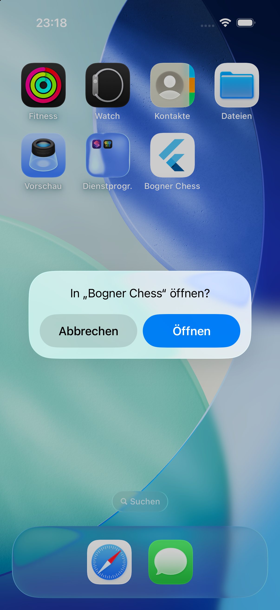

## Scope

Turn the `flutter create` iOS project into the project the rest of the app builds on: build settings in readable xcconfig files, the identity and capability keys in `Info.plist`, an entitlements file, a privacy manifest and licence headers on the native sources. Only files under `ios/` and `docs/`.

- `ios/Config/{Shared,Debug,Release}.xcconfig` plus an optional untracked `Local.xcconfig`, included from Flutter's own `ios/Flutter/{Debug,Release}.xcconfig`. Settings that would override them are removed from `project.pbxproj`.
- iOS 16.0, iPhone only, portrait only, version numbers from `pubspec.yaml`, signing off for the simulator and automatic otherwise, with the team coming from `Local.xcconfig`.
- `Info.plist`: bundle name, localizations, export compliance, local networking for the mock server, the URL scheme, the "Chess PGN" document type with the imported `com.chess.pgn` type.
- `Runner/Runner.entitlements` with `aps-environment`. No App Group yet.
- `Runner/PrivacyInfo.xcprivacy`, as a resource of the Runner target.
- SPDX headers on the native source files.
- `docs/ios-project.md`.

## Out of scope

`tool/` and `.github/` (WP-02), `lib/` and `pubspec.yaml` (WP-03), `third_party/` and `lib/core/chess` (WP-04). The App Group and the Share Extension target (WP-24). Any Swift code for push (WP-32) or for receiving documents (WP-23). fastlane (WP-50). Signing identities, certificates and App Store Connect.

## Contracts

**Consumes:** the WP-00 scaffold; bundle id `com.bognerchess.mobile` and display name "Bogner Chess" from H1.
**Produces:** the xcconfig layering, the `Info.plist` keys (URL scheme `com.bognerchess.mobile`, document type `com.chess.pgn`), `Runner.entitlements`, `PrivacyInfo.xcprivacy`, `docs/ios-project.md`. WP-23, WP-24, WP-25, WP-32, WP-43 and WP-50 rely on them.

## Steps

1. Add the xcconfig files, include them from Flutter's xcconfig files, strip the overriding settings from `project.pbxproj`.
2. Edit `Info.plist`, add the entitlements file and the privacy manifest, register both in `project.pbxproj`.
3. Add licence headers to the native sources.
4. Build for the simulator, inspect the built app, launch it on a dedicated simulator, try an unsigned release build.
5. Write `docs/ios-project.md`, paste the evidence, write handoff notes.

## Acceptance commands

```bash
flutter pub get
flutter build ios --simulator --debug
xcodebuild -workspace ios/Runner.xcworkspace -scheme Runner -configuration Debug -sdk iphonesimulator -showBuildSettings \
  | grep -E "PRODUCT_BUNDLE_IDENTIFIER|IPHONEOS_DEPLOYMENT_TARGET|TARGETED_DEVICE_FAMILY|MARKETING_VERSION|CODE_SIGN"
plutil -lint ios/Runner/Info.plist ios/Runner/Runner.entitlements ios/Runner/PrivacyInfo.xcprivacy
find build/ios/iphonesimulator/Runner.app -name PrivacyInfo.xcprivacy
/usr/libexec/PlistBuddy -c "Print :CFBundleURLTypes" -c "Print :CFBundleDocumentTypes" -c "Print :UIDeviceFamily" build/ios/iphonesimulator/Runner.app/Info.plist
# install and launch on a dedicated simulator, screenshot to docs/tasks/evidence/WP-01-launch.png
flutter analyze --fatal-infos
flutter test
flutter build ios --release --no-codesign
```

## Evidence

All commands were run on 2026-09-19 from the root of the `mobile/WP-01` worktree, after the last change to `ios/`. `tool/check.sh` does not exist yet (WP-02 is in progress in parallel); its future parts `dart format`, `flutter analyze` and `flutter test` were run by hand.

`flutter pub get`

```
Got dependencies!
4 packages have newer versions incompatible with dependency constraints.
Try `flutter pub outdated` for more information.
exit code: 0
```

`flutter build ios --simulator --debug`

```
Building com.bognerchess.mobile for simulator (ios)...
Running Xcode build...
Xcode build done.                                            9.7s
✓ Built build/ios/iphonesimulator/Runner.app
```

`xcodebuild -workspace ios/Runner.xcworkspace -scheme Runner -configuration Debug -sdk iphonesimulator -showBuildSettings | grep -E "PRODUCT_BUNDLE_IDENTIFIER|IPHONEOS_DEPLOYMENT_TARGET|TARGETED_DEVICE_FAMILY|MARKETING_VERSION|CODE_SIGN"`

```
    AD_HOC_CODE_SIGNING_ALLOWED = YES
    COCOAPODS_PARALLEL_CODE_SIGN = true
    CODE_SIGNING_ALLOWED = NO
    CODE_SIGNING_REQUIRED = NO
    CODE_SIGN_CONTEXT_CLASS = XCiPhoneSimulatorCodeSignContext
    CODE_SIGN_ENTITLEMENTS = Runner/Runner.entitlements
    CODE_SIGN_INJECT_BASE_ENTITLEMENTS = YES
    CODE_SIGN_STYLE = Automatic
    DEPLOYMENT_TARGET_SETTING_NAME = IPHONEOS_DEPLOYMENT_TARGET
    IPHONEOS_DEPLOYMENT_TARGET = 16.0
    MARKETING_VERSION = 0.1.0
    PRODUCT_BUNDLE_IDENTIFIER = com.bognerchess.mobile
    RECOMMENDED_IPHONEOS_DEPLOYMENT_TARGET = 17.0
    TARGETED_DEVICE_FAMILY = 1
```

`CODE_SIGN_IDENTITY` is set to the empty string for the simulator, and `xcodebuild` leaves empty settings out of this listing. `CURRENT_PROJECT_VERSION = 1`, `APS_ENVIRONMENT = development` and no `DEVELOPMENT_TEAM` were checked with a wider grep.

The same listing for the other configurations and the test target (selected lines):

```
-- Runner, Release, iphoneos
    APS_ENVIRONMENT = production
    CODE_SIGNING_ALLOWED = YES
    CODE_SIGN_ENTITLEMENTS = Runner/Runner.entitlements
    CODE_SIGN_IDENTITY = Apple Development
    CODE_SIGN_STYLE = Automatic
    IPHONEOS_DEPLOYMENT_TARGET = 16.0
    TARGETED_DEVICE_FAMILY = 1
-- Runner, Profile, iphoneos
    APS_ENVIRONMENT = development
    IPHONEOS_DEPLOYMENT_TARGET = 16.0
    MARKETING_VERSION = 0.1.0
    PRODUCT_BUNDLE_IDENTIFIER = com.bognerchess.mobile
-- RunnerTests, Debug, iphonesimulator   (no CODE_SIGN_ENTITLEMENTS, as intended)
    CODE_SIGNING_ALLOWED = NO
    IPHONEOS_DEPLOYMENT_TARGET = 16.0
    MARKETING_VERSION = 1.0
    PRODUCT_BUNDLE_IDENTIFIER = com.bognerchess.mobile.RunnerTests
    TARGETED_DEVICE_FAMILY = 1
```

`plutil -lint ios/Runner/Info.plist ios/Runner/Runner.entitlements ios/Runner/PrivacyInfo.xcprivacy` (and `plutil -lint ios/Runner.xcodeproj/project.pbxproj`: OK)

```
ios/Runner/Info.plist: OK
ios/Runner/Runner.entitlements: OK
ios/Runner/PrivacyInfo.xcprivacy: OK
```

`find build/ios/iphonesimulator/Runner.app -name PrivacyInfo.xcprivacy` (the second one is the Flutter engine's own; the release build shows the same two)

```
build/ios/iphonesimulator/Runner.app/PrivacyInfo.xcprivacy
build/ios/iphonesimulator/Runner.app/Frameworks/Flutter.framework/PrivacyInfo.xcprivacy
```

Keys of the built `build/ios/iphonesimulator/Runner.app/Info.plist`, printed with `/usr/libexec/PlistBuddy -c "Print :<key>"` in this order: `CFBundleName`, `MinimumOSVersion`, `UIDeviceFamily`, `UISupportedInterfaceOrientations`, `CFBundleLocalizations`, `ITSAppUsesNonExemptEncryption`, `NSAppTransportSecurity`, `CFBundleURLTypes`, `CFBundleDocumentTypes`, `UTImportedTypeDeclarations`, `LSSupportsOpeningDocumentsInPlace`.

```
Bogner Chess
16.0
Array {
    1
}
Array {
    UIInterfaceOrientationPortrait
}
Array {
    de
    en
}
false
Dict {
    NSAllowsLocalNetworking = true
}
Array {
    Dict {
        CFBundleTypeRole = Editor
        CFBundleURLName = com.bognerchess.mobile
        CFBundleURLSchemes = Array {
            com.bognerchess.mobile
        }
    }
}
Array {
    Dict {
        CFBundleTypeName = Chess PGN
        CFBundleTypeRole = Viewer
        LSItemContentTypes = Array {
            com.chess.pgn
        }
        LSHandlerRank = Alternate
    }
}
Array {
    Dict {
        UTTypeIdentifier = com.chess.pgn
        UTTypeConformsTo = Array {
            public.plain-text
        }
        UTTypeDescription = Chess PGN
        UTTypeTagSpecification = Dict {
            public.mime-type = Array {
                application/x-chess-pgn
            }
            public.filename-extension = Array {
                pgn
            }
        }
    }
}
true
```

Flutter picked up the deployment target for its generated Swift package:

```
$ grep -n iOS ios/Flutter/ephemeral/Packages/FlutterGeneratedPluginSwiftPackage/Package.swift
12:        .iOS("16.0")
```

Launch: a dedicated simulator was created (`xcrun simctl create "BC-WP-01" "iPhone 17 Pro"`, iOS 26.5), the app was installed and launched on it by UDID, and the simulator was deleted afterwards. `simctl listapps` showed `CFBundleName = "Bogner Chess"`.

```
$ xcrun simctl install AD44085F-D7FC-44EC-9477-159A2BF47965 build/ios/iphonesimulator/Runner.app
$ xcrun simctl launch AD44085F-D7FC-44EC-9477-159A2BF47965 com.bognerchess.mobile
com.bognerchess.mobile: 51519
```


The URL scheme is registered. `xcrun simctl openurl <udid> "com.bognerchess.mobile://shared-pgn"` with the app terminated makes iOS ask whether to open Bogner Chess:



The native test target still builds and passes with the new settings (`xcodebuild -workspace Runner.xcworkspace -scheme Runner -configuration Debug -destination "id=<udid>" test`):

```
Test case 'RunnerTests.testExample()' passed on 'Clone 1 of BC-WP-01 - Runner (49359)' (0.001 seconds)
** TEST SUCCEEDED **
```

`dart format --set-exit-if-changed .`, `flutter analyze --fatal-infos`, `flutter test`

```
Formatted 2 files (0 changed) in 0.01 seconds.
exit code: 0
Analyzing studentapp-WP-01...
No issues found! (ran in 4.2s)
00:00 +1: All tests passed!
```

`flutter build ios --release --no-codesign` succeeds without a team and without `Local.xcconfig`:

```
Warning: Building for device with codesigning disabled. You will have to manually codesign before deploying to device.
Building com.bognerchess.mobile for device (ios-release)...
Running Xcode build...
Xcode build done.                                           16.6s
✓ Built build/ios/iphoneos/Runner.app (13.9MB)
exit: 0
```

Entitlements: the simulator debug build is not signed by Xcode (`codesign -dv` shows `flags=0x20002(adhoc,linker-signed)`, and there is no `__entitlements` section), so it builds with signing disabled and carries no entitlements. To prove that `$(APS_ENVIRONMENT)` is expanded, one scratch build was made with signing forced on from the command line (`CODE_SIGNING_ALLOWED=YES CODE_SIGN_IDENTITY=-`, derived data outside the repository). Its `Runner.app-Simulated.xcent` contained:

```
  "aps-environment" => "development"
```

## Handoff notes

**Layering (everyone)**

- Read `docs/ios-project.md` once. The rule that bites: a value in `project.pbxproj` beats the xcconfig files. Xcode's "Signing & Capabilities" pane and `flutter create .` write `DEVELOPMENT_TEAM`, `CODE_SIGN_*`, `PRODUCT_BUNDLE_IDENTIFIER` and friends back into the project file. Check `git diff ios/Runner.xcodeproj` after using either, and verify with `xcodebuild -showBuildSettings`, not by reading files.
- `ios/Config/{Debug,Release}.xcconfig` are the base configuration of the Runner target (through `ios/Flutter/*.xcconfig`, after `Generated.xcconfig`) **and** of the project. The second part is a decision beyond the task text: it gives `RunnerTests`, and later the share extension, the deployment target, device family, signing settings and team from the same place. Without it `RunnerTests` would have had no deployment target once the value left the project file.
- Profile keeps using `ios/Flutter/Release.xcconfig`, as in the Flutter template. There is no `Profile.xcconfig`; the one difference is `APS_ENVIRONMENT[config=Profile] = development` in `Config/Release.xcconfig`.
- Only identity, versions, platform and signing moved. Template boilerplate (`INFOPLIST_FILE`, bridging header, `SWIFT_VERSION`, `LD_RUNPATH_SEARCH_PATHS`, the warning flags) stayed in the project file on purpose, so that Flutter's regex-based project migrations keep matching.
- New objects in `project.pbxproj` have hand-made ids `BC01000000000000000000NN` (01 Config group, 02 to 04 and 08 the xcconfig files, 05 entitlements, 06 and 07 the privacy manifest and its build file). Continue with `BC24…` or let Xcode generate ids; both work. `de` was added to `knownRegions`.
- **The WP-00 commit on `main` contains `DEVELOPMENT_TEAM = VZAQ45R22N` in `project.pbxproj`** (three times; `flutter create` takes it from the keychain). It is removed here. A team id is not a secret, but it identifies the developer account, so decide before the repository goes public whether history gets rewritten. No remote exists yet, so this is still cheap.
- Flutter resolves the bundle id through `xcodebuild -showBuildSettings` on macOS, so moving it out of the project file is safe. Its non-macOS fallback greps the project file and would now find only the `RunnerTests` id; that path is display-only and irrelevant for an iOS-only app.
- `App.framework/Info.plist` reports `MinimumOSVersion` 15.0. The Flutter tool writes its own floor there on every build; it is not configurable and not a problem.
- Headers: the three Swift files, the bridging header and the xcconfig files carry the three-line header. If WP-02's header check covers `ios/`, it should skip plists, storyboards, `Assets.xcassets` and everything under `ios/Flutter/` (the two xcconfig files there must start with `#include "Generated.xcconfig"`; I left them without a header to stay byte-close to what Flutter's tooling expects).

**WP-23 (document types)**

- `CFBundleDocumentTypes` "Chess PGN" (role Viewer, rank Alternate) and the imported `com.chess.pgn` (conforms to `public.plain-text`, `.pgn`, `application/x-chess-pgn`) are in place. Only the plist side is done and only the URL scheme was exercised in the simulator; opening a `.pgn` from Files was **not** tested, because nothing receives it yet.
- `LSSupportsOpeningDocumentsInPlace` is `true`: the app gets the original file URL, not a copy in `Documents/Inbox`. The URL is security-scoped. Read it between `startAccessingSecurityScopedResource()` and `stopAccessingSecurityScopedResource()`, copy the text, keep no reference to the URL.
- The app uses the scene life cycle (`UIApplicationSceneManifest`, `SceneDelegate: FlutterSceneDelegate`). Files and URLs arrive in `scene(_:openURLContexts:)` when the app runs and in `connectionOptions.urlContexts` of `scene(_:willConnectTo:options:)` on a cold start, not in `application(_:open:options:)`. Handle both.
- Because the type is imported, another installed app that exports `com.chess.pgn` defines it. Files whose type iOS resolves to plain `public.plain-text` (a `.txt` with PGN inside) are not offered to us; that is what paste and the share extension are for.

**WP-24 (share extension, App Group)**

- No App Group yet. Add `com.apple.security.application-groups` to `Runner/Runner.entitlements` and to the extension's own entitlements file, and register the latter with one line in `Shared.xcconfig`: `BC_ENTITLEMENTS_<ExtensionTargetName> = <path>`. The lookup uses `$(TARGET_NAME)`, so the name must match exactly.
- The extension target inherits deployment target 16.0, device family, signing and team from the project-level xcconfig. It also inherits `PRODUCT_BUNDLE_IDENTIFIER = com.bognerchess.mobile`, so it **must** set `com.bognerchess.mobile.share` in its target settings, as `RunnerTests` does. Its `MARKETING_VERSION` and `CURRENT_PROJECT_VERSION` refer to `FLUTTER_BUILD_NAME` / `FLUTTER_BUILD_NUMBER`, which only exist where `Generated.xcconfig` is included; give the extension a base xcconfig that includes `../Flutter/Generated.xcconfig` and `Config/<x>.xcconfig`, or the version strings will be empty and App Store validation will reject the mismatch with the host app.
- Simulator debug builds are unsigned and carry **no entitlements**. If the App Group container does not resolve in the simulator, do not fight it: change the three `[sdk=iphonesimulator*]` lines in `Config/Debug.xcconfig` to ad-hoc signing (`CODE_SIGNING_ALLOWED = YES`, `CODE_SIGN_IDENTITY = -`). That needs no team and no certificate either; I verified that such a build succeeds and embeds the simulated entitlements.
- The hand-off URL `com.bognerchess.mobile://shared-pgn` reaches the app (see the screenshot: iOS asks to open it). Flutter's own deep-link handling may forward custom-scheme URLs to the router as a route; check `FlutterDeepLinkingEnabled` behaviour together with WP-03's router before relying on either path.

**WP-25 (auth)**

- The redirect `com.bognerchess.mobile:/oauthredirect` uses the registered scheme. `ASWebAuthenticationSession` intercepts the callback itself, so it normally never reaches the scene delegate.
- `NSAllowsLocalNetworking` permits `http://localhost:<port>` for the mock server only. A plain-HTTP identity provider on a LAN IP address is **not** covered.

**WP-32 and WP-43 (push)**

- `aps-environment` is `$(APS_ENVIRONMENT)`: `development` for Debug and Profile, `production` for Release. The value to send as `environment` in `registerDevice` must follow what the *signed app* carries, not the configuration name: with automatic signing the provisioning profile decides, and a Release build run from Xcode with a development profile talks to the sandbox. Deriving it in Swift from the embedded provisioning profile (or from a dart define set by the deploy workflow) is more reliable than `#if DEBUG`.
- Not verified, because it needs a team (human gate): whether Xcode accepts `production` in the entitlements file together with a development profile for a locally run Release build. If it complains about a mismatch, set `APS_ENVIRONMENT = development` in `Config/Release.xcconfig`; the App Store export re-signs with `production` regardless. One-line change.
- In the unsigned simulator build the entitlement is absent, so `registerForRemoteNotifications` is expected to fail there with "no valid aps-environment entitlement". `xcrun simctl push <udid> com.bognerchess.mobile payload.json` still delivers, which is enough for the foreground, tap and cold-start handling. For a real token in the simulator use the ad-hoc switch described under WP-24.
- The Push Notifications capability still has to be enabled for the App ID in the developer portal (human gate H6).
- `Localizable.strings` for `loc-key` pushes: add `de.lproj` and `en.lproj` variants to the Runner target; `de` is already a known region.

**WP-50 and WP-54 (fastlane, reproducible build)**

- `flutter build ios --release --no-codesign` works with no team and no `Local.xcconfig`. `--config-only` writes `Generated.xcconfig`, which the version settings depend on; never call `xcodebuild` or `build_app` on a clean clone before a `flutter build ios --config-only` (or `flutter pub get` plus a build), otherwise `#include "Generated.xcconfig"` fails.
- CI has no `Local.xcconfig`. Pass the team on the command line instead (`xcargs: "DEVELOPMENT_TEAM=… -allowProvisioningUpdates …"`); command-line settings beat every xcconfig. Do not generate a `Local.xcconfig` in CI unless you also make sure it cannot be uploaded as an artefact.
- `CODE_SIGN_IDENTITY[sdk=iphoneos*] = Apple Development` with `CODE_SIGN_STYLE = Automatic` is what cloud-managed signing expects for the archive step; the export step re-signs for distribution.
- `ITSAppUsesNonExemptEncryption = NO` is set, so uploads do not stop at the export-compliance question.
- Version and build number come only from `pubspec.yaml` or `--build-name` / `--build-number`; there is nothing to bump in `ios/`.

**WP-53 (privacy)**

- The purposes in `PrivacyInfo.xcprivacy` are my reading of the design: user id, email and device id are linked and for app functionality; product interaction is linked and for analytics; crash data is not linked. H8 must confirm them against the real analytics and Sentry setup, and the App Store labels must say the same. The built app currently contains two manifests (ours and the Flutter engine's); every plugin added later may bring another.

**Not done, on purpose**

- No app icon work, no launch screen work, no `UIBackgroundModes`, no associated domains, no App Group.
