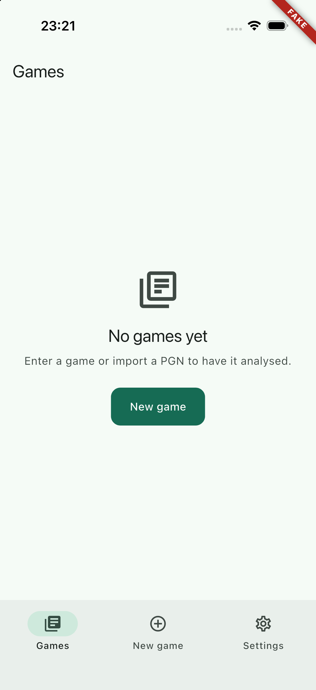
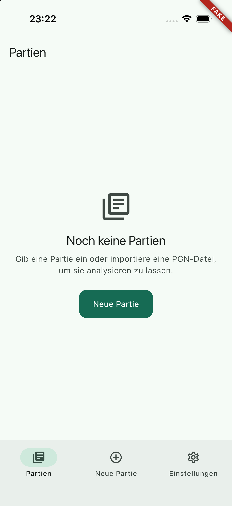
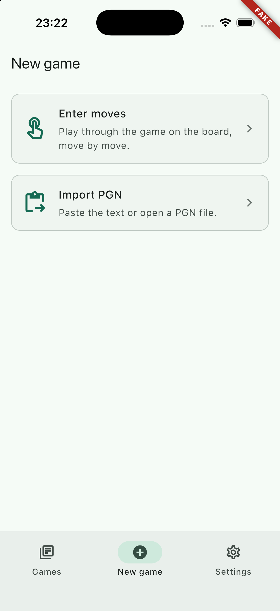
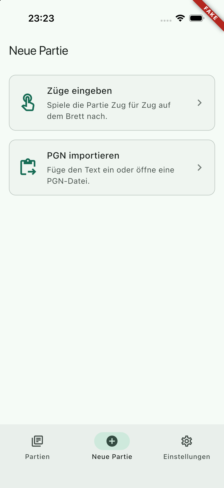
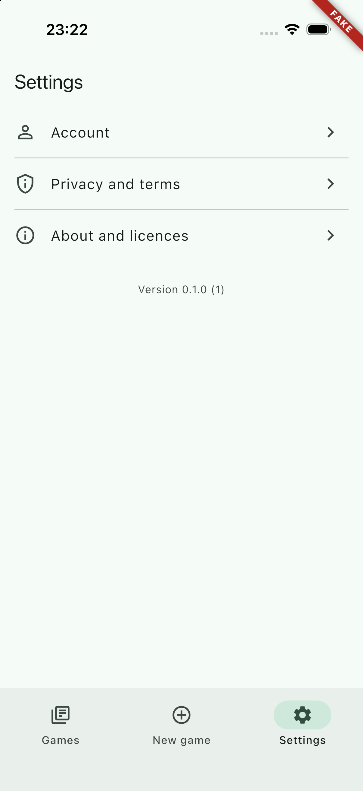
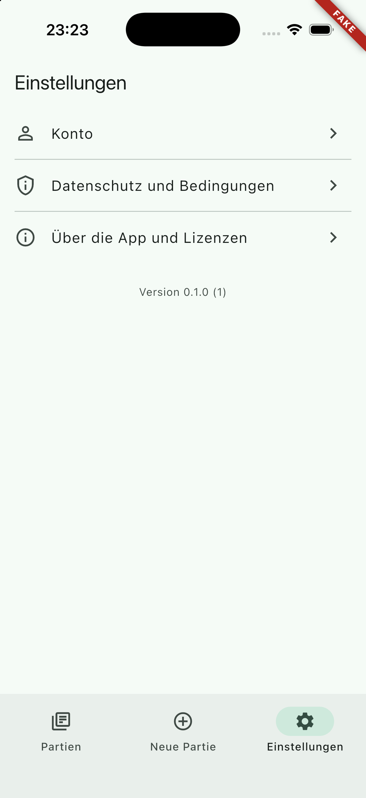
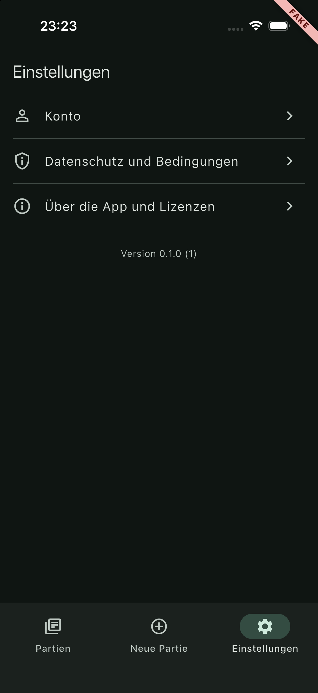

## Scope

The frame every feature is built into: Riverpod, go_router with a three-tab shell and placeholder routes, light and dark themes, German and English localisation, the typed build configuration, an environment banner, the logging and crash-reporting abstractions, and the auth-state seam the router redirects on.

- `lib/main.dart`, `lib/app.dart`, `lib/router.dart`, `lib/config/env.dart`
- `lib/core/`: `auth/auth_state.dart`, `crash/crash_reporter.dart`, `log.dart`, `app_info.dart`, `storage/preferences.dart`, `l10n/` (ARB files, `l10n.dart`, checked-in `generated/`), `ui/theme.dart`, `ui/widgets/`
- `lib/features/<feature>/ui/`: one small screen per route (library, new_game, entry, import, review, settings, legal, consent, account, auth)
- `config/{dev,fake,staging,prod}.json`, `l10n.yaml`, the shell's packages in `pubspec.yaml` and `docs/dependencies.md`
- `test/`: shell, router, localisation and scaling, shared widgets, env, ARB parity, log and crash

## Out of scope

`ios/` (WP-01), `tool/` and `.github/` (WP-02), the chessground fork and `lib/core/chess` (WP-04). No real screen content: every feature screen is a placeholder for its own work package. No Sentry (WP-34), no real auth (WP-25), no API client (WP-12).

## Contracts

**Consumes:** the WP-00 scaffold (Flutter 3.47.5, bundle id, strict analysis options, the three-line SPDX header).
**Produces:** `envProvider`/`Env`, `authStateProvider`/`AuthState`, `routerProvider` with `AppRoutes` and `AppRouteNames`, `crashReporterProvider`/`CrashReporter`, `Log`, `appInfoProvider`, `preferencesProvider`, `AppLocalizations` with `context.l10n`, `AppTheme`/`AppColors`/`AppSpacing`/`AppRadii`, the shared widgets, the config files, and `test/helpers/pump_app.dart`. Details under Handoff notes.

## Steps

1. Re-verify the packages on pub.dev, add them, record them in `docs/dependencies.md`.
2. Config files and `Env`; l10n set-up with checked-in output; theme and shared widgets.
3. Auth-state seam, router with tab shell and placeholders, app and main with error wiring.
4. Tests; simulator build with the fake config; screenshots in English and German.

## Acceptance commands

```bash
flutter pub get
flutter gen-l10n
dart format --set-exit-if-changed lib test
flutter analyze --fatal-infos
flutter test
flutter build ios --simulator --debug --dart-define-from-file=config/fake.json
# then: install and launch on a simulator, screenshot every tab in en and de
```

## Evidence

All commands were run on 2026-09-19 from the repository root, after the last change to the code.

`flutter pub get`

```
Got dependencies!
4 packages have newer versions incompatible with dependency constraints.
```

(The four are `material_color_utilities`, `meta`, `test_api` and `vector_math`, all pinned by the Flutter SDK.)

`flutter gen-l10n` — no output, and no change to the checked-in files under `lib/core/l10n/generated/`.

`dart format --set-exit-if-changed lib test`

```
Formatted 41 files (0 changed) in 0.08 seconds.
```

`flutter analyze --fatal-infos`

```
Analyzing studentapp-WP-03...
No issues found! (ran in 8.2s)
```

`flutter test`

```
00:02 +52: All tests passed!
```

52 tests: tabs switch and keep their stacks, full-screen routes cover the tab bar, env banner present in `fake` and absent in `prod`, light and dark themes, redirects (pure function and through the widget tree, including a signed-out deep link that arrives after signing in), every route and named route, the not-found screen, German and English including framework strings, fallback to English for French, text scale 1.3 on a 375 x 667 screen over all twelve locations in both languages and both brightnesses, shared widgets, the config files, ARB parity, logger and crash reporter. That the overflow check has teeth was confirmed by hand: the pumped app reports `SystemTextScaler (1.3x)` and the empty-state headline wraps to two lines.

`flutter build ios --simulator --debug --dart-define-from-file=config/fake.json`

```
Building com.bognerchess.mobile for simulator (ios)...
Xcode build done.                                           41.1s
✓ Built build/ios/iphonesimulator/Runner.app
```

The build changed nothing under `ios/` (the two plugins come in through Swift Package Manager).

**Simulator.** A throw-away device `BC-WP-03` (iPhone 17 Pro, iOS 26.5) was created, the app installed and launched with `xcrun simctl launch <udid> com.bognerchess.mobile -AppleLanguages "(en)"` and again with `"(de)" -AppleLocale de_CH`; tabs were switched with the simulator tool's taps, dark mode with `xcrun simctl ui <udid> appearance dark`. The device was deleted afterwards. All screenshots were looked at: text is complete and unclipped in both languages, the `FAKE` ribbon sits top-end clear of the title, the version line reads "Version 0.1.0 (1)" from the real `package_info_plus`.

| | English | German |
| --- | --- | --- |
| Games |  |  |
| New game |  |  |
| Settings |  |  |
| Settings, dark | |  |

## Handoff notes

**Material now comes from a package: import `package:material_ui/material_ui.dart`, never `package:flutter/material.dart`.** This was not in the plan. `go_router` 18 moved to `material_ui` (the Material library, decoupled from the framework, flutter.dev, BSD-3-Clause) and decides how to build pages by looking for *that* package's `MaterialApp`. With the framework's legacy `MaterialApp` it silently falls back to bare pages: no transitions, no swipe-back. The two libraries have separate `Theme` and `MaterialLocalizations` types, so mixing them in one tree means legacy widgets do not see the app's theme. Consequences:

- App code and tests import `material_ui`. `dart fix --apply --code=migrate_design_widgets` converts a file written the old way. `package:flutter/widgets.dart` and `foundation.dart` are unaffected.
- A third-party widget that still reads the legacy `Theme` (possible for `chessground`, `fl_chart`, `flutter_markdown_plus`) gets default colours. `material_ui` ships `MaterialUiCompatibilityBridge` for that, but it is already marked deprecated, which `--fatal-infos` rejects; wrap the one subtree that needs it with a targeted `// ignore: deprecated_member_use` and a comment, or pass colours explicitly. The shell does not install it globally.
- `AppLocalizations.localizationsDelegates` (generated) carries the *legacy* Material delegate. Use `[AppLocalizations.delegate, ...GlobalMaterialLocalizations.delegates]` with `GlobalMaterialLocalizations` from `material_ui`, as `app.dart` and `test/core/ui/widgets_test.dart` do.
- WP-02's layer check could well forbid `package:flutter/material.dart` and `cupertino.dart` under `lib/` and `test/`.

**Providers** (plain Riverpod 3, no generator)

| Provider | Type | File | Notes |
| --- | --- | --- | --- |
| `envProvider` | `Provider<Env>` | `lib/config/env.dart` | `Env.fromEnvironment()`. Fields: `envName`, `apiUrl` (Uri), `tenantSlug`, `oidcIssuer` (Uri), `oidcClientId`, `oidcRedirect`, `sentryDsn`, `authMode` (`AuthMode.real|fake`), getters `isProd`, `usesFakeAuth`. Without dart-defines the `dev` values apply. In a release build, fake auth or a non-https API throws at start-up (`assertSafeForRelease`). Anything other than exactly `fake` parses as real auth. |
| `authStateProvider` | `NotifierProvider<AuthStateNotifier, AuthState>` | `lib/core/auth/auth_state.dart` | `sealed AuthState` = `SignedOut()` or `SignedIn(sub)`, both with value equality; `toString` hides the subject. Fake auth gives `SignedIn(kFakeAuthSub)` (`'fake-user-1'`), everything else `SignedOut`. WP-25 replaces `AuthStateNotifier.build` and keeps the types. |
| `routerProvider` | `Provider<GoRouter>` | `lib/router.dart` | Re-runs the redirect whenever `authStateProvider` changes. |
| `crashReporterProvider` | `Provider<CrashReporter>` | `lib/core/crash/crash_reporter.dart` | Interface: `recordError(error, stack, {fatal, reason})`, `addBreadcrumb(message, {category})`. Default `NoopCrashReporter`. WP-34 changes the provider's value; `main.dart` needs no change. |
| `appInfoProvider` | `FutureProvider<AppInfo>` | `lib/core/app_info.dart` | `version`, `buildNumber`. The only importer of `package_info_plus`. Retry is off. |
| `preferencesProvider` | `Provider<SharedPreferencesAsync>` | `lib/core/storage/preferences.dart` | Nothing uses it yet. |

`main.dart` creates one `ProviderContainer`, wires `FlutterError.onError`, `PlatformDispatcher.instance.onError` and `runZonedGuarded` to `Log` and the crash reporter, and runs the app in an `UncontrolledProviderScope`. Start-up work that needs providers goes inside the guarded zone, before `runApp`.

`Log` (`lib/core/log.dart`): `const Log('name').debug|info|warning|error(...)`, output through `dart:developer`, debug lines dropped in release, `Log.sink` replaceable in tests (`Log.resetSink()` afterwards). Never log tokens, e-mail addresses or PGN.

**Routes** (`AppRoutes` for paths, `AppRouteNames` for names, both in `lib/router.dart`)

| Path | `AppRoutes` | `AppRouteNames` | Screen (file to replace) | Where it opens |
| --- | --- | --- | --- | --- |
| `/games` | `games` (= `initial`) | `games` | `LibraryScreen`, `features/library/ui/library_screen.dart` | tab 1 |
| `/games/:id` | `game(id)` | `game` | `GameScreen(gameId)`, `features/library/ui/game_screen.dart` | full screen |
| `/games/:id/review` | `gameReview(id)` | `game-review` | `ReviewScreen(gameId)`, `features/review/ui/review_screen.dart` | full screen |
| `/new` | `newGame` | `new-game` | `NewGameScreen`, `features/new_game/ui/new_game_screen.dart` (real, not a placeholder) | tab 2 |
| `/new/entry` | `newGameEntry` | `new-game-entry` | `EntryScreen`, `features/entry/ui/entry_screen.dart` | full screen |
| `/new/import` | `newGameImport` | `new-game-import` | `ImportScreen`, `features/import/ui/import_screen.dart` | full screen |
| `/settings` | `settings` | `settings` | `SettingsScreen`, `features/settings/ui/settings_screen.dart` | tab 3 |
| `/settings/about` | `settingsAbout` | `settings-about` | `AboutScreen`, `features/legal/ui/about_screen.dart` | inside tab 3 |
| `/settings/account` | `settingsAccount` | `settings-account` | `AccountScreen`, `features/account/ui/account_screen.dart` | inside tab 3 |
| `/settings/legal` | `settingsLegal` | `settings-legal` | `LegalScreen`, `features/legal/ui/legal_screen.dart` | inside tab 3 |
| `/consent/ai` | `consentAi` | `consent-ai` | `AiConsentScreen`, `features/consent/ui/ai_consent_screen.dart` | full-screen dialog |
| `/sign-in` | `signIn` | `sign-in` | `SignInScreen`, `features/auth/ui/sign_in_screen.dart` | full screen, public |

- `/` redirects to `/games`; an unknown location shows `NotFoundScreen`.
- "Full screen" means `parentNavigatorKey: rootNavigatorKey`: the page covers the tab bar, which the board screens need. A deep link to `/games/42/review` builds the stack library → game → review, so back works (tested). Settings sub-pages stay inside their tab.
- `authRedirect({auth, uri})` is a pure top-level function. Signed out, every location outside `_publicLocations` (only `/sign-in` today; WP-30 may need the legal documents there) goes to `/sign-in?from=<location>`. Once signed in, `/sign-in` leads to `from` if it is an in-app path, else to `/games`. This is how a push tap survives a sign-in.
- `AppRoutes.game(id)` percent-encodes the id. Path parameter name: `AppRoutes.gameIdParam`.
- Tab indices: `TabShell.gamesTab|newGameTab|settingsTab`. Tapping the active tab pops it to its root.
- **Custom-scheme links are not handled yet.** For `com.bognerchess.mobile://games/1/review` the URI parser takes `games` as the host and go_router sees only `/1/review`. WP-23/WP-32 should normalise incoming URIs (host + path) before `router.go`, or emit `com.bognerchess.mobile:///games/...`.

**Adding a route:** add one constant line to `AppRoutes` and one to `AppRouteNames` in alphabetical position, add one `GoRoute(...)` block in the right section of `routerProvider` (root routes, or a tab's sub-routes; alphabetical by path; give it `parentNavigatorKey: rootNavigatorKey` if it should cover the tab bar), and put the screen in `lib/features/<feature>/ui/`. Replacing a placeholder normally needs no router change at all: keep the class name and constructor. Add the location to `allLocations` in `test/l10n_and_scaling_test.dart` so it is walked in both languages at text scale 1.3. `router.dart` and the feature screens import each other (for `AppRoutes`); Dart allows that.

**Adding a string:** append the key to **both** `lib/core/l10n/app_en.arb` (with an `@key` block containing a `description`; `required-resource-attributes` makes gen-l10n fail without one) and `app_de.arb`, run `flutter gen-l10n` (later `tool/gen.sh`), commit the regenerated files, and read it with `context.l10n.<key>` after importing `package:bogner_chess/core/l10n/l10n.dart`. Keys are camelCase with the feature as prefix (`libraryEmptyTitle`, `common...` for shared ones). German uses the informal "du". `test/core/l10n/arb_test.dart` fails when the two files differ in keys. Generated files carry the SPDX header through `lib/core/l10n/header.txt`. `pubspec.yaml` now has `flutter: generate: true`, which gen-l10n insists on; `synthetic-package` no longer exists in this Flutter version and must not be added to `l10n.yaml`. English is listed first (`preferred-supported-locales`), which is what makes it the fallback for other system languages. German showed up on the simulator without `CFBundleLocalizations`; WP-01 still adds it so that iOS offers the per-app language setting.

**Theme tokens** (`lib/core/ui/theme.dart`)

- `AppTheme.light()` / `AppTheme.dark()`: Material 3, `ColorScheme.fromSeed(AppPalette.green /* 0xFF2E5E4E */, tonalSpot)`, `ThemeMode.system`. Flat app bar on `surface`, navigation bar on `surfaceContainer`, outlined cards without elevation, 48-point minimum button height.
- Colours: use `Theme.of(context).colorScheme` roles. Roles Material lacks are in the `AppColors` theme extension, read with `AppColors.of(context)`: `success`/`onSuccess`, `warning`/`onWarning`, `envBanner`/`onEnvBanner`. Move-classification colours belong there too when WP-29a needs them (extend the class, `copyWith` and `lerp`).
- `AppSpacing`: `xs` 4, `sm` 8, `md` 16, `lg` 24, `xl` 32, `xxl` 48, `page` 16. `AppRadii`: `sm` 8, `md` 12, `lg` 20.

**Shared widgets** (`lib/core/ui/widgets/`): `AppScaffold(title, body, actions, floatingActionButton, bottomBar)`; `EmptyState(icon, title, message, actionLabel, onAction)`; `ErrorRetry(title, message, onRetry)` with localised defaults; `CenteredMessage` (the scrolling centred column both use); `EnvBanner` (corner ribbon with `ENV_NAME` in capitals, nothing in prod, installed once in `MaterialApp.builder`; Flutter's own debug ribbon is switched off because it would sit in the same corner); `PlaceholderScreen(title, detail)`; `NotFoundScreen`; `TabShell`.

**Tests:** `test/helpers/pump_app.dart` has `pumpApp(tester, {env, auth, locale, brightness, textScale, screen})`, which pumps the whole app with `envProvider` and `appInfoProvider` overridden on an iPhone-sized surface, plus `testEnv()`, `TestAuthNotifier` (`.set(state)` to drive redirects), `routerOf`, `containerOf`, `locationOf`, `kIphoneSe`, `kIphone17Pro`. Drive navigation with `routerOf(tester).go(...)`.

**Config:** `config/staging.json` points at `https://staging.invalid/graphql` and carries a `TODO` key saying so; replace the URL when a staging host exists. An extra key in a config file only becomes an unused dart-define. `Env.keys` lists the required ones and `test/config/env_test.dart` checks all four files, including that no key looks like a secret and `SENTRY_DSN` is empty.

**Not done here:** `freezed`/`freezed_annotation` were pencilled in for this WP in `docs/dependencies.md`, but the shell has no domain model that needs them; the rows now say "first user". `tool/check.sh` does not exist on this branch (WP-02); its future steps were run by hand (format, analyze, tests, SPDX header on every new Dart file, no `chessground`/`graphql`/legacy-material imports).
