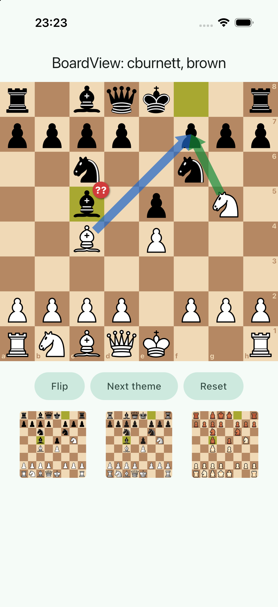
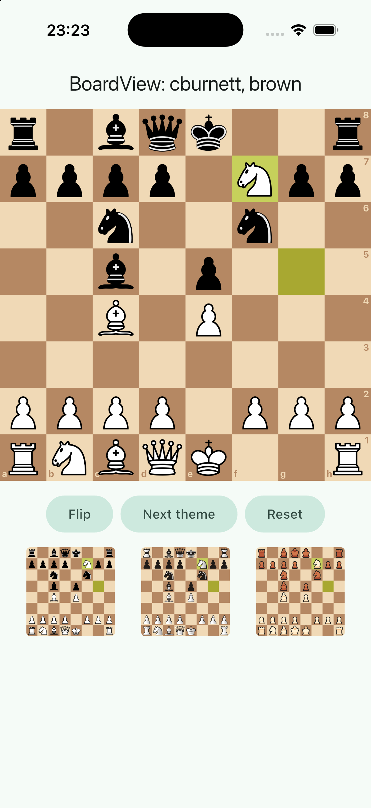

## Scope

Give the app a chess board whose bundled artwork is licence-clean, and hide the board package behind one widget.

- `third_party/chessground/`: a trimmed copy of `lichess-org/flutter-chessground` 10.2.0, used through `path:`. Three piece sets (cburnett, merida, rhosgfx), no board images. `BOGNER_CHANGES.md` there records upstream commit and every change; `third_party/sync_chessground.py` redoes the trim.
- `lib/core/chess/`: `BoardView` (interactive or read-only board with a semantics overlay of 64 labelled squares), `BoardThumbnail` (static board for list rows), the app's own board vocabulary (`chess_models.dart`), and a demo harness in `dev/`.
- `dartchess ^0.13.1` from pub.dev.
- `tool/asset_allowlist.txt`, `NOTICE` (piece-set table, vendored code), `docs/dependencies.md`, `dart_test.yaml` (declares the `golden` tag).

**Decision that replaces the plan:** the planning documents say "org fork pinned by git ref". There is no fork. The trimmed copy lives in this repository instead, because no GitHub fork exists yet and because an in-repo copy makes "the public source builds the shipped client" true without a second repository.

## Out of scope

`ios/` (WP-01), `tool/check.sh`, `tool/check_bundled_assets.sh` and `.github` (WP-02; this WP only supplies `tool/asset_allowlist.txt`), `lib/main.dart`, router, l10n (WP-03). Full PGN import (WP-22). A theme picker UI (WP-36). Registering the piece-set licences with `LicenseRegistry` (WP-31).

## Contracts

**Consumes:** the Flutter project and licence skeleton from WP-00.
**Produces:** `package:bogner_chess/core/chess/board_view.dart` (exports `BoardView`, `BoardInteraction`, `BoardTheme`, `BoardPieceSet`, `BoardColors`, `BoardArrow`, `BoardArrowStyle`, `BoardGlyph`, `BoardGlyphTone`, `BoardSemanticsLabels`, `boardSquareIdentifier`, `precacheBoardTheme`, `kBoardAnimationDuration`), `board_thumbnail.dart` (`BoardThumbnail`), `board_geometry.dart` (`squareRect`, `squareCell`, `promotionChoices`, `isPromotionPawnMove`), `test/helpers/board_tester.dart`, `tool/asset_allowlist.txt`.

## Steps

1. Clone upstream, record version and commit, read `MIGRATION.md` and `lib/src`.
2. Vendor and trim with `third_party/sync_chessground.py`; check every kept set against lila's `COPYING.md`.
3. Exclude `third_party/` from the app's analyzer; `dart analyze third_party/chessground` stays clean.
4. Add `dartchess`.
5. Write `lib/core/chess/` and its tests, including one golden.
6. Build the demo harness for the simulator, check the bundled assets, take a screenshot.

## Acceptance commands

```bash
flutter pub get
dart format --set-exit-if-changed lib test
flutter analyze --fatal-infos
dart analyze third_party/chessground
flutter test
flutter test --tags golden          # macOS only
flutter build ios --simulator --debug -t lib/core/chess/dev/board_demo.dart
find build/ios/iphonesimulator/Runner.app -path "*chessground*" -type d | sort
```

## Evidence

All run on 2026-09-19 on macOS 26.6.2, Flutter 3.47.5, after the last code change.

`flutter pub get`

```
+ chessground 10.2.0 from path third_party/chessground
+ dartchess 0.13.1
Changed 2 dependencies!
```

`dart format --set-exit-if-changed lib test` (and `.`, which includes the vendored code, also reports 0 changed)

```
Formatted 12 files (0 changed) in 0.02 seconds.
```

`flutter analyze --fatal-infos`

```
Analyzing studentapp-WP-04...
No issues found! (ran in 3.1s)
```

`dart analyze third_party/chessground`

```
Analyzing chessground...
No issues found!
```

`flutter test` (22 tests: 21 in `board_view_test.dart` and `widget_test.dart`, 1 golden) and `flutter test --tags golden`

```
00:00 +22: All tests passed!
00:00 +1: All tests passed!
```

`flutter build ios --simulator --debug -t lib/core/chess/dev/board_demo.dart`

```
Building com.bognerchess.mobile for simulator (ios)...
Xcode build done.                                           12.2s
✓ Built build/ios/iphonesimulator/Runner.app
```

Bundled chessground assets in the built app (prefix `build/ios/iphonesimulator/Runner.app/Frameworks/App.framework/flutter_assets/` removed). 144 files, all `.webp`; no `boards` directory, no other piece set:

```
packages/chessground
packages/chessground/assets
packages/chessground/assets/piece_sets
packages/chessground/assets/piece_sets/cburnett
packages/chessground/assets/piece_sets/cburnett/2.0x
packages/chessground/assets/piece_sets/cburnett/3.0x
packages/chessground/assets/piece_sets/cburnett/4.0x
packages/chessground/assets/piece_sets/merida
packages/chessground/assets/piece_sets/merida/2.0x
packages/chessground/assets/piece_sets/merida/3.0x
packages/chessground/assets/piece_sets/merida/4.0x
packages/chessground/assets/piece_sets/rhosgfx
packages/chessground/assets/piece_sets/rhosgfx/2.0x
packages/chessground/assets/piece_sets/rhosgfx/3.0x
packages/chessground/assets/piece_sets/rhosgfx/4.0x
```

Simulator: the demo was installed on a throw-away device ("BC-WP-04", iPhone 17 Pro, iOS 26.5; deleted afterwards). Pieces, last-move highlight, both arrows, the "??" glyph, coordinates and the three thumbnails (one per piece set) render. Tapping g5 showed the selection and the legal-move dots; tapping f7 played Nxf7 and the thumbnails followed.




The simulator tool's `inspect` was not available in this session, so the accessibility tree was verified in widget tests only (labels, identifiers, tap action, rects). Whoever does the first UI work package should confirm with `inspect` that the 64 nodes show up on the device.

Licences of the kept sets, from `https://raw.githubusercontent.com/lichess-org/lila/master/COPYING.md` fetched on 2026-09-19:

```
public/piece/cburnett | Colin M.L. Burnett | GPLv2+
public/piece/merida | Armando Hernandez Marroquin | GPLv2+
public/piece/rhosgfx | RhosGFX | CC0 1.0
```

## Handoff notes

**Upstream**

- chessground **10.2.0**, commit `4b4f1d4734a453cfbe43a37cac95be09d8d1b0bc` (2026-09-16). Upstream has **no git tag for 10.2.0** (newest tag is `v10.1.1`); the commit is the "Bump version" commit on `main`, and its `lib/` and `pubspec.yaml` are identical to the pub.dev 10.2.0 archive.
- dartchess **0.13.1** (`^0.13.1`), exactly what chessground 10.2.0 asks for. `lichess-org/mobile` has the same constraint but currently overrides dartchess to a git ref for an unreleased 0.14.0; expect a bump soon. dartchess 0.13.1 needs no `fast_immutable_collections`: `makeLegalMoves` returns a plain `Map<Square, Set<Square>>`, which is what `GameData.validMoves` takes.
- Third piece set: **rhosgfx (CC0)** rather than chessnut (Apache-2.0). Both are GPL-compatible; CC0 carries no notice obligations, and it is the one set whose licence is not the GPL, which matters if the store question (H7) ever turns on the GPL artwork.
- Note for H7: cburnett and merida are third-party GPLv2+ works. The section 7 app-store permission this project drafts for its own files cannot cover them, exactly as it cannot cover chessground and dartchess.

**Updating the vendored copy:** see `third_party/chessground/BOGNER_CHANGES.md`. In short: clone upstream at the wanted commit, `python3 third_party/sync_chessground.py <checkout>`, `flutter pub get`, `dart analyze third_party/chessground`, the normal gate, then update the refs in `BOGNER_CHANGES.md`, `NOTICE` and `docs/dependencies.md`. The script is idempotent and reads the kept sets from `tool/asset_allowlist.txt`. Never edit the vendored files by hand. Only `pubspec.yaml`, `lib/src/piece_set.dart` and `lib/src/board_color_scheme.dart` differ from upstream.

**BoardView API** (`import 'package:bogner_chess/core/chess/board_view.dart';`, plus `package:dartchess/dartchess.dart` for `Position`, `Square`, `NormalMove`, `Side`)

```dart
const BoardView({
  Key? key,
  required Position position,            // side to move, legal moves, check highlight come from it
  double? size,                          // null: shorter side of the (bounded) parent
  Side orientation = Side.white,
  BoardInteraction interaction = BoardInteraction.readOnly, // or .entry
  Move? lastMove,
  List<BoardArrow> arrows = const [],
  Map<Square, BoardGlyph> glyphs = const {},
  BoardTheme theme = const BoardTheme(), // BoardPieceSet {cburnett, merida, rhosgfx} x BoardColors {brown, blue, green, ic}
  bool autoQueen = false,
  bool showCoordinates = true,
  bool animate = true,                   // false for a jump to an unrelated position
  Duration animationDuration = kBoardAnimationDuration, // 120 ms
  BoardSemanticsLabels semanticsLabels = BoardSemanticsLabels.english,
  ValueChanged<NormalMove>? onMove,
})
```

The widget is **controlled**: it reports a move and does not play it. `entry` means both colours can be moved (whichever is to move), tap-tap and drag, legal-move dots, premoves off. It needs an `Overlay` (dragging) and a `Directionality` (glyph text) above it; any `MaterialApp` has both.

Entry screen (WP-20):

```dart
BoardView(
  position: state.position,
  orientation: state.orientation,
  interaction: BoardInteraction.entry,
  lastMove: state.lastMove,
  theme: settings.boardTheme,
  autoQueen: settings.autoQueen,
  semanticsLabels: boardLabelsOf(AppLocalizations.of(context)), // build a BoardSemanticsLabels from ARB strings
  onMove: (move) => notifier.play(move), // position.play(move); keep `move` as lastMove
)
```

Review screen (WP-29a, WP-29c):

```dart
BoardView(
  position: node.position,
  orientation: game.orientation,
  lastMove: node.move,                    // readOnly is the default
  animate: !jumped,                       // false when the user taps a far-away move in the list
  arrows: [
    ?BoardArrow.ofMove(node.bestMove),                                        // green
    ?BoardArrow.ofMove(node.alternative, style: BoardArrowStyle.alternative), // blue
  ],
  glyphs: {if (node.move case NormalMove(:final to)) to: BoardGlyph.blunder},
)
```

`BoardGlyph` has `brilliant`, `good`, `interesting`, `inaccuracy`, `mistake`, `blunder`, or build one: `BoardGlyph('!', BoardGlyphTone.positive)` (one or two characters). Arrow styles: `best` green, `alternative` blue, `danger` red, `hint` amber; `scale` below 1 thins later moves of a line. Library rows: `BoardThumbnail(fen: game.finalFen, size: 56, semanticLabel: ...)`. Call `precacheBoardTheme(theme)` once at start-up to avoid a first frame without pieces.

**Castling** arrives as the user made it: `e1g1` when they tapped g1, `e1h1` when they tapped the rook. `Position.play`, `isLegal` and `makeSan` accept both; use `position.normalizeMove(move)` (king onto rook) or SAN when a canonical form is stored or sent.

**Semantics overlay.** 64 nodes, label from `BoardSemanticsLabels.square` ("e4, white pawn", "e5, empty"), identifier `board-square-e4` (`accessibilityIdentifier` on iOS), reading order as seen on screen, orientation-aware. On an entry board each node is a button whose tap action is turned into a synthetic pointer down/up on the middle of the square, so VoiceOver takes exactly chessground's tap-tap path (selection, dots, promotion picker). The overlay does not take part in hit testing: a finger, or an automation tool that taps the centre of a node's frame, reaches chessground directly. While the promotion picker is open the nodes are relabelled ("Promote to queen" … on the four picker squares, "Cancel promotion" elsewhere). chessground does not announce the picker, so `BoardView` looks at `controller.pendingPromotion` in a microtask after every pointer event; `promotionChoices` in `board_geometry.dart` mirrors the picker's layout, and the promotion tests fail if upstream moves it. Not exposed: which square is currently selected (chessground keeps that private). WP-52 may want it.

**Test helpers** (`test/helpers/board_tester.dart`, an extension on `WidgetTester`; works in `integration_test` too; expects exactly one `BoardView`):

```dart
await tester.tapSquare('e2');            // finger tap on the centre of the square
await tester.playMove('e2e4');           // two taps
await tester.playMove('e7e8n');          // two taps, then the knight in the picker (either orientation, any language)
await tester.dragPiece('g1', 'f3');
await tester.activateSquare('e2');       // the accessibility tap action
expect(tester.boardSquareLabel('e4'), 'e4, white pawn');
tester.boardSquare('e4');                // Finder, for getRect / getCenter
```

**Gotchas**

- `test/core/chess/` imports `chessground` to assert on shapes and settings. If WP-02's layer check scans `test/`, allow `test/core/chess/`. `lib/core/chess/dev/board_demo.dart` has its own `main` and is imported by nothing.
- The golden (`test/core/chess/goldens/board_arrows_glyph.png`, 320 px, no coordinates) needs piece images, which the engine decodes with real async: the test calls `precacheBoardTheme` inside `tester.runAsync` first. Ordinary widget tests run without piece images and do not need this. Plain `flutter test` runs the golden too; on Linux use `--exclude-tags golden`. `dart_test.yaml` declares the tag; if WP-02 adds the same file, merge the two.
- `analysis_options.yaml` excludes `third_party/**`; the vendored package has its own small `analysis_options.yaml` (upstream's strict modes and 100-column formatter, without `package:lint`), so `dart format .` leaves it alone and `dart analyze third_party/chessground` works from the repository root after `flutter pub get`.
- `tool/asset_allowlist.txt` is three bare names, no comments, because WP-02's reader was not written yet.
- The project `CLAUDE.md` still says "trimmed fork pinned by git ref" (licence rules, last bullet) and "the fork's `MIGRATION.md`" (architecture rules). This session was not allowed to edit `CLAUDE.md`; the wording should become "vendored trimmed copy in `third_party/chessground/` (path dependency); see `BOGNER_CHANGES.md` there" and "the vendored copy's `MIGRATION.md`". `NOTICE`, `docs/dependencies.md` and `docs/plans/2026-09-19-mobile-mvp-client.md` are updated.
- The demo and the screenshots are English only: `core/chess` has no user-facing strings of its own, and the German labels arrive through `BoardSemanticsLabels` from whoever owns the ARB files.
