## Scope

PRD IN-1: enter moves on the board (drag or tap-tap) with undo, legal-move validation and a promotion picker. The product bar is a 40-move game entered on an iPhone in under three minutes without input errors, so the screen is built around speed and cheap error recovery.

- `lib/features/entry/domain/`: `entry_game.dart` (`EntryGame`, `EntryMove`; pure Dart on dartchess), `entry_draft_store.dart` (`EntryDraftStore`, `EntryDraftSnapshot`, `InMemoryEntryDraftStore`, `entryDraftStoreProvider`, `EntryAutosaver`, `newEntryDraftId`), `entry_controller.dart` (`entryControllerProvider`, `EntryController`, `EntryState`, `EntryPlayOutcome`, `entryClockProvider`), `entry_result.dart` (`EntryResult`), `entry_settings.dart` (`entryAutoQueenProvider`).
- `lib/features/entry/data/screen_wakelock.dart`: `ScreenWakelock` seam, the only importer of `wakelock_plus`.
- `lib/features/entry/ui/`: `entry_screen.dart` (replaces the placeholder at `/new/entry`), `entry_move_list.dart`, `entry_overwrite_sheet.dart`, `entry_identified.dart` (`EntryIds`, `EntryIdentified`).
- `lib/features/entry/dev/entry_demo.dart`: development entry point that drives the screen with synthetic touches.
- `lib/core/l10n/board_labels.dart`: `boardLabelsOf(AppLocalizations)`, the localised `BoardSemanticsLabels` WP-04 asked for. New file outside the feature directory on purpose: the review screen needs it too and may not import another feature's `ui/`.
- ARB strings (both languages, appended), `router.dart` (`AppRoutes.draftIdParam`, `AppRoutes.newGameEntryResume`, the entry route reads `?draftId=`), `pubspec.yaml`/`pubspec.lock`, `docs/dependencies.md`.

## Out of scope

Metadata form and `GameMetadata` (WP-21), the drift DAO and the submit queue (WP-13, WP-27), a board-theme setting (WP-36), the on-simulator `integration_test` version of the full-game test (later WP), variations, non-standard starting positions.

## Contracts

**Consumes:** `BoardView` and `test/helpers/board_tester.dart` (WP-04); router, `preferencesProvider`, l10n, theme, `pumpApp` helpers (WP-03).
**Produces:** everything listed under Scope; details under Handoff notes.

## Steps

1. `EntryGame` and its unit tests; found that dartchess accepts a promotion without a role and guarded against it.
2. Draft store seam and autosaver, unit-tested with `fake_async`.
3. Controller, screen, move list, overwrite sheet, settings, wakelock seam; ARB strings in both languages.
4. Widget tests, including the scripted 80-ply game by tap-tap and by dragging.
5. Simulator check on two throw-away devices through a dev entry point (the simulator tool was not usable, see Evidence).

## Acceptance commands

```bash
tool/check.sh
flutter test test/features/entry
flutter build ios --simulator --debug --dart-define-from-file=config/fake.json
tool/check_bundled_assets.sh
```

## Evidence

All run on 2026-09-19, after the last code change.

`tool/check.sh`

```
==> 1/7 dependencies: flutter pub get --enforce-lockfile
==> 2/7 format: dart format --set-exit-if-changed
Formatted 97 files (0 changed) in 0.15 seconds.
==> 3/7 analyze: flutter analyze --fatal-infos
No issues found! (ran in 2.3s)
==> 4/7 licence headers: tool/check_headers.dart
check_headers: ok
==> 5/7 layer imports: tool/check_layers.dart
check_layers: ok
==> 6/7 codegen is clean: tool/gen.sh, then compare the working tree
codegen: clean
==> 7/7 tests: flutter test --exclude-tags golden
00:13 +211: All tests passed!
OK in 21s
```

211 tests, 111 of them new:

| File | Tests | What |
| --- | --- | --- |
| `entry_game_test.dart` | 49 | play, castling in both notations (`e1g1`/`e1h1`, `e8a8`), en passant, promotion incl. underpromotion and "needs a role", check/mate/stalemate and the suggested result, the undo rule, goTo, overwrite, PGN round trips, lenient parsing |
| `entry_draft_store_test.dart` | 12 | in-memory store, snapshot equality, autosaver debounce (249 ms no write, 250 ms write, never above 300 ms), burst coalescing, flush, dispose, failing store, UUID v4 |
| `entry_controller_test.dart` | 7 | play outcomes, animate flag, draft ids, rejected while loading, flush on dispose, `finish`, emptied draft |
| `entry_screen_test.dart` | 39 | ten plies by tap-tap, drag, illegal taps, haptics, status line, wakelock, undo/redo, accessibility actions, jump, overwrite accept/cancel/dismiss, promotion with and without auto-queen (persisted), flip, autosave per ply / on pause / on leaving / failing store, resume (incl. damaged and unknown drafts), Done (snackbar path and `context.push` result), German, text scale 1.3 on 375x667 in en/de x light/dark, move list keeps the cursor in view over 80 plies |
| `entry_full_game_test.dart` | 4 | the fixture is validated with dartchess alone; 80 plies by tap-tap give the exact movetext, 80 haptics, 80 saves, result `0-1`; the same game flipped and by dragging |

The 80-ply fixture is a constructed game (seeded playout after a hand-written opening, nobody played it): en passant `3. exf6`, `O-O` entered as `e1g1`, `O-O-O` entered king-onto-rook as `e8a8`, promotions `bxc1=Q`, `hxg1=B`, `e1=B`, `dxe8=N`, mate on ply 80.

`flutter build ios --simulator --debug --dart-define-from-file=config/fake.json`

```
Xcode build done.                                           44.6s
✓ Built build/ios/iphonesimulator/Runner.app
```

Nothing under `ios/` changed (`wakelock_plus` comes through Swift Package Manager). `tool/check_bundled_assets.sh`: `check_bundled_assets: ok`.

**Simulator.** Two throw-away devices, `BC-WP-20` (iPhone 17 Pro) and `BC-WP-20-SE` (iPhone SE 3rd generation, the smallest supported screen), iOS 26.5, both deleted afterwards. The iOS Simulator tool refused access to the new devices in this non-interactive session ("The user has not granted Claude access"), so the screen was driven by `lib/features/entry/dev/entry_demo.dart`, which sends real pointer events to the centre of the semantics nodes (`board-square-e2`, `entry-move-4`, `entry-done`): the same path as a finger. Screenshots with `xcrun simctl io screenshot`. **Every file below was opened and looked at; each shows what its name says.**

| | |
| --- | --- |
| ten plies, en, 17 Pro | 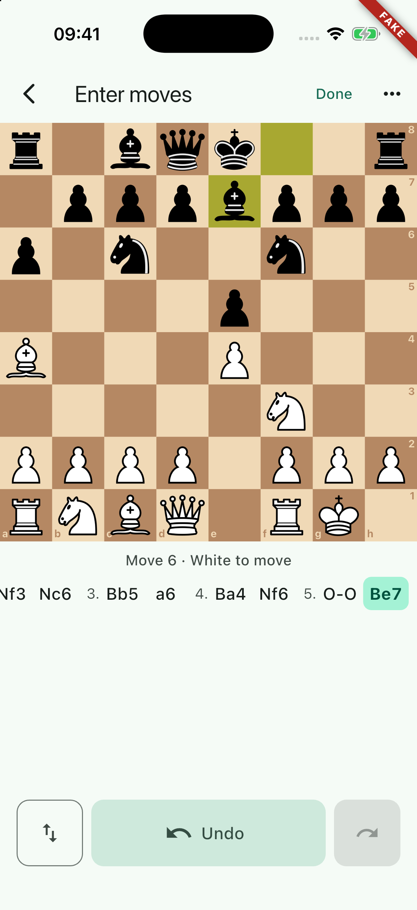 |
| ten plies, de, SE | 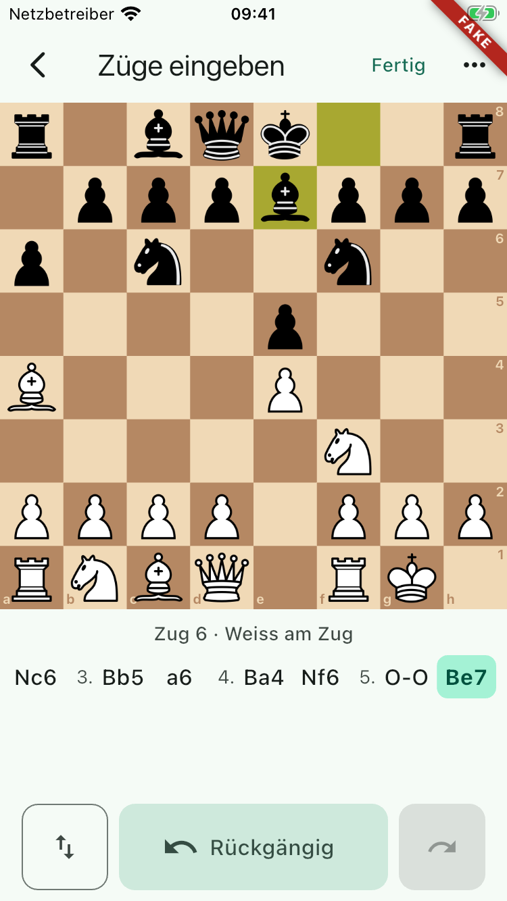 |
| mid-move: selection and legal-move dots, en | 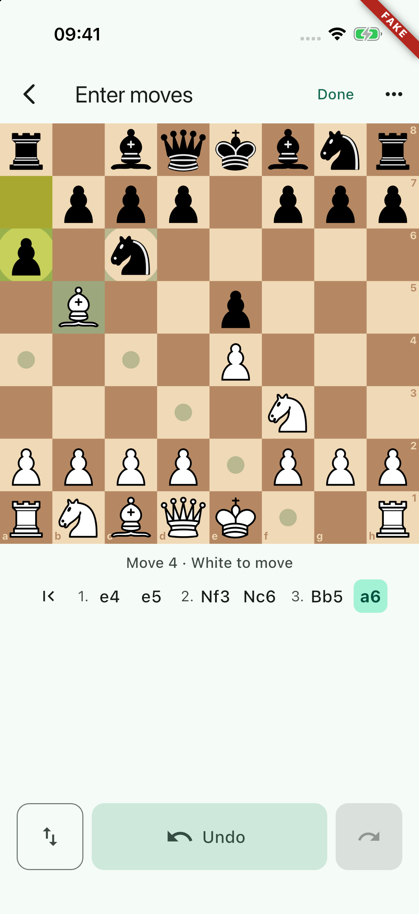 |
| empty state, de, SE | 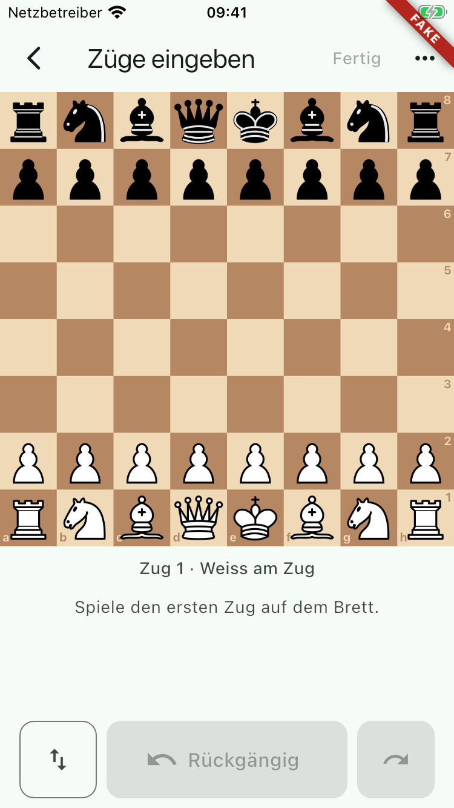 |
| overwrite sheet, de, 17 Pro | 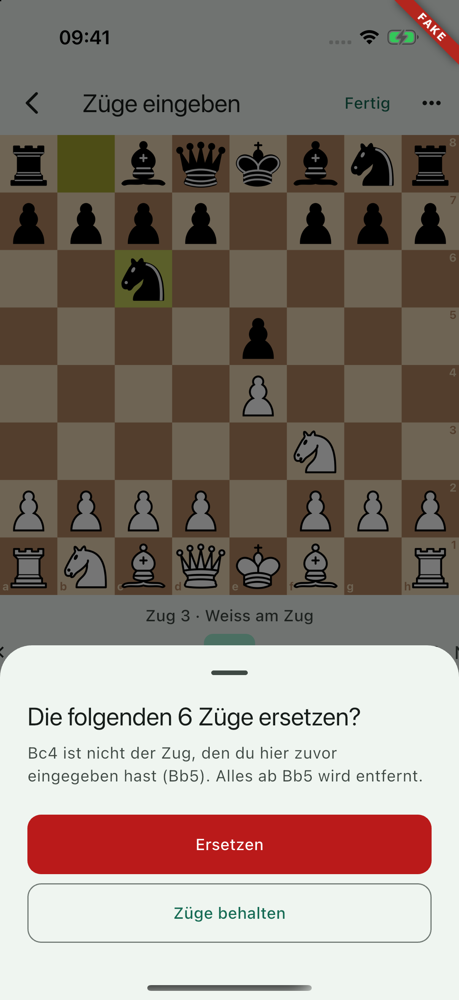 |
| overwrite sheet, en, SE | 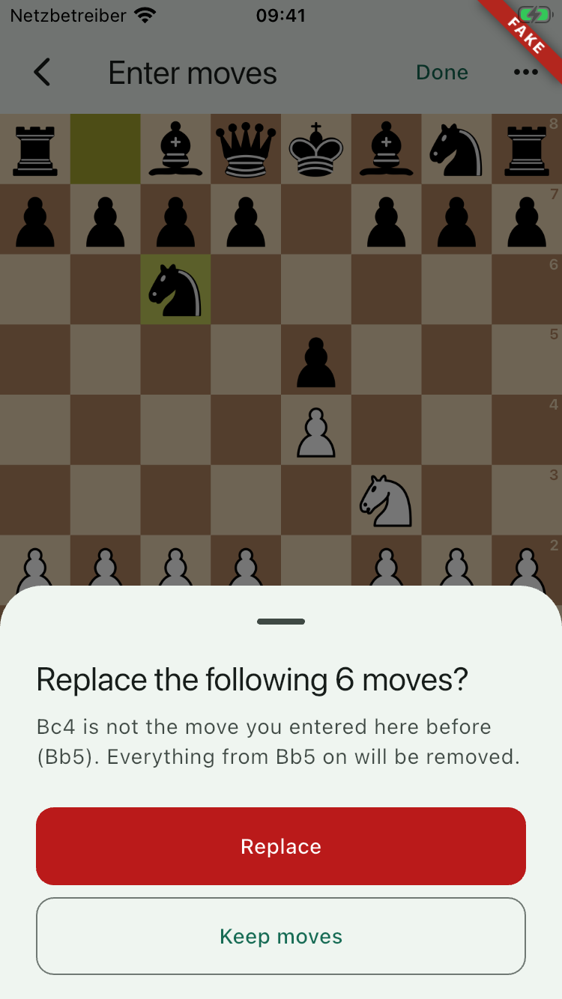 |
| promotion picker, en | 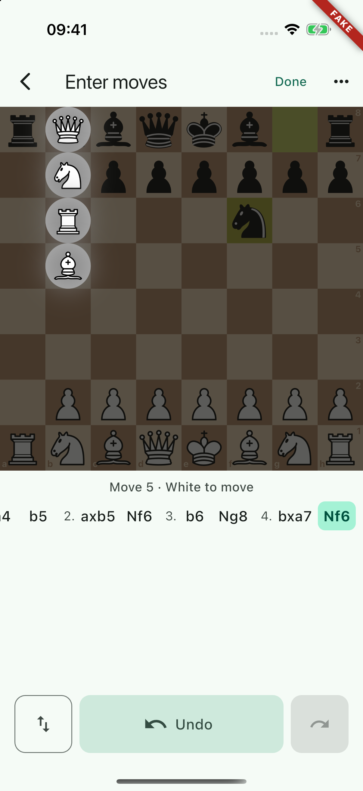 |
| 80-ply draft resumed, checkmate, en | 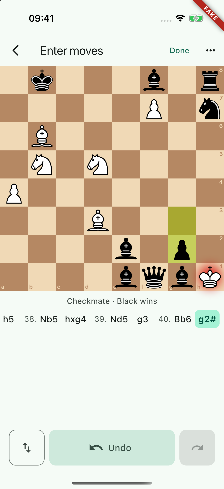 |
| the same, dark | 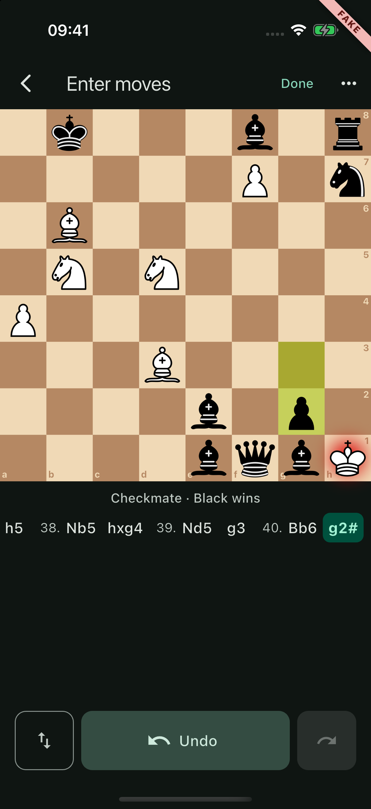 |
| the same, de, SE | 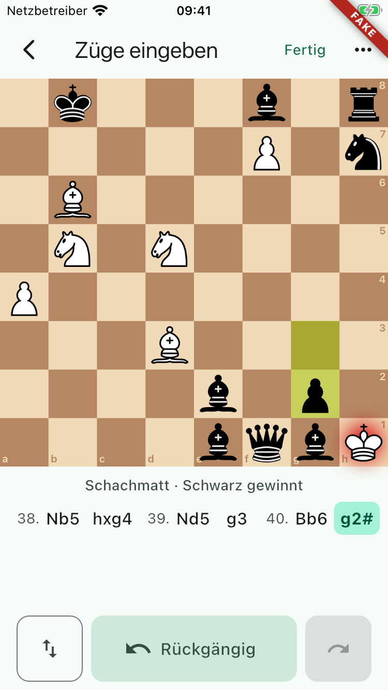 |
| after Done: snackbar on "Neue Partie", de | 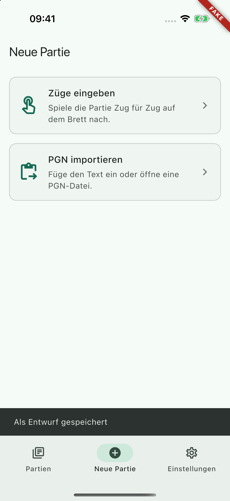 |
| dark, largest standard type (XXXL), de, SE | 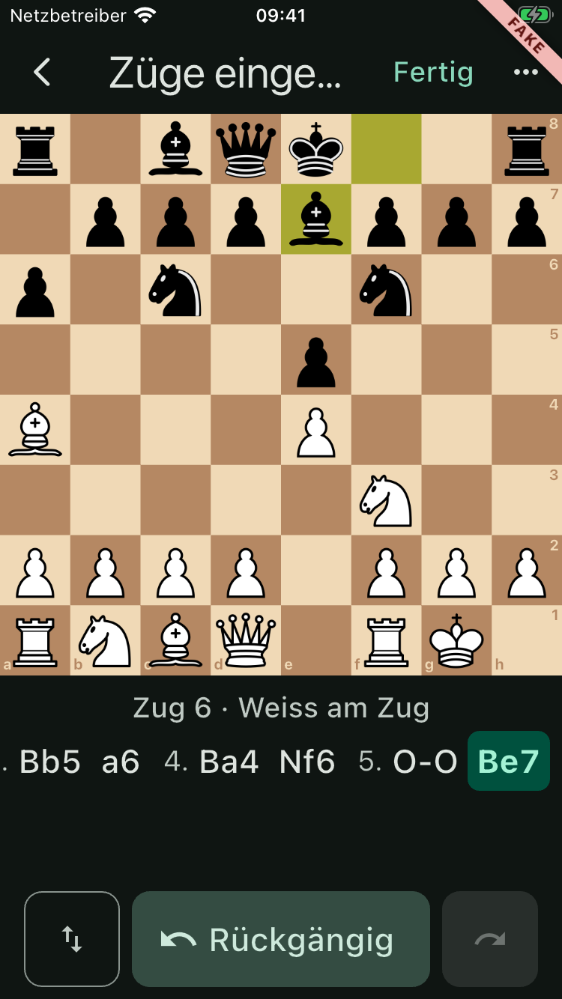 |

Nothing is clipped on either device. On the SE the board keeps the full width and the controls fit below it; at XXXL the app-bar title is ellipsised ("Züge einge…"), everything else is complete.

**What went wrong on the way, so nobody trusts a file that no longer exists.** A first batch of seven screenshots was taken after a `flutter build` that had in fact failed (`File` resolved to dartchess's chess file, not `dart:io`'s; the output was piped through `tail -1`), so the previous binary was reinstalled and every scenario silently ran the default one. Those seven files were deleted and retaken after the fix, with the install gated on "✓ Built". `WP-20-en-selection.png` is from the earlier, working build and shows the default scenario mid-tap.

**Not verified on a device: the overwrite sheet at XXXL type on the SE.** Two attempts produced a screenshot without a sheet (deleted both times). The demo found `entry-move-4` (no "nothing with identifier" line in the device log) and tapped it after scrolling it into view, but the jump did not happen; the cause is not established. That case is covered only by the widget test at text scale 1.3 on 375x667 (en/de x light/dark), which asserts that both sheet buttons are on screen. See Open points.

`inspect` through the simulator tool could not be run for the same access reason, so the accessibility tree is verified in widget tests only (identifiers, labels, enabled state, tap actions, German square labels). WP-04 left the same note.

## Handoff notes

**The undo rule.** *Undo always takes back the move shown on the board; Forward always brings it back. Only the last move of the line is ever removed without a confirmation.*

- Undo at the end of the line removes the last move from the line and from the PGN. This is the fast correction: undo, play the right move, no question. The removed move is remembered, so Forward restores it after an accidental undo; playing a different move forgets it (re-playing the same move by hand keeps the rest of the redo stack).
- Undo inside the line (after tapping a move in the list) only steps the cursor back. Forward steps on.
- Playing inside the line: the move already there just advances; any other move opens "Replace the following N moves?" (Replace / Keep moves; dismissing keeps). The board is controlled, so the piece snaps back while the sheet is open.
- The redo stack is not persisted; a resumed draft has none.

**`EntryGame`** (`lib/features/entry/domain/entry_game.dart`, immutable, pure Dart)

```dart
factory EntryGame.initial();
factory EntryGame.fromPgnMoves(String pgnMoves, {int? cursorPly, bool lenient = false}); // FormatException; lenient keeps the legal prefix
List<EntryMove> moves;          // EntryMove{NormalMove move (castling normalised to king-onto-rook), String san, NormalMove highlight (e1g1 form)}
int cursor; int plyCount; int tailLength;
Position position; Position finalPosition; Position positionAt(int ply); EntryMove? lastMove;
bool isAtEnd, canUndo, canRedo;
bool isLegal(NormalMove move);           // also rejects a promotion without a role
bool wouldOverwriteTail(NormalMove move);
EntryGame play(NormalMove move, {bool overwrite = false}); // ArgumentError if illegal, StateError for an unconfirmed overwrite
EntryGame undo(); EntryGame redo(); EntryGame goTo(int ply); // goTo clamps
String toPgnMoves();                     // "1. e4 e5 2. Nf3", no headers, no result, independent of the cursor
Outcome? outcome; String? suggestedResult; // '1-0' | '0-1' | '1/2-1/2' | null, from the END of the line
```

**dartchess gotcha:** `Position.isLegal(NormalMove(a7, b8))` is true without a promotion role, and playing it leaves a pawn on the last rank. `EntryGame.isLegal` guards against it; anything else that takes moves from outside (WP-22 import replays SAN, which is safe; engine lines in WP-29 are UCI) should check too.

**`EntryResult`**: `{String draftId, String pgnMoves, int plyCount, String? suggestedResult, Side orientation}`, value equality. `suggestedResult` is a hint for the result chips (checkmate, stalemate, insufficient material), never a fact. `orientation` is the side at the bottom when the user finished, a hint for "which colour did you play". The PGN is always the whole line, even when the cursor is inside it.

**Draft store seam** (`entry_draft_store.dart`)

```dart
abstract interface class EntryDraftStore {
  Future<EntryDraftSnapshot?> load(String draftId);
  Future<void> save(EntryDraftSnapshot snapshot);   // upsert by snapshot.id
  Future<void> delete(String draftId);
}
// EntryDraftSnapshot{String id, String pgnMoves, int cursorPly, Side orientation, DateTime updatedAt}
final entryDraftStoreProvider = Provider<EntryDraftStore>((ref) => InMemoryEntryDraftStore());
```

- WP-27 overrides `entryDraftStoreProvider` with a drift-backed implementation (map onto `drafts.id`, `pgn`, `updated_at`; `cursorPly` and `orientation` fit `meta_json`). `save` must not touch columns the entry screen does not own (state, metadata, `client_game_id`).
- Autosave: `EntryAutosaver`, trailing debounce 250 ms (an assert forbids more than 300 ms), writes chained so an older snapshot never lands last, flush on app pause/inactive, on leaving the screen (provider dispose) and in `finish()`. A failing store is logged and never disturbs entry.
- A game nobody touched is not saved. Once a draft exists, an emptied line is saved empty rather than deleted, because deleting would take WP-27's metadata with it. The screen never calls `delete`.
- Draft ids are UUID v4 from `newEntryDraftId()` (no `uuid` dependency yet; WP-13 may swap it).
- Resume: `context.go(AppRoutes.newGameEntryResume(id))` (`/new/entry?draftId=…`). An unknown id starts an empty game under that id; a damaged draft gives back its legal prefix.

**Where WP-27 connects the flow.** `EntryScreen({String? draftId, ValueChanged<EntryResult>? onDone})`. Today the router passes no `onDone`, so Done flushes the draft, shows "Saved as draft" and pops with the `EntryResult` (a caller that did `context.push<EntryResult>(AppRoutes.newGameEntry)` receives it; tested). To connect entry → metadata → submit queue, change one place, the entry `GoRoute` builder in `lib/router.dart`:

```dart
builder: (context, state) => EntryScreen(
  draftId: state.uri.queryParameters[AppRoutes.draftIdParam],
  onDone: (result) => context.push(AppRoutes.newGameMetadata, extra: result),
),
```

`AppRoutes.newGameMetadata` did not exist on this branch (WP-21 is parallel), hence the seam. With `onDone` set, no snackbar is shown.

**Other seams.** `screenWakelockProvider` (`ScreenWakelock.enable/disable`; the plugin implementation swallows and logs failures, which is why the existing full-app tests pass without an override). `entryAutoQueenProvider` (key `entry.autoQueen` through `preferencesProvider`; WP-36 can show the same switch in Settings, a feature's `domain/` may be imported). `entryClockProvider` for timestamps. The board theme is the default until a setting exists.

**Identifiers:** `entry-undo`, `entry-redo`, `entry-flip`, `entry-done`, `entry-menu`, `entry-auto-queen`, `entry-status`, `entry-overwrite-confirm`, `entry-overwrite-cancel`, `entry-move-<ply>` (`entry-move-0` jumps to the start), plus WP-04's `board-square-e4`. Each control is one semantics node with label, enabled state and tap action (`EntryIdentified`).

**Layout decisions.** Board full width, shrinking only when a small screen with large type needs the height. Status line and a horizontally scrolling move list directly under it (current move highlighted and auto-scrolled to the middle, moves after the cursor dimmed). Bottom row within thumb reach: flip, a 64-point Undo that takes the remaining width, forward. **Done sits in the app bar, not next to Undo**: an accidental Done during fast entry costs a navigation, an accidental Undo costs one tap on Forward. Haptic (`selectionClick`) on every accepted move only.

**Tests:** `test/features/entry/pump_entry.dart` has `pumpEntry(tester, {store, preferences, draftId, locale, brightness, textScale, screen})` returning the fakes, `settleAutosave`, `tester.tapEntryControl(id)` (scrolls a move chip into view first), `tester.playMoveWithoutSettling(uci)` (because `playMove` settles, and settling lets the 250 ms debounce run out), `tester.entryPgn`, `tester.entryState`. A snackbar leaves a 4 s timer: pump 5 s before the test ends.

**Dependencies:** `wakelock_plus ^1.8.0` (BSD-3-Clause; pulls `dbus`, MPL-2.0, Linux-only and tree-shaken on iOS, plus `xml`, `petitparser`, `args`) and `fake_async ^1.3.3` as a dev dependency (already in the lock through `flutter_test`). Rows are in `docs/dependencies.md`.

## Open points

1. **Overwrite sheet at XXXL on the SE is unverified on a device** (see Evidence). One hypothesis worth checking by hand: a touch that lands on the move list while its 150 ms auto-scroll is still running is taken by Flutter as "stop scrolling", not as a tap. If that is it, a very fast user could see a swallowed tap on a move chip right after playing a move, at any type size. Not reproduced, not ruled out.
2. A hit-test **warning** (not a failure) remains in `entry_screen_test.dart` when the test taps the "Always promote to queen" menu row at the top edge of the screen. The behaviour is asserted and passes (preference written, board auto-queens). The cause was not established and the warning was deliberately not silenced with `warnIfMissed: false`.
3. German uses Swiss spelling ("Weiss", "weisser Bauer"), following the `de_CH` launches in WP-03. If the product wants "Weiß", change `app_de.arb`.
4. SAN in the move list uses English piece letters (N, B, R, Q, K), as in PGN. German players write S, L, T, D. Figurine or localised display is a later decision; the stored PGN must stay English.
5. The 17 Pro has about 170 points of empty space between the move list and the controls. Candidates for it: captured pieces, or a two-line move list.
6. Simulator `inspect` still has not been run by anyone (access was refused here as in WP-04).
