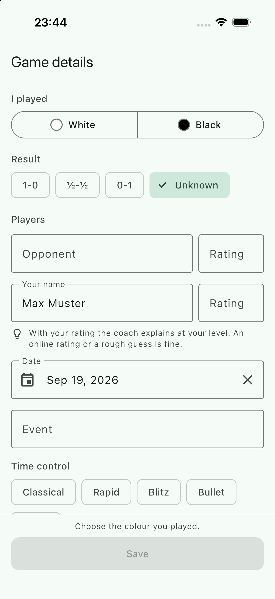
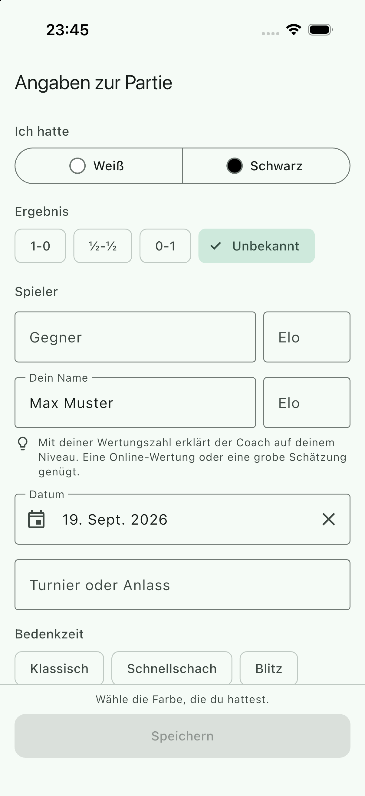
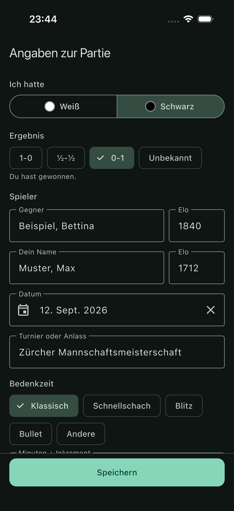

## Scope

PRD IN-2: "Game metadata: players, colour played, result, date, event, time control", plus both ratings, because the coach adapts its explanations to the player's rating.

- `lib/core/game/`: the shared domain model. `game_metadata.dart` (`GameMetadata`, `PlayerColor`, `GameResult`, `PlayerOutcome`, validation types), `game_date.dart` (`GameDate`), `time_control.dart` (`TimeControl`, `TimeControlKind`). Pure Dart, hand-written JSON, PGN header mapping both ways.
- `lib/features/metadata/ui/metadata_form.dart`: `MetadataForm`, the reusable form widget.
- `lib/features/metadata/ui/metadata_screen.dart`: `MetadataScreen` with a Save button, and `MetadataScreenArgs`.
- `lib/features/metadata/dev/metadata_demo.dart`: a development entry point that shows only this screen.
- `lib/router.dart`: one full-screen route, `/new/metadata` (append-only).
- 39 strings in both ARB files (prefix `metadata`), regenerated l10n output.
- Tests under `test/core/game/` and `test/features/metadata/`; the new location was added to `allLocations` in `test/l10n_and_scaling_test.dart`.

## Out of scope

Who opens the screen and what happens with the result: entry (WP-20), import (WP-22), game detail. Writing and parsing PGN text (`lib/core/chess`, WP-04): this package only maps tag pairs. The draft store (WP-13): it stores `toJson()` as `meta_json`. No "discard changes?" dialog on back.

## Contracts

**Consumes:** the WP-03 shell (`AppScaffold`, `AppTheme`, `AppSpacing`, `context.l10n`, `rootNavigatorKey`, `test/helpers/pump_app.dart`).
**Produces:** `GameMetadata` and its helpers, `MetadataForm`, `MetadataScreen`/`MetadataScreenArgs`, `AppRoutes.newGameMetadata`. Details under Handoff notes.

## Steps

1. Domain model with JSON, PGN headers and validation; unit tests.
2. Strings in both languages; form widget; screen and route; widget tests.
3. Simulator build of the demo entry point, screenshots in English and German, layout fixes.

## Acceptance commands

```bash
tool/check.sh
flutter build ios --simulator --debug --dart-define-from-file=config/fake.json \
  -t lib/features/metadata/dev/metadata_demo.dart
# then: install and launch on a throw-away simulator, screenshot in en and de
```

## Evidence

Run on 2026-09-19 (Flutter 3.47.5), after the last change.

`tool/check.sh` (progress lines cut)

```
==> 1/7 dependencies: flutter pub get --enforce-lockfile
==> 2/7 format: dart format --set-exit-if-changed
Formatted 80 files (0 changed) in 0.09 seconds.
==> 3/7 analyze: flutter analyze --fatal-infos
No issues found! (ran in 1.7s)
==> 4/7 licence headers: tool/check_headers.dart
check_headers: ok
==> 5/7 layer imports: tool/check_layers.dart
check_layers: ok
==> 6/7 codegen is clean: tool/gen.sh, then compare the working tree
codegen: clean
==> 7/7 tests: flutter test --exclude-tags golden
00:05 +171: All tests passed!
OK in 11s
```

`pubspec.yaml` and `pubspec.lock` are unchanged: no new dependency.

91 of the 171 tests are new:

- `test/core/game/` (54): JSON round trip through a string, the stored shape, unknown keys, enum values from a newer version, wrong types, an impossible date, non-objects; `toPgnHeaders` order, "?" and "????.??.??", every result, zero-padded dates, optional tags; `fromPgnHeaders` with "?", "-", blank, partial and broken dates, `UTCDate` as a stand-in, results as found in the wild, provisional and nonsense ratings, tag names in any case, colour inferred from the account name ("Muster, Max" is "Max Muster"); a full round trip through the headers; validation (only the colour is required, rating bounds inclusive, tomorrow allowed and the day after not, over-long text); `TimeControl` tag mapping both ways and the kind bands; `GameDate`.
- `test/features/metadata/metadata_form_test.dart` (31): date default reported once, kept, absent without the default, cleared, picked (the picker offers no future day); own name filled in and not overwritten; colour flip in both modes; the four result chips, tap-again, the "You won." line, spoken labels; rating digits and length, the low-value error only after leaving the field, the high-value error at once, the rating hint; time-control chips, inference from the numbers, a user's chip not overruled; keyboard "next" order; every label in German; text scale 1.3 on 375 x 667 in en and de, light and dark, in the tallest state (verdict line, two rating errors, long names and event), scrolled through. Each of those four asserts that the scale really is 1.3 and the brightness the requested one.
- `test/features/metadata/metadata_screen_test.dart` (6): pushed through the real router with `extra`, Save disabled until the colour is chosen and returning the metadata (including the default date nobody touched), an invalid rating blocking Save, back returning null, `MetadataScreenArgs.existingGame`, a deep link without `extra`, and German + dark + 1.3 on the small screen. `test/l10n_and_scaling_test.dart` also walks the new location in all four configurations.

**Simulator.** `flutter build ios --simulator --debug --dart-define-from-file=config/fake.json -t lib/features/metadata/dev/metadata_demo.dart` ended with `✓ Built build/ios/iphonesimulator/Runner.app`. A throw-away device `BC-WP-21` (iPhone 17 Pro, iOS 26.5) was created, the app installed and launched with `-AppleLanguages "(en)"` and with `-AppleLanguages "(de)" -AppleLocale de_CH`, and once more built with `--dart-define=METADATA_DEMO=filled` in dark appearance. The device was deleted afterwards. The screenshots were looked at, and three things were fixed because of them: the Black segment's icon took the text colour and was therefore white in the dark theme (now a painted disc with an outline); the "Players" heading sat on the floating label of the first field; the form scrolled under the Save bar without a dividing line.

| English | German | German, imported game, dark |
| --- | --- | --- |
|  |  |  |

**Not verified on the simulator:** anything that needs a tap. The simulator tool had no access to the device in this session ("The user has not granted Claude access"), and `simctl` cannot tap. So the keyboards (the return key on the rating fields, see below), the date picker and the colour flip were exercised in widget tests only. With `METADATA_DEMO=autofocus` the keyboard came up and the form resized above it; the keyboard area itself showed iOS's first-run "slide to type" card, so that screenshot was not kept.

## Handoff notes

### `GameMetadata` (`package:bogner_chess/core/game/game_metadata.dart`, which also exports `GameDate` and `TimeControl`)

Immutable, `const`-constructible, value equality. **Names and ratings are stored by colour**, not by role: `whiteName`, `blackName`, `whiteRating`, `blackRating`. The brief listed `playerRating`/`opponentRating` as fields; they are derived getters instead, like `opponentName`. Reason: a PGN and the server both speak in colours, and an imported game has facts about White and Black before anybody knows which of them is the user; role-based fields would have had nothing true to hold in that state.

| Member | |
| --- | --- |
| `GameMetadata({whiteName, blackName, playerColor, result = GameResult.unknown, playedDate, eventName, timeControl, whiteRating, blackRating})` | all optional |
| `GameMetadata.forPlayer({required playerColor, playerName, opponentName, playerRating, opponentRating, result, playedDate, eventName, timeControl})` | build it from the user's point of view |
| `playerName`, `opponentName`, `playerRating`, `opponentRating` | derived; null while `playerColor` is null |
| `PlayerOutcome? playerOutcome` | `win`, `loss`, `draw`; null without colour or result |
| `copyWith({...})` | leaving an argument out keeps the field, passing `null` clears it (sentinel); `result` is not nullable |
| `withSidesSwapped({bool flipPlayerColor = false})` | names and ratings change sides |
| `PlayerColor? inferPlayerColor(String? name)` | "Weis, Roman" equals "roman weis"; null when neither or both sides match |
| `MetadataValidation validate({GameDate? today})` | see below |
| `Map<String, String> toPgnHeaders()` | Seven Tag Roster in order (`Site` and `Round` are always "?"), then `WhiteElo`, `BlackElo`, `TimeControl` only when known. Unknown date is `????.??.??`. **Values are not escaped**; the PGN writer must escape `"` and `\`. |
| `GameMetadata.fromPgnHeaders(Map<String, String> headers, {PlayerColor? playerColor, String? playerName})` | never throws. "?", "-", blank and partial dates become null; `Date` wins over `UTCDate`; "1850?" is 1850; ratings outside 100..3500 are dropped; tag names in any case. Pass the account name as `playerName` to get the colour inferred. |
| `Map<String, Object?> toJson()` / `GameMetadata.fromJson(Object? json)` | camelCase keys plus `"v": 1`; result as the PGN string, date as `2026-09-19`, time control as `{"kind": "rapid", "detail": "15+10"}`. Reading never throws: unknown keys ignored, wrong types and unknown enum values read as "not known", a non-object gives `const GameMetadata()`. WP-13: `jsonEncode(metadata.toJson())` is `meta_json`. |
| `minRating` 100, `maxRating` 3500, `maxNameLength` 100, `maxEventLength` 120, `isPlausibleRating(int?)` | |

- Text getters normalise: trimmed, white space collapsed to one line, blank is null. Equality, JSON and PGN use the normalised values.
- `toString()` contains no names and no event, so logging one by accident leaks nothing. Keep it that way.
- `GameResult`: `whiteWins` "1-0", `blackWins` "0-1", `draw` "1/2-1/2", `unknown` "*"; `.pgn`, `GameResult.fromPgn(Object?)` (tolerant: "½-½", spaces, an en dash).
- `GameDate(year, month, day)`: a calendar day without time zone, deliberately not a `DateTime`. The constructor throws on a date that does not exist; `tryParseIso`, `tryParsePgn` return null. `toIso()`, `toPgn()`, `toLocalDateTime()`, `GameDate.today()`, `GameDate.fromDateTime`, `Comparable`. A partial PGN date is null, not "year only": the app knows a game's day or it does not. The original PGN text keeps the partial date for anyone who needs it.
- `TimeControl(kind, {detail})` with `TimeControlKind { classical, rapid, blitz, bullet, other }`. `detail` is what players write, minutes plus increment in seconds ("90+30"). `toPgnTag()` turns that into seconds ("5400+30") and passes any other text through; with a kind only there is no tag, so **a kind without numbers does not survive a PGN round trip** (it does survive JSON). `TimeControl.fromPgnTag("600+5")` is rapid "10+5"; several periods keep the tag text as detail. `TimeControl.kindForDetail` uses FIDE's bands on base plus 60 increments (up to 10 minutes blitz, under 60 rapid, above classical) and bullet under 3 minutes. That makes 10+0 blitz, where lichess says rapid; the user can overrule it with a chip.
- Validation: `validate()` returns `MetadataValidation` with `issues` (`MetadataIssue(field, problem)`), `isValid`, `missing`, `invalid`, `problemOf(field)`. `MetadataField { playerColor, whiteName, blackName, playedDate, eventName, timeControl, whiteRating, blackRating }` with `MetadataField.nameOf(color)` and `ratingOf(color)`; `MetadataProblem { missing, invalid }`. **Only the colour is required.** Invalid: a rating outside the bounds, over-long text, a date more than one day after today. The one day of slack is for online PGNs, whose date is UTC and therefore "tomorrow" for an evening game in America. `GameResult.unknown` is valid (an adjourned or unfinished game).

### Embedding the form

```dart
MetadataForm(
  initial: metadata,                 // read once; give the form a new key to load other data
  onChanged: (m) => setState(() => _metadata = m),   // every edit, valid or not
  defaultPlayerName: accountName,    // fills "Your name" when it is empty
  autofocus: false,                  // true: opponent's name focused, keyboard up
  swapSidesOnColorChange: true,      // see below
  defaultDateToToday: true,          // false for imports and stored games
  today: null,                       // tests only
)
```

- It is a `Column`, not a scroll view and not a route. Put it into a `SingleChildScrollView` (as `MetadataScreen` does, with `keyboardDismissBehavior: onDrag`) or a sheet. It brings no padding.
- When the form fills something in by itself (today's date, the default name), it reports that **once through `onChanged` right after the first frame**. A host that reads its own copy before that frame has the unfilled value; `MetadataScreen` shows the pattern.
- **`swapSidesOnColorChange`** decides what "I played Black" means. `true` (a game the user entered): what was typed is "me" and "my opponent", so both move to the other side of the board and the text fields stay as they are. `false` (an imported PGN, a stored game): White and Black are facts, only "which one is me" changes, and the fields are reloaded. With `false` and no colour yet the two rows are labelled "White" and "Black", White first, and the default name is held back until a colour is chosen. WP-22 and game detail want `false` together with `defaultDateToToday: false`; `MetadataScreenArgs.existingGame(initial:, defaultPlayerName:)` sets both.
- The colour control starts with nothing selected and cannot be deselected. Tapping the selected result chip goes back to "unknown"; tapping the selected time-control chip clears it.
- Typing "15+10" selects the Rapid chip; once the user has tapped a chip, the numbers no longer move it.
- Rating errors: above 3500 at once, below 100 only after the field loses focus ("15" may be on its way to "1500"). `onChanged` still reports the out-of-range number, and `validate()` flags it, so a Save button is disabled either way.
- Keyboard: "next" walks opponent name, opponent rating, (own name, skipped when it is filled), own rating, event, time control ("done"). Rating fields use `TextInputType.numberWithOptions(signed: true)` on purpose: the plain iOS number pad has no return key, so there would be no "next". The time-control field uses `TextInputType.datetime` to get digits and "+" with a return key. **Neither keyboard was seen on a device in this work package** (see Evidence); whoever next has tap access to a simulator should look at both.
- Keys for tests and the simulator tool: `MetadataFormKeys.color`, `.result(GameResult)`, `.outcome`, `.opponentName`, `.opponentRating`, `.playerName`, `.playerRating`, `.ratingHint`, `.date`, `.dateClear`, `.event`, `.timeControl(TimeControlKind)`, `.timeControlDetail`; `MetadataScreen.saveKey`, `.saveHintKey`. Note that `find.text('White')` is ambiguous while an imported game has no colour (segment and field label): search inside `MetadataFormKeys.color`.
- VoiceOver: section headings are headers, the result chips say "White won, 1-0", the narrow rating fields say "Your rating" / "Opponent's rating", the verdict line is a live region, the clear-date button has a tooltip.

### The screen and the route

```dart
final result = await context.push<GameMetadata>(
  AppRoutes.newGameMetadata,                       // '/new/metadata', AppRouteNames.newGameMetadata
  extra: MetadataScreenArgs(initial: draft.metadata, defaultPlayerName: name),
);
if (result != null) { ... }                        // null: the user went back
```

`MetadataScreen(args:)` also works with a plain `Navigator.push(MaterialPageRoute(...))`; Save calls `Navigator.pop<GameMetadata>`. The route is full screen (`parentNavigatorKey: rootNavigatorKey`). `extra` does not survive a cold start, so a deep link to `/new/metadata` shows the empty form; nothing links there. Save is enabled when `validate().isValid`; while it is not, a line above the button says why ("Choose the colour you played." or "Check the marked fields.").

### Strings

39 keys with the prefix `metadata`, appended to both ARB files. German uses standard-German "Weiß" (there is one `de` file; a `de_CH` file with "Weiss" is a separate decision). **Overruled at integration:** the app launches German as `de_CH` and the rest of the file already wrote "Weiss", so the three `metadata*` strings were changed to Swiss spelling and `test/core/l10n/arb_test.dart` now refuses `ß` outright. The short rating label is "Rating" in English and "Elo" in German, because that is what German-speaking players call any rating number; the hint under the own rating spells out that an online rating or a guess is fine.

### Dev entry point

`lib/features/metadata/dev/metadata_demo.dart` has its own `main()` and is imported by nothing. `--dart-define=METADATA_DEMO=filled` opens an imported game, `=autofocus` opens with the keyboard up. It is built into the app only when named with `-t`.
