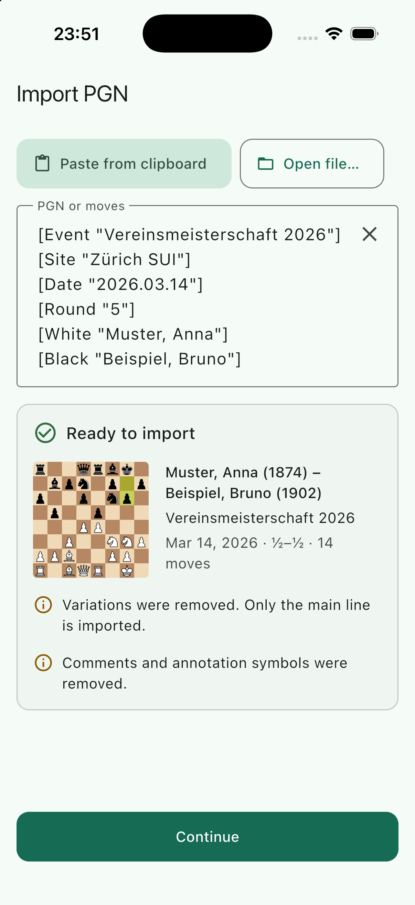
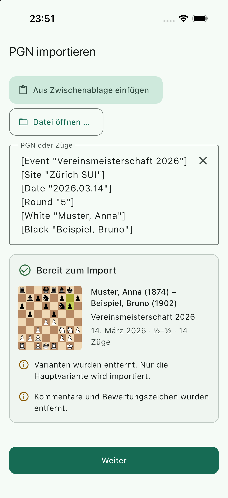
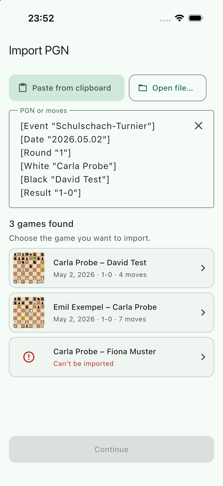
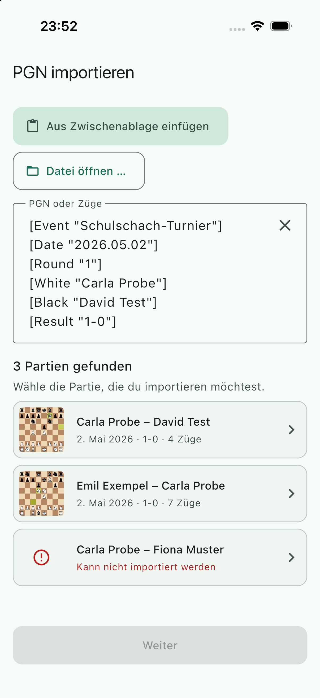
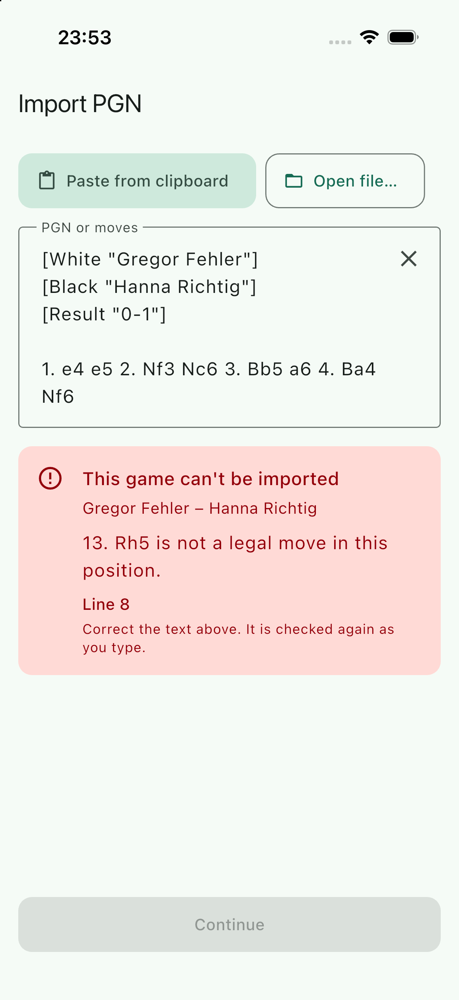
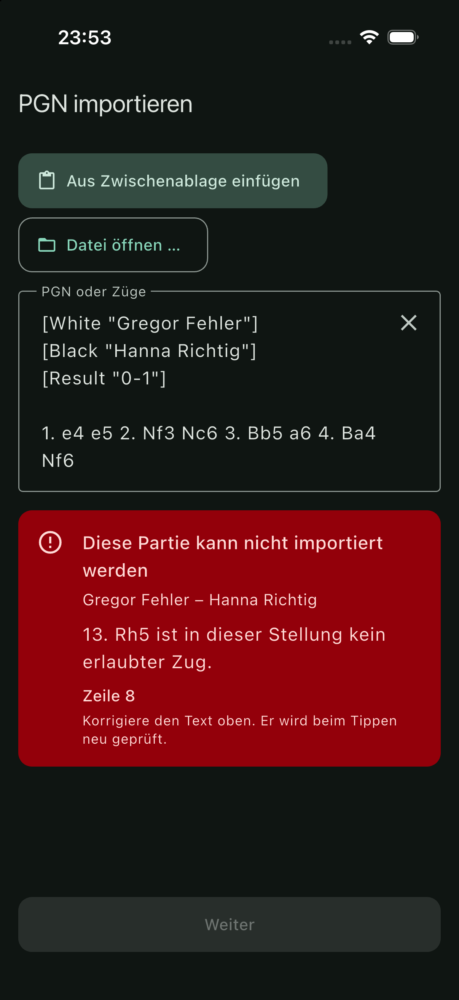

## Scope

The first half of PRD feature IN-3: get a game into the app from PGN text.

- `lib/core/pgn/pgn_import.dart` (pure Dart on `dartchess`): `parsePgnText`, a strict reader for PGN as people really have it, with typed errors. `lib/core/pgn/pgn_bytes.dart`: `decodePgnBytes` for files (UTF-8, UTF-16 with BOM, Latin-1).
- `lib/features/import/`: `ui/import_screen.dart` replaces the placeholder at `/new/import` (paste field, "Paste from clipboard", "Open file…", live validation, error panel, preview card, multi-game chooser, Continue); `ui/import_widgets.dart`, `ui/import_texts.dart`; `domain/import_result.dart` (`ImportResult`), `domain/pending_import.dart` (`pendingImportProvider`); `data/pgn_file_picker.dart` (`PgnFilePicker` interface and the `file_picker` implementation); `dev/import_demo.dart`.
- 40 strings appended to both ARB files; `file_picker ^13.1.0` in `pubspec.yaml` and `docs/dependencies.md`.
- Fixtures in `test/fixtures/pgn/` (written for this project, invented names): `lichess_style.pgn`, `chesscom_style.pgn`, `otb_annotated.pgn`, `multi_game.pgn`, `fen_start.pgn`, `broken.pgn`.

## Out of scope

`GameMetadata` (WP-21), the entry screen (WP-20), document types and "Open in…" (WP-23), the share extension (WP-24), the flow import → metadata → submit (WP-27). `router.dart` was not touched. Games from a set-up position and variations are V1.

## Contracts

**Consumes:** `BoardThumbnail` (WP-04), `AppScaffold`, theme tokens, `context.l10n`, `Log`, `pumpApp` (WP-03), `dartchess` 0.13.1.
**Produces:** `parsePgnText`, `PgnImportResult`, `PgnImportedGame`, `PgnRejectedGame`, `PgnImportError`, `PgnImportErrorCode`, `PgnImportWarning`, `decodePgnBytes`, `ImportScreen`, `ImportResult`, `pendingImportProvider`, `PgnFilePicker` / `pgnFilePickerProvider`. Details under Handoff notes.

## Steps

1. Read `dartchess`'s PGN parser; decide to write the reader on top of `dartchess`'s rules instead (see Handoff).
2. Parser, fixtures, unit tests.
3. Check `file_picker` 13 for Swift Package Manager and its v13 API; wrap it.
4. Screen, strings (en, de), widget tests.
5. Demo entry point, simulator build, screenshots in English and German, light and dark.

## Acceptance commands

```bash
tool/check.sh
flutter build ios --simulator --debug --dart-define-from-file=config/fake.json
tool/check_bundled_assets.sh
flutter build ios --simulator --debug --dart-define-from-file=config/fake.json \
  --dart-define=IMPORT_DEMO=single -t lib/features/import/dev/import_demo.dart   # also multi, error
```

## Evidence

All run on 2026-09-19, Flutter 3.47.5, after the last code change.

`tool/check.sh`

```
==> 2/7 format: dart format --set-exit-if-changed
Formatted 91 files (0 changed) in 0.22 seconds.
==> 3/7 analyze: flutter analyze --fatal-infos
No issues found! (ran in 3.3s)
==> 4/7 licence headers: tool/check_headers.dart
check_headers: ok
==> 5/7 layer imports: tool/check_layers.dart
check_layers: ok
==> 6/7 codegen is clean: tool/gen.sh, then compare the working tree
codegen: clean
==> 7/7 tests: flutter test --exclude-tags golden
OK in 14s
```

`flutter test --exclude-tags golden`: `+207: All tests passed!` (100 before). New: 65 in `test/core/pgn/` (61 parser, 4 byte decoding), 42 in `test/features/import/` (37 screen, 5 file picker).

The parser tests cover: the six fixtures; BOM; CRLF and lone CR; several games (with tags, without tags split at the result, without a blank line between them, two tag sections in a row); `{…}` comments over several lines with tag-like text inside; `;` comments; `%` escape lines; NAGs and glyphs (`Nf3!?`); clock, eval and arrow annotations (no warning); nested variations, a result inside a variation, illegal moves inside a variation; missing result, `*`, tag against termination marker, `1/2-1/2` without tags; junk before the first tag and before tag-less movetext; movetext without tags and without move numbers, `1.e4`, `1...e5`; `0-0` and `0-0-0`; promotion with and without `=`; long algebraic and over-specified SAN; illegal move, ambiguous move, a pinned piece that makes a move unambiguous, a typo that must not be skipped, null move, moves after mate (each with move number, side, SAN and line); FEN and SetUp tags in any letter case, a FEN tag with the normal starting position; variants; tags without moves; unterminated comment and variation; empty, no game, too large, too many games, 500 games at the default limits in well under a second; `toPgn()` round trip through this reader and through `dartchess`.

The widget tests cover: paste → preview → Continue (the `ImportResult` is asserted field by field); empty clipboard; debounced typing; the error panel (what and where) and that fixing the text clears it; one message per error code; clear; initial text with warnings; chooser → preview → back → a rejected game explains itself → Continue on another game; a 300-game text builds only the visible rows; the file picker fake (picked, cancelled, unreadable, too large); inside the real app: `pendingImportProvider` is taken once, a second offer replaces the text, Continue pops the route with the result; German strings and date format; de and en × light and dark × five states at text scale 1.3 on 375 × 667 without overflow; the dark error colours; a parse result crosses an isolate boundary.

`flutter build ios --simulator --debug --dart-define-from-file=config/fake.json`

```
Xcode build done.                                           18.4s
✓ Built build/ios/iphonesimulator/Runner.app
```

`tool/check_bundled_assets.sh`: `check_bundled_assets: ok`. The build changed nothing under `ios/`; the plugin arrives through Swift Package Manager:

```
ios/Flutter/ephemeral/Packages/FlutterGeneratedPluginSwiftPackage/Package.swift
18:        .package(name: "file_picker_darwin", path: "../.packages/file_picker_darwin-2.1.0"),
27:                .product(name: "file-picker-darwin", package: "file_picker_darwin"),
```

**Simulator.** A throw-away device `BC-WP-22` (iPhone 17 Pro, iOS 26.5) was created, the demo entry point built three times (`IMPORT_DEMO=single|multi|error`), installed and launched with `-AppleLanguages "(en)"` and `"(de)" -AppleLocale de_CH`, dark mode with `xcrun simctl ui <udid> appearance dark`. The device was deleted afterwards. All screenshots were looked at. The first German one showed the preview cut off below the nine-line field, so the field now shows at most six lines; the screenshots below are from after that change. The simulator tool's `screenshot`/`inspect` were not granted for the new device in this session, so the screenshots come from `xcrun simctl io screenshot`, and nothing was tapped on the device: the file picker sheet and the iOS paste prompt were **not** exercised on a device (see open points).

| | English | German |
| --- | --- | --- |
| Preview with warnings |  |  |
| Chooser, third game broken |  |  |
| Error panel |  |  (dark) |

## Handoff notes

**Why not `PgnGame.parsePgn` from dartchess.** Its parser "skips any invalid tokens". A typo such as `Nf9` is dropped silently, and the next move is then read for the wrong side: the rest is a different game or an error far from the cause. Its token pattern also ends in a stray `/`, so it never reads `1/2-1/2` from the movetext, and it splits games only at blank-line-plus-`[`. The reader here (one file, about 750 lines with the result types and comments) is written fresh (nothing adapted from lichess-org/mobile, so no GPL-3.0-only file and no NOTICE row). It uses `dartchess` for the rules only: `Position.legalMoves`, `makeSan`, `fen`. It is strict about moves and lenient about everything around them.

**Parser API** (`package:bogner_chess/core/pgn/pgn_import.dart`, pure Dart, never throws)

```dart
PgnImportResult parsePgnText(String text, {int maxChars = kPgnMaxChars /* 2 MiB, UTF-16 units */, int maxGames = kPgnMaxGames /* 500 */});

final class PgnImportResult {
  final List<PgnGameResult> games;   // every game in order, importable or not
  final PgnImportError? error;       // whole-input refusal; games is empty then
  List<PgnImportedGame> get importable;
}

sealed class PgnGameResult { int index; int line; Map<String, String> headers; } // headers raw, in order, unmodifiable

final class PgnImportedGame extends PgnGameResult {
  List<String> sanMoves;             // canonical SAN regenerated by dartchess
  String get movetext;               // "1. e4 e5 2. Nf3", one line, no comments, no result
  int get plyCount;
  String result;                     // 1-0 | 0-1 | 1/2-1/2 | *  (termination marker, else Result tag, else *)
  String finalFen;
  Move? lastMove;                    // for BoardThumbnail(lastMove:)
  int variationCount, commentCount, nagCount;
  Set<PgnImportWarning> get warnings; // variationsRemoved, commentsRemoved
  String toPgn();                    // original tags (Result normalised) + movetext + result
}

final class PgnRejectedGame extends PgnGameResult { PgnImportError error; }

final class PgnImportError {
  PgnImportErrorCode code; int? line; int? moveNumber; Side? side; String? token; int? limit;
  String? get moveLabel;             // "13. Rh5" / "10... Nd7"
}
```

| `PgnImportErrorCode` | Level | Fields set |
| --- | --- | --- |
| `empty`, `noGames` | input | – |
| `tooLarge`, `tooManyGames` | input | `limit` |
| `noMoves` | game | `line` (game start) |
| `customStartPosition` | game | `line`. `FEN` tag (any letter case) other than the normal starting position, or `SetUp "1"` without a FEN. V1. |
| `unsupportedVariant` | game | `line`, `token` (the variant). Accepted: none, `Standard`, `Chess`, `Classical`, `Normal`, `From Position` (which then fails on its FEN). Chess960 is rejected. |
| `illegalMove`, `ambiguousMove` | game | `line`, `moveNumber`, `side`, `token` (SAN as written, without glyphs) |
| `unreadableToken` | game | same; `token` is the word. Null moves (`--`) land here. |
| `unterminatedComment`, `unterminatedVariation` | game | `line` where it opens |

Behaviour worth knowing:

- `moveNumber` is counted from the moves read, not taken from the numbers in the text; written move numbers are ignored entirely.
- `commentsRemoved` is set by comments with real text, NAGs (`$1`) and glyphs (`!?`). Comments that contain only `[%clk …]`, `[%eval …]`, `[%cal …]` and the like do **not** set it, otherwise every online export would carry a warning.
- Variations are counted at the top level only; nothing inside them is validated.
- Game boundaries: a tag pair at the start of a line after movetext; a termination marker (then the next move or move number starts a tag-less game); a second `Event` tag in a tag section.
- Before the first game and between games, words that are not moves are skipped as prose ("Here is my game:"). A move or a dotted move number ends that. Consequence: a PGN whose first game has no tags but whose later games do is read correctly, but prose containing a bare SAN-looking word ("e4 is my favourite") would start a game.
- Tolerated: `e.p.`, evaluation symbols (`+-`, `=`, `+/-`, `∞`, `N`), a stray `)` or `}`, a broken tag line, `e8Q`, `e2-e4`, `Ng1f3`, `1/2` and `½-½` as a draw. `Kg1` is not accepted as castling. German piece letters are not read; the unreadable-token message tells the user to use K, Q, R, B, N.
- 500 copies of a 33-ply game parse in well under a second, so the limits are about memory and UI, not time.

**`ImportResult`** (`lib/features/import/domain/import_result.dart`): `movetext`, `headers` (raw tag map), `warnings` (`Set<PgnImportWarning>`), plus `result`, `plyCount`, `finalFen`. `ImportResult.fromGame(PgnImportedGame)` builds it. Whoever needs a full PGN string: `PgnImportedGame.toPgn()`, or tags from the metadata form plus `movetext` plus `result`.

**`ImportScreen({String? initialText, ValueChanged<ImportResult>? onContinue})`**. With `onContinue` the screen calls it and stays; without, Continue does `Navigator.maybePop(result)`, so `final r = await context.push<ImportResult>(AppRoutes.newGameImport)` works (tested). The route in `router.dart` is unchanged (`const ImportScreen()`), and `NewGameScreen` still uses `context.go`, which drops the result. Typed text is checked 300 ms after the last change; pasted, picked and pushed text at once; text over 64 KiB in an isolate with a progress row. Widget keys for tests and integration tests: `import-field`, `import-paste`, `import-open-file`, `import-clear`, `import-continue`, `import-hint`, `import-checking`, `import-error` (`-message`, `-where`), `import-preview` (`-players`, `-facts`), `import-warning-variationsRemoved`, `import-warning-commentsRemoved`, `import-games-found`, `import-game-<index>`, `import-choose-another`.

**Seams**

- **WP-21 (metadata).** Nothing here imports `GameMetadata`. At merge time: `GameMetadata.fromPgnHeaders(importResult.headers)`; `ImportResult.result` is the already-normalised result if the form wants a default. The preview's own tag reading (`import_texts.dart`: players, ratings, event, date) is display-only and could move to `GameMetadata` later.
- **WP-23 ("Open in…") and WP-24 (share extension).** `ref.read(pendingImportProvider.notifier).offer(pgnText)`, then `router.go(AppRoutes.newGameImport)`. The screen takes the text once when it opens (the slot is emptied, so opening the screen by hand later starts empty), and also while it is already open, where a second text replaces the first. Read file bytes with `decodePgnBytes`, and check the size before (`kPgnMaxChars`). No route `extra` was added: `go` to a location that is already showing does not rebuild the screen's state, a provider does.
- **WP-27 (submit flow).** Either push the route and await the `ImportResult`, or build `ImportScreen(onContinue: …)` in the route and navigate to the metadata step from the callback. WP-20's entry seam was not merged when this was written; if it differs, adapt this screen to it, the change is the `_continue` method.
- **WP-13 (drafts).** Not connected. The pasted text lives in the screen's state only.

**`file_picker` 13.1.0** (MIT, victorcarreras.dev) was chosen as planned: its iOS implementation `file_picker_darwin` 2.1.0 ships a `Package.swift`, the app builds with Swift Package Manager and no CocoaPods, and nothing under `ios/` changed. `file_selector` was the prepared fallback and was not needed. No Info.plist key is required for picking documents (the document picker returns a copy; `LSSupportsOpeningDocumentsInPlace` from WP-01 is for WP-23). v13 API as used: `FilePicker.pickFile(type: FileType.custom, allowedExtensions: ['pgn', 'txt'])` returns `PlatformFile?`; `await file.length()` is `int?` (null: unknown, then the bytes are measured after reading); `readAsBytes()`. On iOS the extensions become uniform types: `pgn` resolves to the `com.chess.pgn` type WP-01 declared, `txt` to plain text, which also admits `.pgn` files another installed app has claimed under its own type as long as that type conforms to text. Only `lib/features/import/data/pgn_file_picker.dart` imports the plugin; tests override `pgnFilePickerProvider`, and `pgn_file_picker_test.dart` swaps `FilePickerPlatform.instance`. The log line for a failed read carries the exception type only, never the file name or content.

**Open points**

- The document picker sheet and the iOS "allow paste" prompt were not driven on a device in this session (no tap access to the simulator). The Dart side is tested with fakes; the native side is only proven to build and link. WP-23 or WP-40 should pick a real `.pgn` from Files once.
- "Line N" in the error panel counts real line breaks, while the field soft-wraps long lines, so on a phone the number is a hint rather than something to count on screen. Selecting the offending token in the field would be better; the error would need a character offset, which the reader has at hand (`_i`) but does not expose yet.
- `pubspec.yaml`: `file_picker` sits alphabetically after `dartchess`, where WP-13's `drift` will want to go as well: expect a trivial conflict there, and at the end of both ARB files.
- German piece letters (S, L, T, D) and figurine notation are not read. Club players in Switzerland do write them by hand; worth a V1 ticket.
- The fixtures use the site names in `Site` tags and file names (`lichess_style.pgn`), which is test data describing an export format, not branding; nothing of it reaches the app or the screenshots.
