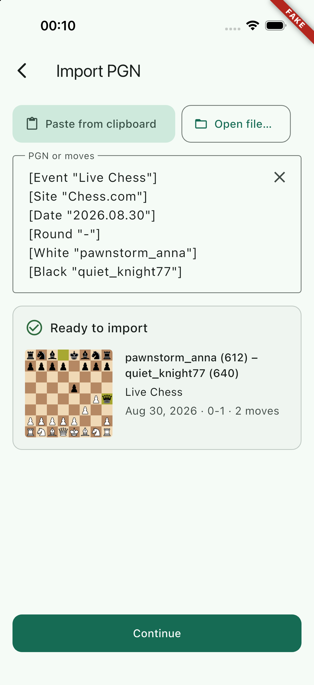
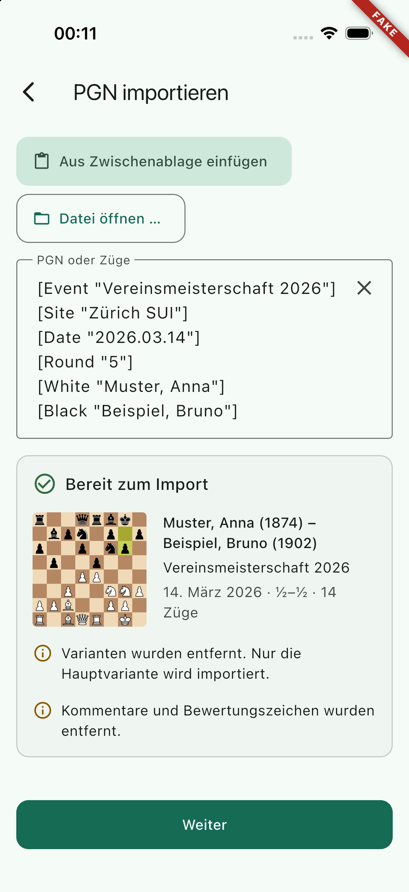
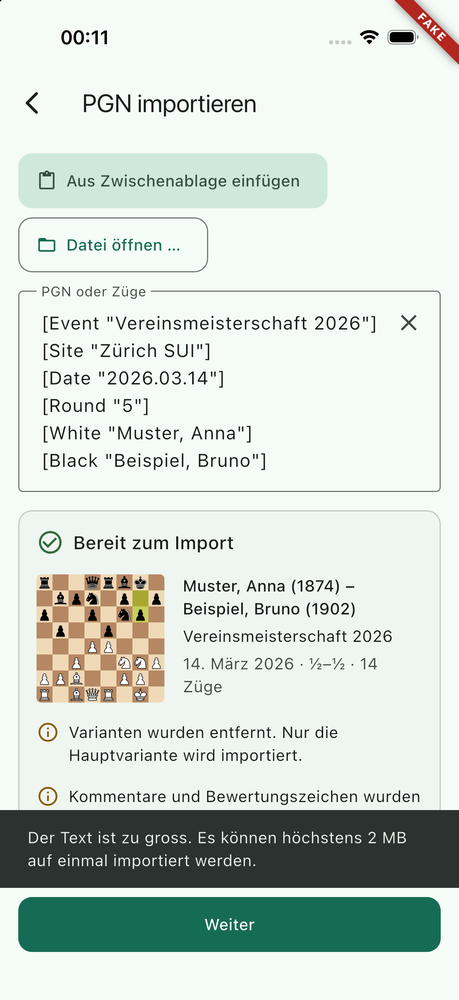
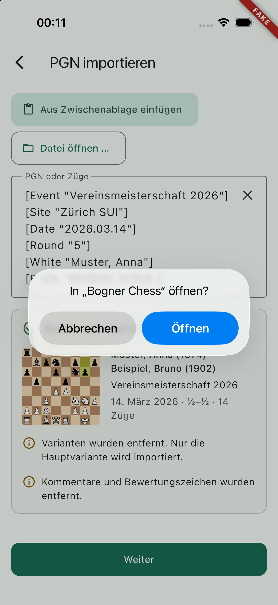

## Scope

Part of PRD feature IN-3. A `.pgn` file opened from Files, Mail or the share sheet ("Open in Bogner Chess", "Copy to Bogner Chess") lands on the import screen with its text filled in, from a cold start and while the app runs, signed in or signed out. Links of the app's scheme (`com.bognerchess.mobile://games/<id>/review`) open their location through one mapping table. The OIDC redirect on the same scheme is left alone. The hand-off URL of the future share extension has a seam.

- `ios/Runner/IncomingLinkHandler.swift` (new), registered in `AppDelegate.swift`; `FlutterDeepLinkingEnabled = false` in `Info.plist`.
- `lib/core/links/`: `incoming_link.dart` (events, the source interface, the event channel), `link_target.dart` (classification and the mapping table), `incoming_link_service.dart`, `incoming_link_notices.dart`, `shared_pgn_source.dart`.
- One line each in `lib/main.dart` (start the service) and `lib/app.dart` (the notice widget), a small hook in `lib/router.dart`.
- Tests in `test/core/links/`; `docs/ios-project.md`, `docs/dependencies.md`.

## Out of scope

The share extension, the App Group and the real `SharedPgnSource` (WP-24). Auth (`lib/core/auth`, `lib/features/auth`, WP-25). Push (WP-32). Universal links (no associated domains in the MVP). No change to the import screen, no new strings.

## Contracts

**Consumes:** `pendingImportProvider` and `AppRoutes.newGameImport` (WP-22), `decodePgnBytes`, `kPgnMaxChars` (WP-22), `routerProvider`, `authRedirect` and its `from` parameter (WP-03), the document type, the imported `com.chess.pgn` type, `LSSupportsOpeningDocumentsInPlace` and the URL scheme in `Info.plist` (WP-01), the strings `importErrorTooLarge` and `importFileUnreadable` (WP-22).

**Produces:** `incomingLinkServiceProvider` / `IncomingLinkService` (`start`, `openLocation`), `classifyLink` / `classifyUri` / `LinkTarget`, `IncomingLinkSource` / `incomingLinkSourceProvider`, `SharedPgnSource` / `sharedPgnSourceProvider`, `incomingLinkNoticeProvider`, `externalLinkRedirect` in the router, the event channel `com.bognerchess.mobile/incoming_links`. Details under Handoff notes.

## Steps

1. Read `app_links` 7.2.1 (pub.dev API and its iOS source) and decide: not used, see Handoff notes.
2. Check in the Flutter 3.47.5 engine headers how scene URL events reach app code (`FlutterSceneLifeCycleDelegate`, `addSceneDelegate`) and what the engine does with URLs by itself (`FlutterDeepLinkingEnabled`).
3. Swift handler, Dart classification, service, notices, router hook.
4. Tests.
5. Simulator: file open warm and cold, refused file, custom-scheme URL.

## Acceptance commands

```bash
tool/check.sh
flutter build ios --simulator --debug --dart-define-from-file=config/fake.json
tool/check_bundled_assets.sh
git diff ios/Runner.xcodeproj      # four added lines, no build setting
```

## Evidence

All run on 2026-09-20, Flutter 3.47.5, after the last code change.

`tool/check.sh`

```
==> 1/7 dependencies: flutter pub get --enforce-lockfile
Got dependencies!
==> 2/7 format: dart format --set-exit-if-changed
Formatted 149 files (0 changed) in 0.26 seconds.
==> 3/7 analyze: flutter analyze --fatal-infos
No issues found!
==> 4/7 licence headers: tool/check_headers.dart
check_headers: ok
==> 5/7 layer imports: tool/check_layers.dart
check_layers: ok
==> 6/7 codegen is clean: tool/gen.sh, then compare the working tree
codegen: clean
==> 7/7 tests: flutter test --exclude-tags golden
00:13 +540: All tests passed!
OK in 48s
```

`flutter test test/core/links`: `+132: All tests passed!` New tests:

- `link_target_test.dart` (76): every row of the mapping table in all four spellings (`scheme://games/…`, `scheme:///games/…`, `scheme:/games/…`, `/games/…`), scheme and host in any case, UUID, numeric and base64-style ids, query and fragment dropped, the id percent-encoded again; the OIDC redirect in seven spellings and that no target prints a URL; `shared-pgn` with and without a path; hostile input: locations that are not in the table (`sign-in?from=https://evil…`, `consent/ai`, `new/metadata`), path traversal plain and percent-encoded in the id position, encoded slash and backslash, NUL, whitespace, a right-to-left override, SQL and HTML fragments, an over-long id, dot segments, foreign schemes (`https`, `file`, `javascript`, `data`, look-alike schemes), user info, a port, a scheme-less authority, an over-long URL; about 19 000 generated combinations of awkward fragments never throw.
- `incoming_link_service_test.dart` (40), the whole app with a fake link source: a document while the app runs (import screen, text in the field, preview, slot emptied, back leads to the New game tab, a second document replaces the first, Latin-1 and UTF-16, text that is no PGN shows the import screen's error panel); refused documents (2 MiB + 1 byte, exactly 2 MiB accepted, a PNG, a zip, NUL bytes, an empty file, both native failure reasons, German); cold start (document, app link and a refusal that all arrive before the first frame); signed out (the document waits in `pendingImportProvider`, sign-in shows with `from=/new/import`, after signing in the import screen has the text; the same from a cold start; an app link; a refusal still shows its message); URLs (the stack below a deep link, the OIDC redirect changes nothing and logs nothing, eight ignored URLs including `file:///etc/passwd` leave the location alone and never show the not-found screen, no URL and no content in the log); the `shared-pgn` seam (no-op by default, a fake source goes the document's way, is asked once per link, obeys the size limit); `openLocation`; start twice, dispose, an error on the stream, a throwing source.
- `incoming_link_platform_test.dart` (7): decoding of the channel events, unknown shapes dropped, the mocked event channel delivers in order.
- `router_links_test.dart` (9): `externalLinkRedirect`; a custom-scheme URI given to `go` and pushed by the platform; signed out; unknown link; the OIDC redirect does not show the not-found screen; a pending import offered before `go` is prefilled on the import route.

`flutter build ios --simulator --debug --dart-define-from-file=config/fake.json`

```
Xcode build done.                                            5.5s
✓ Built build/ios/iphonesimulator/Runner.app
```

`tool/check_bundled_assets.sh`: `check_bundled_assets: ok`. The built `Info.plist` has `FlutterDeepLinkingEnabled = false`. `git diff ios/Runner.xcodeproj` is four added lines (file reference, build file, group entry, sources entry, ids `BC23…01` and `BC23…02`), no build setting. No package was added; `pubspec.yaml` and `pubspec.lock` are unchanged.

**Simulator.** A throw-away device `BC-WP-23` (iPhone 17 Pro, iOS 26.5) was created, the fake-config build installed, and the device deleted afterwards. All screenshots were looked at. The file-open path can be driven end to end from the command line, because `xcrun simctl openurl <udid> "file://…"` hands the URL to the app's document handler without a confirmation (commands in `docs/ios-project.md`, "Incoming links and documents"):

| Step | Result |
| --- | --- |
| App running (English). `chesscom_style.pgn` copied into the app's `Documents`, `simctl openurl file://…/Documents/game.pgn` | Import screen, text filled in, "Ready to import" with players, date and board: . The file in `Documents` was still there afterwards (only an `Inbox` copy is ever deleted). |
| App **terminated**, language German. `otb_annotated.pgn` copied into the Files app's local storage (`…/Shared/AppGroup/<id>/File Provider Storage/Vereinsabend.pgn`, outside the app's container), `simctl openurl file://…` | The app starts and opens on the import screen with the text and both warnings: . This is the `scene(_:willConnectTo:options:)` path and the "events kept until Dart listens" path. |
| App running. A 3.6 MB `.pgn` | Nothing imported, message "Der Text ist zu gross. Es können höchstens 2 MB …":  |
| `simctl openurl "com.bognerchess.mobile://games/abc/review"` | iOS asks "In «Bogner Chess» öffnen?": . **The dialog could not be tapped**: the simulator tool was not granted access to the new device in this session ("The user has not granted Claude access to BC-WP-23"). What happens after "Open" is covered by the tests only; the native function behind it is the same one the file URLs went through. |

**Manual check still worth doing once (about two minutes, any simulator or device):** (1) run the `openurl` command for the custom-scheme link above, tap "Open", expect the review placeholder for game `abc` with back leading to the game and then the library; (2) in the Files app long-press a `.pgn` → Share → "Bogner Chess" (or "Open in Bogner Chess"), and from Mail tap a `.pgn` attachment → share → "Copy to Bogner Chess"; expect the import screen with the text. The Mail path is the one that produces an `Inbox` copy, which the handler deletes after reading; check that `Documents/Inbox` in the app container is empty afterwards. On a real device the security scope is enforced, in the simulator it is not: the simulator run proves the plumbing, not the sandbox.

## Handoff notes

**`app_links` was not added.** Licence (Apache-2.0), publisher and Swift Package Manager support (`is:swiftpm-plugin`, a `Package.swift` next to the podspec) are fine. But its iOS side, read in full, forwards only `url.absoluteString`. With `LSSupportsOpeningDocumentsInPlace` the file URL is security-scoped and the scope belongs to the `URL` object iOS hands over, so the read has to happen natively in any case; and the handler that does it sees the custom-scheme URLs in the same two callbacks. One Swift file with one event channel replaced the package; the row in `docs/dependencies.md` moved from "Planned" to "Rejected" with this reasoning. Nothing was adapted from lichess-org/mobile: I looked at its `shared_pgn_service.dart` and `Info.plist` for the approach only (native side reads the content, Dart gets text; `FlutterDeepLinkingEnabled` false), which matches what the constraints here lead to anyway. No GPL-3.0-only file, no `NOTICE` row.

**How a URL travels.** iOS → `FlutterSceneDelegate` → objects registered with `registrar.addSceneDelegate`, in registration order, until one returns `true` → if nobody did and `FlutterDeepLinkingEnabled` is not `false`, the engine pushes the URL into the router. `IncomingLinkHandler` is registered *before* `GeneratedPluginRegistrant`, claims file URLs and app-scheme URLs, and returns `false` for the OIDC redirect and anything foreign. `FlutterDeepLinkingEnabled = false` closes the engine's own path, which would have shown the not-found screen for `file:///…`, for the OIDC redirect and (host position) for every custom-scheme link. Keep it `false`; if it ever has to be switched on, `externalLinkRedirect` in the router still normalises custom-scheme URIs and sends the OIDC redirect to the start location.

**Native side.** `startAccessingSecurityScopedResource()` synchronously in the callback; then on a background queue a coordinated read (`NSFileCoordinator`, because a file-provider file may have to be downloaded first) of at most 2 MiB + 1 byte through a `FileHandle`, so a huge file is never loaded; `stopAccessing…`; if the file was not opened in place and lies in an `…Inbox` directory inside the app's container, that copy is removed. No path and no file name crosses the channel or reaches a log, and there is no method Dart could call to make the native side read a path: path traversal has nothing to hold on to. Channel events: `{kind: url, url}`, `{kind: file, bytes}`, `{kind: fileError, reason: tooLarge | unreadable}`. Events before Dart listens are kept (at most four) and flushed in `onListen`; there is no "initial link" call, so the classic double delivery cannot happen. `resourceValues(forKeys: [.isRegularFileKey, .fileSizeKey])` is not a required-reason API (the file-timestamp category covers dates, not size), so the privacy manifest is unchanged.

**Dart side.** `IncomingLinkService.start()` is called in `main.dart` before `runApp`. `GoRouter.go` before the first frame works (tested: document, link and refusal on a cold start), so there is no queue on the Dart side. For a document: size check again, refuse empty files and files with a NUL byte unless they start with a UTF-16 byte order mark, `decodePgnBytes`, `pendingImportProvider.offer(text)`, `router.go(AppRoutes.newGameImport)`. Whether the text is a legal game is left to the import screen, which explains errors better than a message from here could. Signed out, nothing special is done: the router redirects to `/sign-in?from=/new/import`, the text waits in the provider (memory only), and after signing in the existing `from` redirect opens the import screen, which takes the text.

**Refusals need a voice.** A file that is too large or unreadable produces no navigation, so without a message "Open in Bogner Chess" would appear to do nothing. `IncomingLinkNotices` sits in `MaterialApp.builder` (inside `EnvBanner`), listens to `incomingLinkNoticeProvider` and shows a snack bar on whatever screen is up, sign-in included. It reuses `importErrorTooLarge` and `importFileUnreadable`; no ARB change. The too-large text says "The text is too large", which is slightly off for a file; a dedicated string is a one-line follow-up if someone minds.

**The mapping table** is `_linkRoutes` in `lib/core/links/link_target.dart`, the only place that says what the outside may open: `games`, `games/<id>`, `games/<id>/review`, `new`, `new/entry`, `new/import`, `settings`. Sign-in, consent, the metadata form and the settings sub-pages are deliberately absent. An id is `[A-Za-z0-9_.~=+:-]{1,128}` and not dots only; the location is built with `AppRoutes.game(id)`, which percent-encodes again. Query and fragment are dropped. Dart's `Uri` resolves dot segments and escapes stray percent signs before the classifier sees them, which the tests pin down. **When a route is added that a link or a push may open, add one row there and one line to the `accepted` map in `link_target_test.dart`.**

**WP-24 (share extension).** The URL `com.bognerchess.mobile://shared-pgn` already arrives: the Swift handler forwards it, `classifyLink` gives `SharedPgnTarget` (only without a path; nobody names a file through a link), and the service calls `ref.read(sharedPgnSourceProvider).take()`. Today that is `NoSharedPgnSource` (returns null, marked `TODO(WP-24)` in `lib/core/links/shared_pgn_source.dart`). To finish: implement `SharedPgnSource.take()` with a method channel that reads **and deletes** `shared.pgn` in the App Group container and returns the bytes (`Uint8List`, not text: the service does the size check, the NUL check and `decodePgnBytes`), cap the read at 2 MiB natively as `IncomingLinkHandler.load` does, and change the provider's default. A good home is a second channel next to `IncomingLinkHandler.swift`, which has to be added to the Runner target only (the extension does not link Flutter). Nothing else in `lib/core/links` needs to change; `incoming_link_service_test.dart` has the tests with a fake source ("the share extension hand-off") to extend. The extension cannot call `UIApplication.open` directly; lichess walks the responder chain for that, which is their code (GPL-3.0-only header and `NOTICE` row if adapted). If the extension also wants to pass *text* (Chess.com and Lichess share PGN as plain text), write it into the same `shared.pgn`.

**WP-32 (push tap).** Do not build a location by hand from the payload and do not pass a payload string to `router.go`. Either build it from typed fields, `router.go(AppRoutes.gameReview(gameId))`, or, if the payload carries a link or a path, call `ref.read(incomingLinkServiceProvider).openLocation(value)`: it runs the same classification (accepts `/games/<id>/review` and the three custom-scheme spellings, refuses everything else, returns whether it navigated). A push tap on a cold start can call it before the first frame, like the links here. The signed-out case is handled by the router's `from` redirect, as for links. `FlutterDeepLinkingEnabled` is `false`, so nothing from the notification reaches the router unless the push code sends it.

**WP-25 (auth).** The OIDC redirect is ignored at three levels: the Swift handler neither forwards nor claims it (returns `false`, so `flutter_appauth` still sees it if `ASWebAuthenticationSession` did not intercept it), `classifyLink` returns `IgnoredTarget(oauthRedirect)` without logging, and the router hook sends it to the start location instead of the not-found screen. Recognised as: first segment or host `oauthredirect`, any case, any query. If the redirect path in `config/*.json` ever changes, change `kOAuthRedirectSegment` (Dart) and `oauthRedirectSegment` (Swift) with it. `main.dart` gained one line inside the guarded zone, before `runApp`; expect a trivial conflict if WP-25 adds its bootstrap at the same spot.

**Open points**

- The custom-scheme link was not driven past the iOS confirmation dialog on a device, and the Files/Mail share sheet was not used by hand (no tap access in this session). See "Manual check" above. WP-40 should include one `.pgn` from Files on a real device, where the security scope is enforced.
- A document that arrives while the user is in the middle of entering a game replaces the stack with New game → Import (`router.go`). Once drafts are persisted (WP-13/WP-20) nothing is lost; until then the entered moves are. If that is not acceptable, the service is the place to ask first.
- `LSHandlerRank` stays `Alternate` and the type stays imported, as WP-01 decided: a `.txt` with PGN inside is not offered to the app. That is what paste and the share extension are for.
- `lib/core/links` imports `features/import/domain/pending_import.dart` and `router.dart`. The layer check allows it (only feature-to-feature `ui/` and `data/` imports are forbidden), and the task asked for the service to live in `core`; if a stricter "core never imports features" rule arrives, move `pendingImportProvider` to `core/pgn`.
