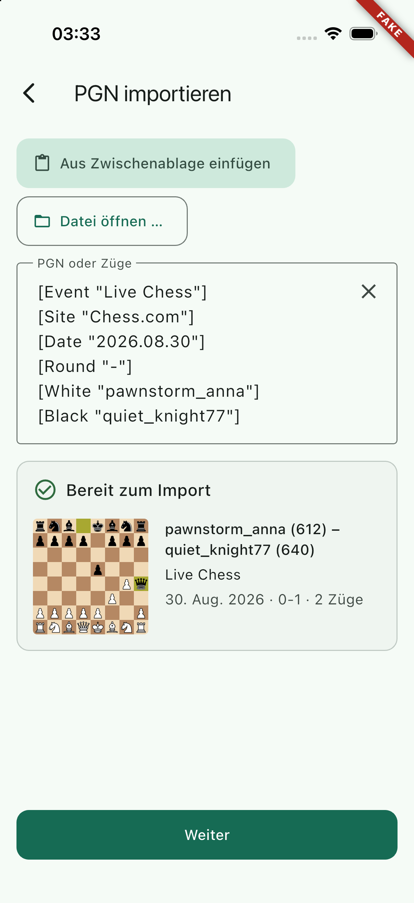
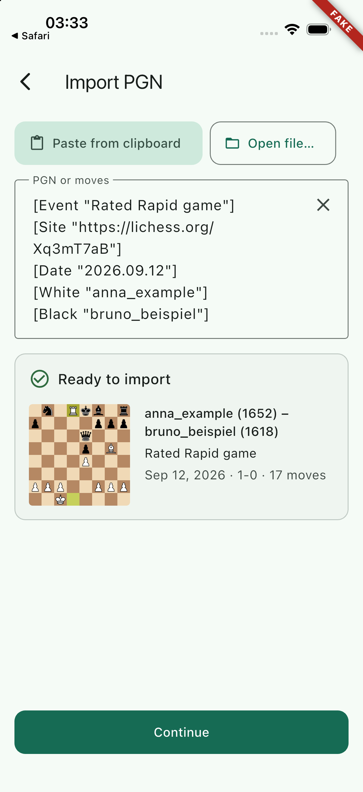
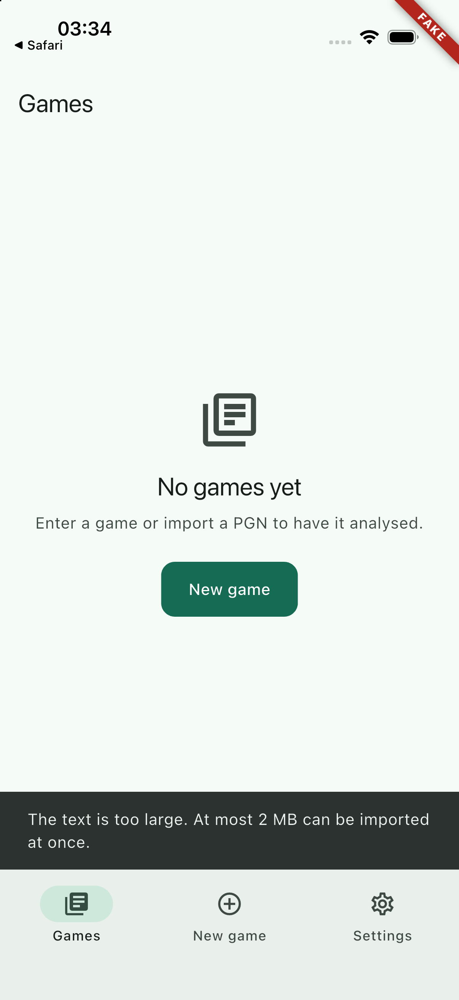

## Scope

Part of PRD feature IN-3. "Bogner Chess" appears in the share sheet of other apps for plain text (how Chess.com and Lichess share a PGN; a text selection in Safari or Mail) and for `.pgn` and text files. The shared PGN ends up on the import screen, from a cold start and while the app runs, signed in or signed out.

- New Xcode target `ShareExtension` (`com.bognerchess.mobile.share`, iOS 16, iPhone only), embedded in Runner: `ios/ShareExtension/{ShareViewController.swift, Info.plist, ShareExtension.entitlements, PrivacyInfo.xcprivacy}`, `ios/Config/ShareExtension{,-Debug,-Release}.xcconfig`, generated by `ios/Scripts/add_share_extension.rb`.
- App side: `ios/Runner/SharedPgnInbox.swift` (method channel, reads and deletes `shared.pgn` in the App Group container), registered in `AppDelegate.swift`; the App Group in `Runner.entitlements`; `lib/core/links/shared_pgn_source.dart` (`PlatformSharedPgnSource`, now the default) and `incoming_link_service.dart` (pickup on the link, at start and on every return to the foreground).
- Simulator debug builds are signed ad hoc instead of not at all (`ios/Config/Debug.xcconfig`), so that they carry entitlements.
- Tests: `test/core/links/` (Dart), `ios/RunnerTests/SharedPgnInboxTests.swift` (XCTest).
- `NOTICE`, `lib/features/about/domain/additional_licenses.dart` (the adapted file), `docs/ios-project.md`, `docs/building.md`, `docs/dependencies.md`.

## Out of scope

Game links (a lichess.org or chess.com URL shared instead of a PGN): the activation rule ignores URLs, fetching a game is a server question. Push (WP-32), fastlane and signing (WP-50), the developer portal (H5). No change to the import screen, no new ARB string. `ios/Runner/Info.plist` is untouched.

## Contracts

**Consumes:** the `SharedPgnSource` seam, `SharedPgnTarget`, `IncomingLinkService`, `IncomingLinkHandler.maxFileBytes` and the URL `com.bognerchess.mobile://shared-pgn` (WP-23); `pendingImportProvider`, `decodePgnBytes`, the strings `importErrorTooLarge` and `importFileUnreadable` (WP-22); the xcconfig layering and `BC_ENTITLEMENTS_<target>` (WP-01); the strict Swift header check (WP-02).

**Produces:**

- App Group `group.com.bognerchess.mobile.share`, file `shared.pgn` in its root: the whole protocol between extension and app. Bytes, undecoded, at most 2 MiB.
- Method channel `com.bognerchess.mobile/shared_pgn`, method `take`, no arguments, answers `Uint8List?` (or the error code `noContainer`).
- `PlatformSharedPgnSource`, `IncomingLinkService.collectSharedPgn()` (returns whether a PGN was imported).
- The target `ShareExtension` and its three xcconfig files; ad-hoc signed simulator builds.

## Steps

1. Read the WP-01, WP-02, WP-22 and WP-23 handoff notes and lichess-org/mobile `ios/ShareExtension` at `f4543db`.
2. Research: build-phase order for Flutter with an embedded extension; opening the host app from a share extension on iOS 18 and later (see Handoff notes).
3. Dart: platform source, foreground and start pickup, tests.
4. Swift: `SharedPgnInbox`, XCTest, the extension.
5. `xcodeproj` script, xcconfig files, entitlements, ad-hoc signing for the simulator.
6. Builds, simulator run, documentation.

## Acceptance commands

```bash
tool/check.sh
flutter build ios --simulator --debug --dart-define-from-file=config/fake.json
flutter build ios --release --no-codesign
tool/check_bundled_assets.sh
/usr/libexec/PlistBuddy -c "Print :CFBundleIdentifier" -c "Print :CFBundleShortVersionString" -c "Print :CFBundleVersion" \
  build/ios/iphonesimulator/Runner.app/PlugIns/ShareExtension.appex/Info.plist
git show --stat HEAD -- ios/Runner.xcodeproj
```

## Evidence

All run on 2026-09-20 with Flutter 3.47.5 and Xcode 27.0, after the last code change, with no `ios/Config/Local.xcconfig` (no team).

`tool/check.sh`

```
==> 1/7 dependencies: flutter pub get --enforce-lockfile
==> 2/7 format: dart format --set-exit-if-changed
Formatted 183 files (0 changed) in 0.24 seconds.
==> 3/7 analyze: flutter analyze --fatal-infos
No issues found! (ran in 2.3s)
==> 4/7 licence headers: tool/check_headers.dart
check_headers: ok
==> 5/7 layer imports: tool/check_layers.dart
check_layers: ok
==> 6/7 codegen is clean: tool/gen.sh, then compare the working tree
codegen: clean
==> 7/7 tests: flutter test --exclude-tags golden
00:14 +842: All tests passed!
OK in 23s
```

`dart tool/check_headers.dart --strict-swift` again after `git add` (the checker lists files through git): `check_headers: ok`. `ShareViewController.swift` passes as an adapted file (`GPL-3.0-only`, provenance line with a 40-character sha, no app-store permission).

Builds

```
$ flutter build ios --simulator --debug --dart-define-from-file=config/fake.json
Xcode build done.                                           15.9s
✓ Built build/ios/iphonesimulator/Runner.app
$ flutter build ios --release --no-codesign
Xcode build done.                                           31.3s
✓ Built build/ios/iphoneos/Runner.app (21.9MB)
$ tool/check_bundled_assets.sh
check_bundled_assets: ok
```

No "Cycle inside Runner" in either build. The built app:

```
Runner.app/PlugIns/ShareExtension.appex/Info.plist
  CFBundleIdentifier          com.bognerchess.mobile.share
  CFBundleShortVersionString  0.1.0     (the app: 0.1.0)
  CFBundleVersion             1         (the app: 1)
  MinimumOSVersion 16.0, UIDeviceFamily [1], CFBundleDisplayName "Bogner Chess"
  NSExtensionPointIdentifier  com.apple.share-services
  NSExtensionPrincipalClass   ShareExtension.ShareViewController
```

With `--build-name 9.8.7 --build-number 65` both `Info.plist` files say `9.8.7` and `65`: the extension's versions follow `pubspec.yaml` through `Generated.xcconfig`. The release build is "not signed at all" (`codesign -dv`), as before. The simulator build: `Signature=adhoc`, `TeamIdentifier=not set`; the executables of the app and of the extension contain a `__TEXT,__entitlements` section with `com.apple.security.application-groups = [group.com.bognerchess.mobile.share]` (and `aps-environment = development` for the app). `xcodebuild -showBuildSettings` for the `ShareExtension` target shows no `DEVELOPMENT_TEAM`, `CODE_SIGN_IDENTITY = -`, `IPHONEOS_DEPLOYMENT_TARGET = 16.0`, `TARGETED_DEVICE_FAMILY = 1`, `CODE_SIGN_ENTITLEMENTS = ShareExtension/ShareExtension.entitlements`. (On this Mac the simulated `application-identifier` has a team prefix although no team is set anywhere, not even with `DEVELOPMENT_TEAM=` on the command line: Xcode takes it from the account configured in Xcode. It is in the build product only, not in the repository.)

Tests

- `flutter test test/core/links`: `+151: All tests passed!` (was 132). New or changed: the group "the share extension hand-off" in `incoming_link_service_test.dart` (16 tests, fake `SharedPgnSource`): no native side; nothing waiting (start, link, resume); warm through the link, again the same link, back leads into the app; warm without the link, found on resume; link and resume together deliver once; cold start before the first frame; cold start through the link, still once; signed out, waits in `pendingImportProvider` with `from=/new/import` and arrives after signing in; the same from a cold start; an empty file; 2 MiB + 1 byte on the link and on a cold start in German; exactly 2 MiB accepted; binary content; no content in the log; no foreground check after dispose. `shared_pgn_source_test.dart` (7, mocked method channel): default provider, channel and method name, bytes and no argument, null, no native side, a native error logs the code and never the message. "A failing source is contained" now covers start, link and resume.
- `xcodebuild test -workspace ios/Runner.xcworkspace -scheme Runner -destination id=<udid> -only-testing:RunnerTests`: `** TEST SUCCEEDED **`, 11 of 11 (`SharedPgnInboxTests`: nothing waits; delivers once and deletes; bytes unchanged; too large is cut one byte after the limit and deleted; exactly the limit; empty file; a directory of that name is removed unread; a symbolic link is not followed and its target survives; leftovers of an interrupted take are removed, other files are not; the limit and the group id).
- `flutter test test/features/about`: the licence list has the adapted-source entry, and its sha is the one in the Swift header and in `NOTICE`.

**Simulator.** A throw-away device `BC-WP-24` (iPhone 17 Pro, iOS 26.5) was created, the fake-config build installed, and the device deleted afterwards. All screenshots were looked at.

| Step | Result |
| --- | --- |
| `xcrun simctl get_app_container <udid> com.bognerchess.mobile groups` | `group.com.bognerchess.mobile.share  …/Containers/Shared/AppGroup/D1713E93-…`: the container resolves with the ad-hoc signed build. |
| `xcrun simctl spawn <udid> pluginkit -m -v -p com.apple.share-services` | lists `com.bognerchess.mobile.share(0.1.0)` at `…/Runner.app/PlugIns/ShareExtension.appex`: iOS has registered the extension for the share sheet. |
| App **not running**, German. `chesscom_style.pgn` copied to `<group>/shared.pgn`, `simctl launch` | Import screen with the text and "Bereit zum Import"; `shared.pgn` is gone:  |
| App **running in the background** (Safari in front), English. `lichess_style.pgn` copied to `shared.pgn`, `simctl launch` (same pid, so a return to the foreground) | Import screen with the text and "Ready to import", the status bar shows "◀ Safari"; `shared.pgn` is gone:  |
| The same with a 2.7 MB file | Nothing imported, "The text is too large. At most 2 MB can be imported at once."; the file is gone:  |
| `simctl openurl <udid> "com.bognerchess.mobile://shared-pgn"` | iOS asks "In «Bogner Chess» öffnen?". **Not tapped**: the simulator tool had no access to the new device ("The user has not granted Claude access to BC-WP-24"). What follows is covered by the Dart tests; the native forwarding of the URL is WP-23's and unchanged. |

**Not verified, and not verifiable from the command line: the share sheet itself and whether iOS 26 lets the extension open the app.** `simctl` cannot open a share sheet, and the device could not be tapped. What is proven is everything on both sides of that step: the extension compiles with `APPLICATION_EXTENSION_API_ONLY`, is embedded, registered with `com.apple.share-services`, and the app picks up what the extension writes. The manual steps are in `docs/ios-project.md`, "The share extension → Trying it" (seven steps, about five minutes; step 4 is the one that answers the iOS 26 question). WP-40 should include them on a real device.

**`git show --stat HEAD -- ios/Runner.xcodeproj`**: `project.pbxproj | 163 +++++++++---`, 150 insertions, 13 deletions, all made by `ios/Scripts/add_share_extension.rb`.

- The 13 deleted lines are not deletions: xcodeproj sorts each section by object id when it saves, which moves the hand-made lines of earlier work packages to the end of their sections (`BC23…01/02` `IncomingLinkHandler.swift`, twice one line; the `BC01…01` Config group, eleven lines). They reappear unchanged among the insertions, the Config group with three new children.
- New objects have the ids `BC24000000000000000000NN` (27): file references for the three xcconfig files, `SharedPgnInbox.swift` (+ build file in Runner's Sources), `SharedPgnInboxTests.swift` (+ build file in RunnerTests' Sources), the group `ShareExtension` with its four files, the product `ShareExtension.appex`; the native target with Sources (`ShareViewController.swift`), Frameworks (empty) and Resources (`PrivacyInfo.xcprivacy`) phases; its configuration list with Debug, Release and Profile, each with a base configuration and **`buildSettings = { }`**; in Runner a target dependency (with its container item proxy) and the copy phase "Embed Foundation Extensions" (`dstSubfolderSpec = 13`, PlugIns) as the **first** build phase; `TargetAttributes` for the new target.
- No build setting was added, changed or removed anywhere in the file. No `DEVELOPMENT_TEAM`, no `PRODUCT_BUNDLE_IDENTIFIER`, no `CODE_SIGN_*`. The comment next to the local Swift package reference, which xcodeproj shortens and Flutter's migrations look for, is restored by the script.
- The scheme file is unchanged: the extension is built as a dependency of Runner.

## Handoff notes

**The protocol is one file.** The extension writes the shared bytes, undecoded and at most 2 MiB, atomically to `shared.pgn` in the root of the App Group container; a PGN that still waits is replaced. The app takes it with `SharedPgnInbox.take`: move aside (so a PGN written in that moment is not deleted unread), read at most 2 MiB + 1 byte, delete, return. A result of 2 MiB + 1 byte *is* the "too large" answer: Dart applies the same limit and shows the usual message, so the channel needs no second kind of answer. Anything that is not a plain file is removed unread. Dart sends no argument and gets no path; nothing about the content is logged on either side. The group id and the file name are literals in two Swift files and two entitlements files; an XCTest pins the app's side.

**Opening the app from the extension is best effort, on purpose.** Researched on 2026-09-20: `NSExtensionContext.open(_:)` answers false for share extensions; the classic responder-chain call of `openURL:` is refused since iOS 18 ("BUG IN CLIENT OF UIKIT … needs to migrate to the non-deprecated UIApplication.open(_:options:completionHandler:). Force returning false"); calling that non-deprecated method on the `UIApplication` found in the responder chain is what people report as working on iOS 18 (Apple developer forums thread 764570), while Apple's DTS calls every such route unsupported and recommends a local notification instead. I found no statement either way for iOS 26 and could not try it (see Evidence). So: the extension tries `context.open`, then the responder chain with the current method (through its implementation pointer, because the method is marked unavailable for extensions at compile time; it is public API, not a private one), and takes the completion handler's answer seriously. If the app was not opened, or nothing answers within two seconds, it shows "Saved. Open Bogner Chess to continue." for 3.5 seconds (tap to dismiss) and the app finds the file on its next start or return to the foreground. That is why `IncomingLinkService` checks at `start()` and on `AppLifecycleListener.onResume`, not only on the link. When link and foreground arrive together, the second `take` finds nothing; the native side serialises them on one queue. A local notification was not added: it needs the notification permission, which is WP-32's to ask for. If the manual test shows that iOS 26 refuses the open, WP-32 can add "tap to continue" as a notification from the extension; the pickup does not change.

**App Review.** The responder-chain open is what lichess-org/mobile and many share extensions ship; it uses public API only. Should a review ever object, delete `openURLViaResponderChain` and its call: the message path then becomes the normal path and nothing else changes.

**Adapted code.** `ShareViewController.swift` started from lichess-org/mobile `ios/ShareExtension/ShareViewController.swift@f4543db42b8d5fb4d4fd533fa56218a4a34eb667` (overall flow, the `context.open` then responder-chain order). Changed: bytes instead of a decoded string, the size limit and capped file read, all attachments of the item searched, the iOS 18 call, the completion result and the fallback HUD, German and English messages. Header `GPL-3.0-only` with the provenance line, row in `NOTICE`, entry "Adapted source: lichess-org/mobile" in `additional_licenses.dart`, and a test that keeps the three shas equal. Upstream has no per-file copyright line, so the header says "the lichess-org/mobile authors". Everything else (plist, entitlements, `SharedPgnInbox.swift`, the Dart side, the script) was written here. Their `Info.plist` rule accepts only their PGN type; ours also accepts plain text.

**Activation rule.** One item, exactly one attachment conforming to `com.chess.pgn` or `public.plain-text`. A `.txt` with a PGN inside works (WP-23's "Open in" does not offer that). A bare URL, a web page or a photo does not activate the extension. An app that shares a link *together with* a text attachment does activate it, and the text is what arrives; if it is no PGN, the import screen says so. The type `com.chess.pgn` resolves because the app imports it (WP-01); the extension declares nothing itself.

**Strings.** The extension cannot read ARB files. Its three sentences are in `ShareViewController.swift` in German and English, chosen by `Locale.preferredLanguages`, and the "too large" text is word for word `importErrorTooLarge`. If that ARB string changes, change it there as well. `.lproj` folders were not worth three strings; `CFBundleLocalizations` (de, en) is in the extension's `Info.plist`.

**Simulator builds are signed ad hoc now** (`CODE_SIGNING_ALLOWED = YES`, `CODE_SIGN_IDENTITY = -` for `[sdk=iphonesimulator*]` in `Config/Debug.xcconfig`), the switch WP-01 prepared. No team, certificate or account is needed; both acceptance builds ran without `Local.xcconfig`. Side effect, useful for WP-32: the simulator build now carries `aps-environment` as well.

**The target has no build settings in `project.pbxproj`.** Everything is in `ios/Config/ShareExtension.xcconfig` (bundle id, `INFOPLIST_FILE`, `APPLICATION_EXTENSION_API_ONLY`, `SKIP_INSTALL`, `SWIFT_VERSION`, run-path) and in the two base files, which include `../Flutter/Generated.xcconfig` first (versions), then `Debug.xcconfig` or `Release.xcconfig` (so `Local.xcconfig` and the team reach the extension too), then the overrides. Profile uses the Release file, as Runner does. Xcode's "Signing & Capabilities" pane will want to write `DEVELOPMENT_TEAM`, `CODE_SIGN_ENTITLEMENTS` and friends into the target: check `git diff ios/Runner.xcodeproj` after using it.

**Build-phase order.** "Embed Foundation Extensions" is Runner's first build phase, as docs.flutter.dev/platform-integration/ios/app-extensions says (above "Run Script"). After "Thin Binary" Xcode reports "Cycle inside Runner". If Xcode or a Flutter migration ever re-orders the phases, that is the symptom to look for.

**The script.** `ruby ios/Scripts/add_share_extension.rb` needs the gem `xcodeproj` **1.27.0** (`gem install --user-install xcodeproj -v 1.27.0`; newer versions need the native `nkf` gem, which the system Ruby 2.6 of macOS cannot compile against the current SDK). It refuses to run when the target exists, gives new objects deterministic ids, and restores the one comment xcodeproj rewrites. Nobody needs the gem to build.

**WP-32 (push) touches the same files.**

- `AppDelegate.didInitializeImplicitFlutterEngine` now registers `IncomingLinkHandler`, then `SharedPgnInbox`, then the generated plugins. Add the push channel anywhere after `IncomingLinkHandler`; the inbox has no scene delegate and claims nothing.
- `Runner.entitlements` has two keys now. Append, do not replace. The extension's entitlements file must **not** get `aps-environment`.
- Ad-hoc signed simulator builds carry the simulated `aps-environment`, so `registerForRemoteNotifications` may now behave differently in the simulator than WP-01's note predicted; check rather than assume.
- `IncomingLinkService.start()` registers an `AppLifecycleListener`. It needs the binding, which `main.dart` has initialised by then. If push handling also wants "on resume", add your own listener; they do not interfere.
- If the iOS 26 manual test fails (see above), a local notification from the extension is the sanctioned replacement for opening the app, and it belongs with the push permission flow.

**WP-50 (fastlane) signs two targets.**

- Two bundle ids: `com.bognerchess.mobile` and `com.bognerchess.mobile.share`. With `match`, two profiles (`app_identifier: ["com.bognerchess.mobile", "com.bognerchess.mobile.share"]`), both containing the App Group; in `export_options` a `provisioningProfiles` entry for each. With cloud-managed automatic signing (`-allowProvisioningUpdates` and an App Store Connect API key) Xcode creates the second App ID and the group by itself, if the key's role may create identifiers; otherwise H5 has to be done by hand first (the three items are listed in `docs/ios-project.md`, "What a signed build needs").
- `DEVELOPMENT_TEAM` on the `xcodebuild` command line reaches both targets. Do not pass `PRODUCT_BUNDLE_IDENTIFIER` or `CODE_SIGN_ENTITLEMENTS` on the command line: a command-line setting applies to every target and would give the extension the app's bundle id or entitlements. For the same reason `PROVISIONING_PROFILE_SPECIFIER` cannot be passed globally with manual signing; use the per-target mapping of `update_code_signing_settings` or `export_options`.
- App Store validation compares `CFBundleShortVersionString` and `CFBundleVersion` of the extension with the app's. They follow `--build-name` and `--build-number` automatically (verified: 9.8.7 and 65 in both); there is nothing to bump.
- `flutter build ios --config-only` must still run before any bare `xcodebuild`: the extension's base configuration includes `Generated.xcconfig` with a plain `#include`, like Runner's.
- `tool/check_bundled_assets.sh` passes with the `.appex` inside the bundle. The reproducible-build comparison (WP-54) will see one more Mach-O, `PlugIns/ShareExtension.appex/ShareExtension`.

**WP-53 (privacy).** The extension has its own, empty `PrivacyInfo.xcprivacy`: no tracking, no collected data, no required-reason API (no `UserDefaults`, no file timestamps, by design; `SharedPgnInbox` asks for a file's type only). The app's manifest is unchanged. The shared PGN stays on the device until the user submits the game.

**Open points**

- The share sheet end to end, and the open-the-app step on iOS 26, need the manual test (`docs/ios-project.md`). Everything else is proven above.
- H5 (App Group and the second App ID in the developer portal) before the first device or TestFlight build.
- A PGN shared while a game is being entered replaces the stack with New game → Import, exactly like an opened document (WP-23's open point, unchanged).
- The foreground check costs one method-channel call per resume, including after the OIDC web session and after system dialogs. It is a `rename` that fails; not measurable.
