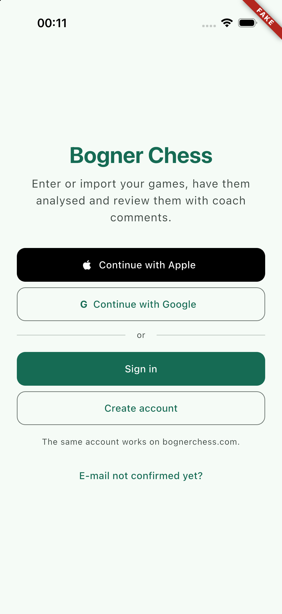
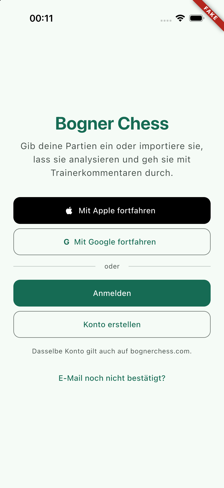
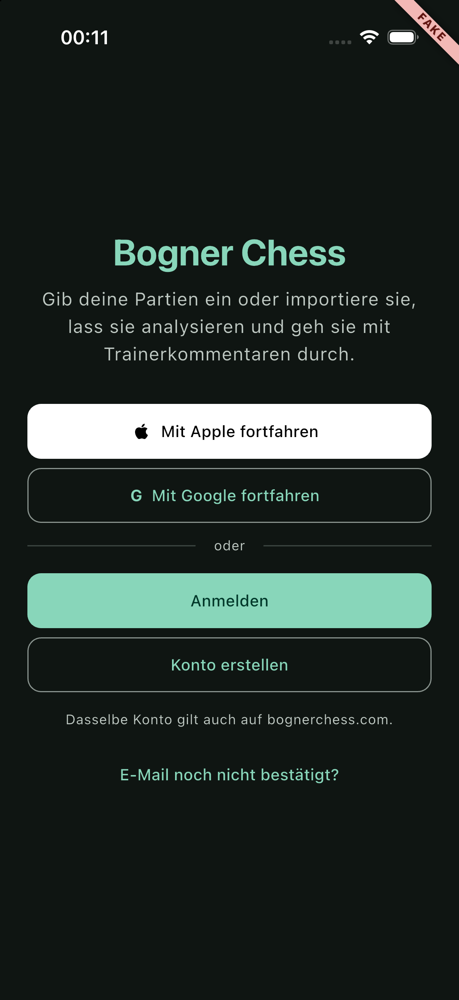
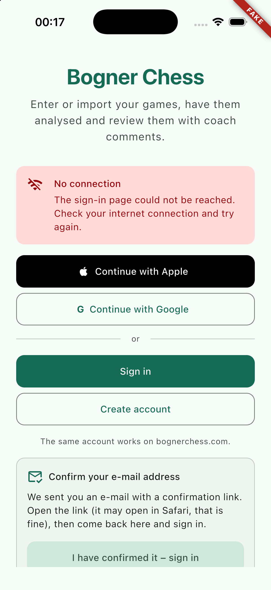
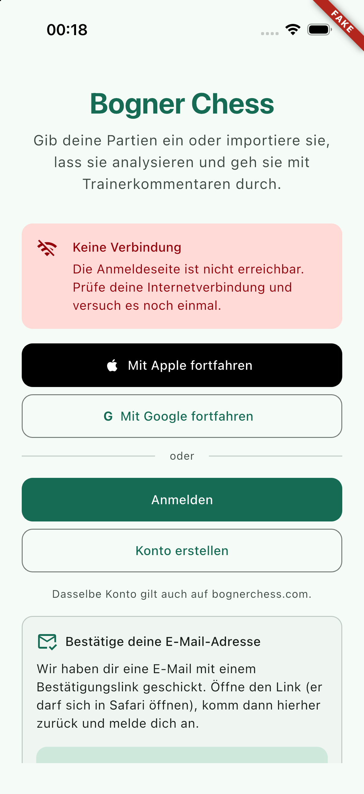
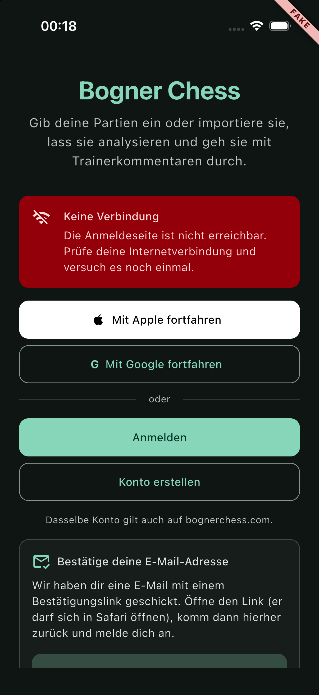

## Scope

PRD feature AC-1, the sign-in part. The auth layer and the sign-in screen:

- `lib/core/auth/`: `AuthRepository` (interface), `AppAuthRepository` (real), `FakeAuthRepository`, `OidcClient` with `AppAuthOidcClient` (the only importer of `flutter_appauth`), `TokenStore` with `SecureTokenStore` (the only importer of `flutter_secure_storage`) and `InMemoryTokenStore`, `InstallMarker`, `Tokens`/`IdTokenClaims`, `AuthConfig`, the providers, and `AuthState` extended with the id-token claims.
- `lib/features/auth/`: `ui/sign_in_screen.dart` (replaces the placeholder at `/sign-in`), `domain/sign_in_idp.dart` (configurable provider buttons), `dev/sign_in_demo.dart` (development entry point that starts signed out).
- `lib/main.dart`: awaits `restore()` before `runApp`.
- 16 strings appended to both ARB files; dependencies `flutter_appauth`, `flutter_secure_storage` (and `shared_preferences_platform_interface` for tests) with rows in `docs/dependencies.md`; the two `Package.resolved` files that pin AppAuth-iOS.
- `docs/auth.md`: flow, storage, refresh rules, session-mode decision, Keycloak client requirements, manual checklist for the human gate.

## Out of scope

The API layer's auth link and 401 retry (WP-12), the account screen with the sign-out button and account deletion (its own WP), handling of the API's `EmailNotVerified` result (WP-12/WP-28), push registration. No real sign-in was made and none may be made by an agent.

## Contracts

**Consumes:** `envProvider` (`oidcIssuer`, `oidcClientId`, `oidcRedirect`, `usesFakeAuth`, `isProd`), `preferencesProvider`, the router's redirect on `authStateProvider` (WP-03); `appDatabaseProvider` and `AppDatabase.wipeOwner(sub, keepDrafts:)` (WP-13); the URL scheme `com.bognerchess.mobile` (WP-01).
**Produces:** `authRepositoryProvider`/`AuthRepository`, `authStateProvider` with the richer `SignedIn`, `oidcClientProvider`, `tokenStoreProvider`, `installMarkerProvider`, `signInIdpsProvider`, `kFakeAccessToken`, `SignInIds`, `docs/auth.md`. Details under Handoff notes.

## Steps

1. Verified the two plugins on pub.dev (versions, licences, publishers) and in the pub cache (both ship a `Package.swift`); added them; simulator build to prove the Swift Package Manager path.
2. Read `flutter_appauth` 12.1 sources for the request options, the ephemeral-session option and the iOS error mapping; fetched the public OIDC discovery document to confirm endpoint paths; checked Keycloak's `prompt=create` support.
3. Token model, store, install marker, OIDC client, repositories, providers, `main.dart`.
4. Sign-in screen, strings, dev entry point.
5. Tests, simulator screenshots (en, de, dark, error state), docs.

## Acceptance commands

```bash
tool/check.sh
flutter build ios --simulator --debug --dart-define-from-file=config/fake.json
tool/check_bundled_assets.sh
```

## Evidence

All run on 2026-09-20 after the last code change.

`tool/check.sh`

```
==> 1/7 dependencies: flutter pub get --enforce-lockfile
==> 2/7 format: dart format --set-exit-if-changed
Formatted 136 files (0 changed)
==> 3/7 analyze: flutter analyze --fatal-infos
No issues found!
==> 4/7 licence headers: tool/check_headers.dart
check_headers: ok
==> 5/7 layer imports: tool/check_layers.dart
check_layers: ok
==> 6/7 codegen is clean: tool/gen.sh, then compare the working tree
codegen: clean
==> 7/7 tests: flutter test --exclude-tags golden
00:11 +364: All tests passed!
OK in 22s
```

104 of the 364 tests are new: 80 in `test/core/auth/` (39 repository, 15 OIDC client, 13 tokens and state, 5 token store and install marker, 8 providers and fake) and 24 in `test/features/auth/`. One WP-03 test was adapted (`router_test.dart`: the fake user now has an e-mail address and a name, so it compares the subject instead of the whole value).

What the tests pin down: 10 concurrent `accessToken()` calls make exactly one refresh, and `accessToken`/`forceRefresh` share it; `invalid_grant` and `invalid_token` sign out and keep local data, transport and server errors keep the tokens and throw; a caller's time-out does not lose the rotated tokens of a late answer; the 30 s margin at its boundary, a device clock set back, a token without expiry; restore with and without tokens, offline with an expired token (no request), unreadable id token, failing Keychain; the reinstall wipe; sign-out with failing, hanging and successful revocation and with a failing wipe hook; a refresh that finishes after the sign-out; cancel is silent (no state change, no warning logged, no message on screen); id-token parsing including UTF-8, missing padding and ten kinds of garbage; no log line of a whole session contains a token, subject or e-mail address; the requests `flutter_appauth` receives (scopes, `prompt=create`, `kc_idp_hint`, ephemeral agent, legacy registration switch, refresh without discovery); the iOS error mapping; revocation against a loopback HTTP server; provider wiring (fake, real, fake+prod refused); sign-out through the provider wipes that user's cache and keeps drafts and other users' data. Screen: every button calls the right thing and the router continues to `from`; busy, cancel, offline and server-error states; the e-mail help (manual, automatic after a cancelled registration, not after a failed one); configurable provider buttons and `AUTH_IDPS` parsing; identifiers, labels, button role and tap action on one semantics node; tap-target and contrast guidelines in both themes; en and de at text scale 1.3 on 375 x 667 in light and dark with the tallest state.

`flutter build ios --simulator --debug --dart-define-from-file=config/fake.json`

```
Xcode is fetching Swift Package Manager dependencies. This may take several minutes...
  Fetching from https://github.com/openid/AppAuth-iOS...
Xcode build done.                                           31.0s
✓ Built build/ios/iphonesimulator/Runner.app
```

(First build; later ones take about 13 s.) No CocoaPods, no `Podfile`; the only change under `ios/` is the two new `Package.resolved` files. `tool/check_bundled_assets.sh`: `check_bundled_assets: ok`. `Runner.app` contains the privacy manifests of `flutter_appauth`, `AppAuth`, `AppAuthCore` and `flutter_secure_storage_darwin`.

**Simulator.** An own device `BC-WP-25` (iPhone 17 Pro, iOS 26.5) was created and deleted afterwards. Launched there: the normal fake build (starts signed in on the Games tab, so `restore()` and plugin registration work), a `config/dev.json` build with real auth (starts on the sign-in screen with the DEV ribbon; Keychain and preferences are read, **no sign-in was attempted**), and the demo entry point for the screenshots. The simulator tool's `inspect` and `tap` were not available in this session (no one to grant access), so the states behind a tap were produced with the demo's `SIGN_IN_DEMO_TAP` define, and semantics were verified in widget tests instead. All screenshots were looked at: nothing clipped in either language, Apple button black on light and white on dark, error banner readable in both themes, the help card scrolls into view.

| | English | German |
| --- | --- | --- |
| Sign-in |  |  |
| Dark | |  |
| Offline error and e-mail help |  |  |
| The same, dark | |  |

## Handoff notes

**Blocked by a human for real verification (H2, H10; H6 for Apple).** Everything was built and tested against fakes. `docs/auth.md` ends with the checklist: sign in, register and verify the e-mail address, Apple, Google, refresh after five minutes, sign out, reinstall.

### `AuthRepository` (for WP-12's auth link and for the account screen)

```dart
final authRepositoryProvider = Provider<AuthRepository>(...);   // lib/core/auth/auth_providers.dart

abstract interface class AuthRepository {                       // lib/core/auth/auth_repository.dart
  AuthState get state;
  Stream<AuthState> get states;                                 // broadcast, synchronous, no replay
  Future<void> restore();                                       // main.dart calls it; never throws
  Future<void> signIn({bool register = false, String? idpHint});// cancel completes normally; throws AuthException
  Future<String?> accessToken();
  Future<String?> forceRefresh({String? rejectedToken});
  Future<void> signOut();                                       // never throws
}
class AuthException { AuthErrorKind kind /* network | server */; String? code; }
```

How the API layer should use it:

- Before every request: `final token = await repo.accessToken()`. `null` means nobody is signed in (possibly found out by this very call; the state is `SignedOut` already and the router is on its way to `/sign-in`): fail the request as `unauthenticated`, do not send it. An `AuthException` means the refresh could not be made: map `network` to the retryable `ApiError.network`, `server` to `ApiError.server`. **Do not sign out on it.**
- After a 401: `await repo.forceRefresh(rejectedToken: theTokenThatWasSent)`, retry once with the result. Passing the rejected token matters: five parallel requests that all get a 401 then cause one refresh, not five. A second 401, or `null`, is `unauthenticated`. The repository has already signed out when the grant was dead; the link must not call `signOut()` for a 401 (a 401 can also be a backend problem).
- Fake mode: `accessToken()` returns `kFakeAccessToken` (`'fake-access-token'`, `fake_auth_repository.dart`). The mock server should accept exactly that for `kFakeAuthSub`.
- The account screen calls `ref.read(authRepositoryProvider).signOut()` and nothing else: clearing, the cache wipe (`wipeOwner(sub, keepDrafts: true)`), revocation and the redirect all follow from it.

### Providers

| Provider | Type | Notes |
| --- | --- | --- |
| `authRepositoryProvider` | `Provider<AuthRepository>` | Fake with `AUTH_MODE=fake` (throws for a release build or `ENV_NAME=prod`), else `AppAuthRepository`. Passes the `wipeOwner` hook to both. Tests override it with `FakeAuthRepository(signedIn: false, signInError: ..., signInDelay: ...)`. |
| `authStateProvider` | `NotifierProvider<AuthStateNotifier, AuthState>` | Unchanged name and type; now mirrors the repository. `SignedIn(sub, {email, emailVerified, name})`, equality over all four, `toString` hides them. `TestAuthNotifier` and `pumpApp(auth:)` still work. |
| `oidcClientProvider` | `Provider<OidcClient>` | `AppAuthOidcClient` from `Env`. Test fake: `test/helpers/fake_oidc.dart` (`FakeOidcClient`, `makeJwt`, `TestClock`). |
| `tokenStoreProvider` | `Provider<TokenStore>` | `SecureTokenStore`; tests use `InMemoryTokenStore`. |
| `installMarkerProvider` | `Provider<InstallMarker>` | Preferences key `auth.install_marker`. |
| `signInIdpsProvider` | `Provider<List<SignInIdp>>` | From the optional dart-define `AUTH_IDPS` (default `apple,google`). |

`pumpApp` gained `overrides:` (appended last). With real auth and no overrides the providers construct without touching a platform channel, so existing tests that pump a signed-out app keep working.

### Decisions

- **Session mode: ephemeral is the default** (`AuthConfig.preferEphemeralSession = true`), a recommendation for the human to confirm. `docs/auth.md` has the comparison. In short: sign-in is rare with offline tokens, so typing credentials is a small cost, while ephemeral removes the system alert, makes revocation-only sign-out complete, and leaves nothing behind on a shared device. Switching to shared also needs `prompt=login` after a sign-out, which is not implemented. In `flutter_appauth` 12 the option is `externalUserAgent: ExternalUserAgent.ephemeralAsWebAuthenticationSession`; `preferEphemeralSession` no longer exists.
- **`prompt=create`** is the standard parameter and Keycloak supports it from 26.1. The production discovery document does not list `prompt_values_supported`, so the server version could not be confirmed from outside. `AuthConfig.useLegacyRegistrationEndpoint` switches to the deprecated `/registrations` endpoint if the human check shows the login page instead.
- **Sign-in uses discovery, refresh and revocation use endpoints derived from the issuer.** `flutter_appauth` fetches the discovery document on every call that is given an issuer; on the refresh path that is an extra round trip and an extra way to fail. The paths match the production discovery document.
- **Revocation is a plain `dart:io` POST**, because AppAuth has none. No `http` dependency.
- **A caller's time-out does not cancel the refresh.** The answer may still come, and its rotated tokens must be stored, or the next refresh ends the session.
- **Only an explicit sign-out wipes the cache.** A session that ended at the server (`invalid_grant`) keeps cache and drafts: usually the same person signs in again, and all rows are scoped by `sub`.
- **An offline sign-out cannot revoke.** The token is gone from the device; the server session ends by time-out or from the account console. Noted in the checklist.
- **The identifier sits on the button's own semantics node** (`MergeSemantics` around `Semantics(identifier:)`). A bare `Semantics(identifier:)` around a Material button creates a parent node, and a UI test would find an element that is not the button. Worth copying for other screens.
- **The e-mail help opens by itself only after a cancelled registration**, not after a failed one, because then no mail was sent.
- The Google button carries a plain "G": Google's logo is not ours to bundle. The Apple mark is `Icons.apple` from the Material icon font.

### Gotchas

- `SharedPreferencesAsync()` throws at construction when no platform implementation is registered (unit tests), which is why `PreferencesInstallMarker` takes a getter.
- Record equality does not look into maps; compare fields (seen in the revocation test).
- `ios/Runner.xcworkspace/xcshareddata/swiftpm/Package.resolved` and its twin under `Runner.xcodeproj/project.xcworkspace` are committed on purpose: they pin AppAuth-iOS 2.1.0 by revision. CI needs network access to github.com for the first build, which it already has for SQLite.
- `lib/features/auth/dev/sign_in_demo.dart` is not imported by anything; tree shaking keeps it out of the app. `SIGN_IN_DEMO=offline|error` and `SIGN_IN_DEMO_TAP=<id>[,<id>]` are its two defines.

### Open points

1. Human gate: run the checklist in `docs/auth.md`, decide the session mode, confirm `prompt=create` on the production Keycloak.
2. Until H6, set `"AUTH_IDPS": "google"` in the configs that reach testers, or the Apple button leads to a Keycloak error page.
3. If the human picks the shared session: add `prompt=login` for the first sign-in after a sign-out.
4. WP-12: auth link as described above. Account screen: sign-out button, and show `emailVerified == false`.
5. Account deletion for Apple-brokered users (design risk 3) is a backend matter; nothing here.
