## Scope

The middle of the app: the list of your games, one game's page, the way from
there to an analysis, and the wiring that makes WP-29's review screen show a
real document instead of the demo one.

**WP-26, the library (AC-2).** `lib/features/library/`:

- `domain/`: `games_repository.dart` (the seam: `GamesRepository`,
  `GameSummary`, `GamePage`), `cached_games_repository.dart` in `data/`
  (server page, offline copy, delete, `applyJob`), `game_summary_codec.dart`
  (the cached row's JSON), `library_controller.dart` (`LibraryController`,
  `libraryControllerProvider`, `libraryRowsProvider`, search and date filter,
  paging, pull-to-refresh, delete), `library_models.dart` (`LibraryRow` and
  its two kinds, `LibraryFilter`, `LibraryStatus`), `owner.dart`
  (`currentOwnerProvider`), `draft_actions.dart`.
- `ui/`: `library_screen.dart` (replaces the placeholder; same class name, so
  `router.dart` keeps its route), `library_row_tile.dart`, `library_ids.dart`.

**WP-28, analysis (AN-1, LIM-2).**

- `lib/features/game_detail/`: `game_detail_controller.dart` (load, request,
  delete), `final_position.dart`, `game_detail_screen.dart`,
  `analysis_request_flow.dart` (every outcome of a request explained),
  `game_texts.dart`, `game_detail_ids.dart`, `dev/flow_demo.dart`.
- `lib/features/analysis_status/`: `job_tracker.dart` (the poller: persisted
  in `pending_jobs`, backing off, foreground only), `job_tracker_providers.dart`,
  `mobile_config_provider.dart`, `ui/analysis_notices.dart` ("Your analysis is
  ready", on whatever screen is showing; it also owns the tracker).
- `lib/features/usage/`: `usage_providers.dart`, `ui/usage_summary.dart`
  (`UsageSummary`, one line or a block — LIM-2's numbers).
- `lib/features/review/data/`: `api_review_repository.dart`,
  `local_feedback_store.dart`, `outbox_feedback_sink.dart`, and
  `review_providers.dart` wired to them, so WP-29's screen reads the real
  document and ratings survive being offline.
- `lib/core/`: `app_foreground.dart` (new), `game/library_refresh.dart`,
  `device/device_id.dart`. `lib/app.dart` gains `AnalysisNotices` in
  `MaterialApp.builder`, next to `IncomingLinkNotices`.

89 strings appended to both ARB files. No new dependency.

## Out of scope

- The review screen itself (WP-29) — only its two providers are filled in.
- The new-game flow and the submit queue (WP-27), push (WP-32), settings
  (WP-30). `UsageSummary(style: block)` exists for the settings screen but is
  not placed there.
- `lib/core/chess`, `lib/core/auth`, `lib/core/links`, `lib/features/entry`,
  `lib/features/metadata`, `docs/tasks/INDEX.md`.

## Contracts

**Consumes:** `core/api` (WP-10/12: `GamesApi`, `AnalysisApi`, `UsageApi`,
`ConfigApi`, the typed errors), `core/storage` (WP-13: `gamesCacheDao`,
`analysisCacheDao`, `pendingJobsDao`, `feedbackOutboxDao`, `draftsDao`),
`core/analysis` (WP-14), shell, theme, `ErrorRetry`, `EmptyState` (WP-03),
`BoardView` (WP-04), `review_providers.dart`'s seams (WP-29), auth (WP-25).

**Produces:** `GamesRepository` and `currentOwnerProvider` (the library's data
seam, used by the job tracker and by the review repository), `JobTracker` and
`trackedJobsProvider` (what any screen asks "is this game being analysed?"),
`libraryRefreshProvider` (WP-27's hook, now real), `AppForeground`,
`UsageSummary`, `deviceIdProvider`, `LibraryIds` / `GameDetailIds`,
and for tests `backendOverrides()` in `test/helpers/pump_app.dart`.

## Steps

1. Library: repository and cache, controller, rows, screen, delete.
2. Game detail: controller, screen, the request flow and all its outcomes.
3. Job tracker: persistence, poll and back-off, foreground gating, notices.
4. Usage and the limit sheet; review repository, feedback outbox, providers.
5. Tests; gate; build, run in the simulator, look, fix, look again.
6. This file.

## Acceptance commands

```bash
tool/check.sh
tool/golden.sh                                                  # macOS
flutter build ios --simulator --debug --dart-define-from-file=config/fake.json
tool/check_bundled_assets.sh
flutter test test/features/library test/features/game_detail \
             test/features/analysis_status test/features/usage \
             test/features/review test/core/device
```

## Evidence

All run on 2026-09-20 on macOS, Flutter 3.47.5, after the last change to the
code.

```text
$ tool/check.sh
==> 1/7 dependencies: flutter pub get --enforce-lockfile
Got dependencies!
==> 2/7 format: dart format --set-exit-if-changed
Formatted 304 files (0 changed) in 0.43 seconds.
==> 3/7 analyze: flutter analyze --fatal-infos
No issues found! (ran in 2.9s)
==> 4/7 licence headers: tool/check_headers.dart
==> 5/7 layer imports: tool/check_layers.dart
==> 6/7 codegen is clean: tool/gen.sh, then compare the working tree
codegen: clean
==> 7/7 tests: flutter test --exclude-tags golden
00:21 +1540: All tests passed!
OK in 30s

$ tool/golden.sh
00:04 +1: .../board_view_golden_test.dart: board with two arrows and a ?? glyph
00:04 +1: .../review_screen_golden_test.dart: coach comment on a blunder, iPhone 17 Pro, English, light
00:05 +2: All tests passed!

$ flutter build ios --simulator --debug --dart-define-from-file=config/fake.json
Building com.bognerchess.mobile for simulator (ios)...
Running Xcode build...
Xcode build done.                                           20.4s
✓ Built build/ios/iphonesimulator/Runner.app

$ tool/check_bundled_assets.sh
  none
check_bundled_assets: ok

$ flutter test test/features/library test/features/game_detail \
               test/features/analysis_status test/features/usage \
               test/features/review test/core/device
00:09 +224: All tests passed!
```

Of those 224, 83 are WP-29's review-screen tests, which this branch does not
change. The work package's own are 141:

| | | |
| --- | --- | --- |
| `library/` | 51 | rows and badges, search and date filter, paging (also when the list is too short to scroll), pull-to-refresh, offline banner and cached rows, the two empty states, swipe-to-delete with its dialog and its snack bar, drafts on top, the cache round trip, `DeleteChessGame`'s variables |
| `game_detail/` | 30 | header and result, final position, the analyse button, every request outcome (accepted, AI consent and the second attempt, e-mail not verified and the recheck, queue full, rate limited, **limit reached**, network), the job card queued and running, open the analysis, delete |
| `analysis_status/` | 25 | 20 tracker (persistence, reconciling with the server, adopting a row the submit queue wrote, back-off, foreground gating, finishing into the cache, a job that vanished) and 5 notices (opponent named, auto-dismiss, failure, silence on that game's own screen, German) |
| `usage/` | 10 | both styles, the headline that matters, unlimited, unknown, exhausted in the warning colour, German and English formats |
| `review/` (added here) | 21 | the API repository against the cache and the job, the feedback outbox and its flush, the providers now that they are wired |
| `core/device/` | 4 | the stable device id |

Every assertion about traffic is `api.requestsOf('<Operation>')`, never on the
whole request list: the shell polls `MobileConfig` on its own (WP-30's update
gate), so the list is never empty and a test written against it would pass
here and fail on the integration branch.

**Simulator.** One throw-away device, `BC-WP-26-pro` (iPhone 17 Pro, iOS 26.5),
created for this session, its UDID kept in this worktree's `build/`, deleted
afterwards. The app was built with the fake config against the mock server on
port 5326 (`dart run tool/mock_server/main.dart --port 5326`; the only change
to `config/fake.json` was that port). The simulator tool's `inspect` was not
available in this session either (as in WP-04, WP-20 and WP-29), so labels and
identifiers are verified by widget tests only.

| | |
| --- | --- |
| Library, German | 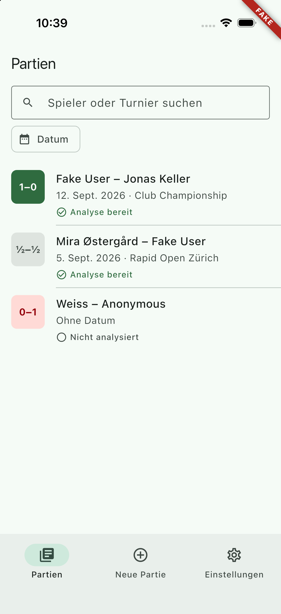 |
| Search | 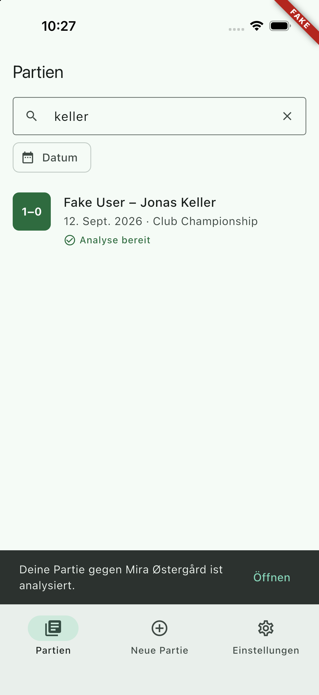 |
| Game detail, not analysed, with the usage line | 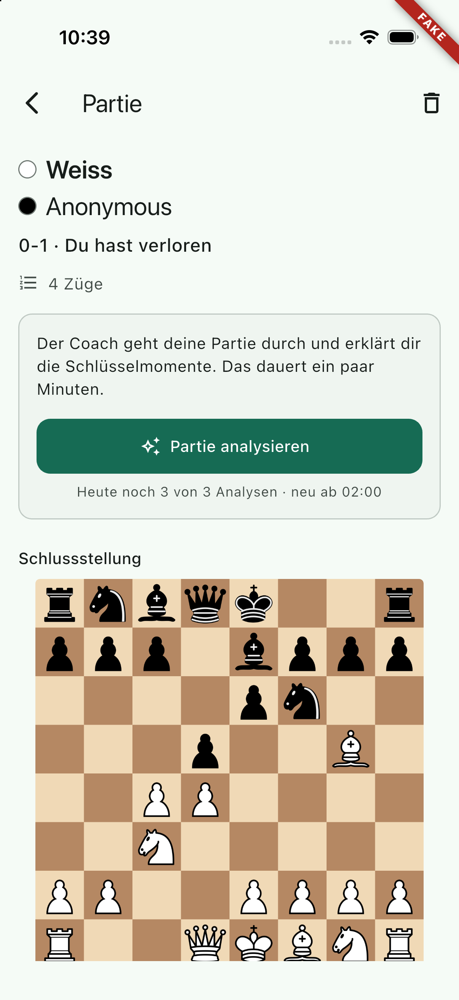 |
| Queued, with the indeterminate indicator | 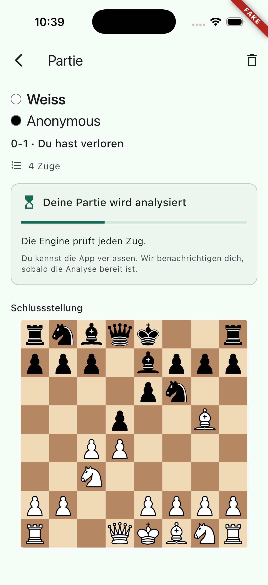 |
| The same game once it is done | 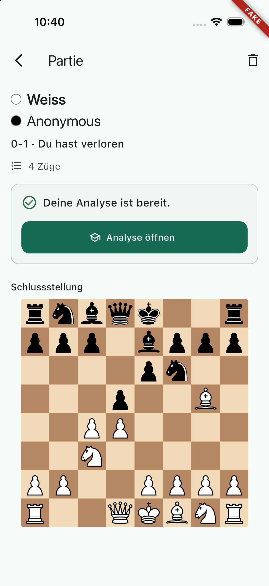 |
| Quota gone: the warning, button still live | 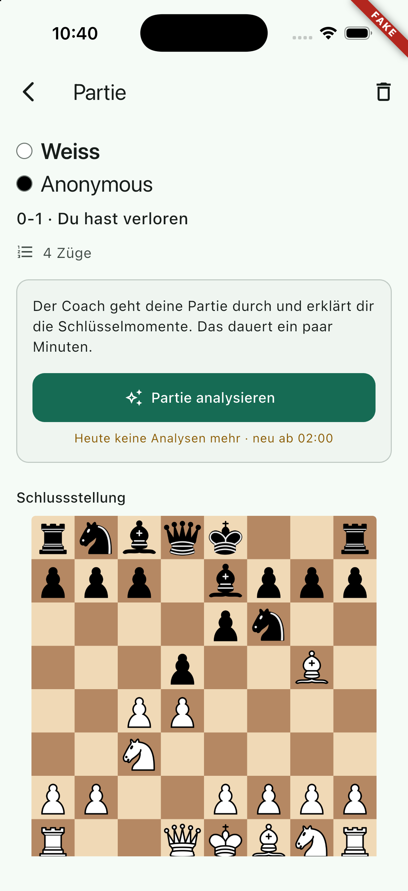 |
| What the server answers (LIM-2) | 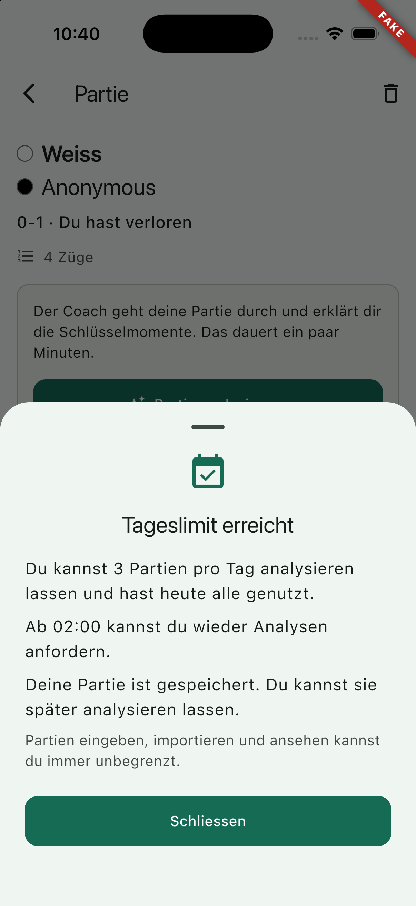 |
| Delete, confirmation | 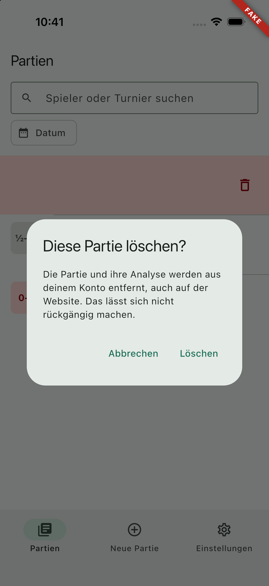 |
| Delete, done | 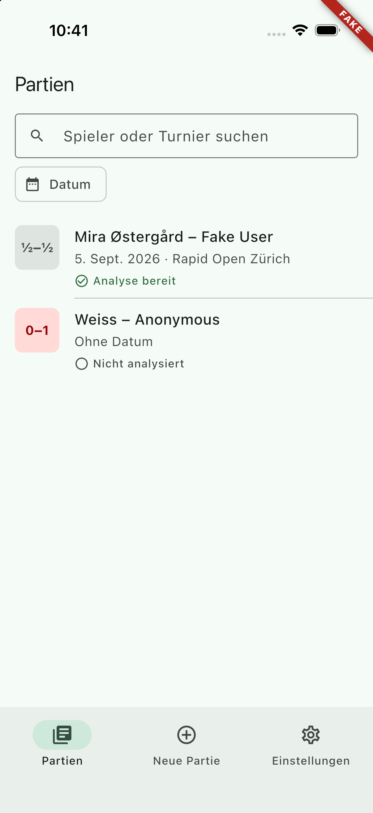 |
| Offline, at extra-extra-large type | 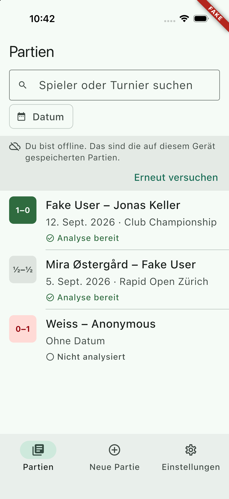 |
| Library, English |  |
| "Your analysis is ready" | 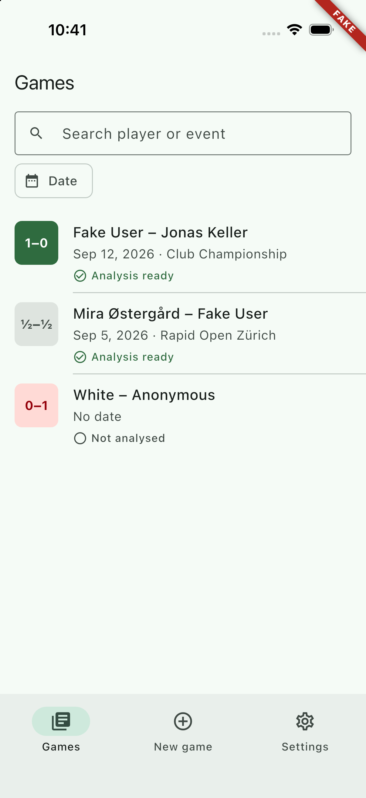 |
| Game detail, English | 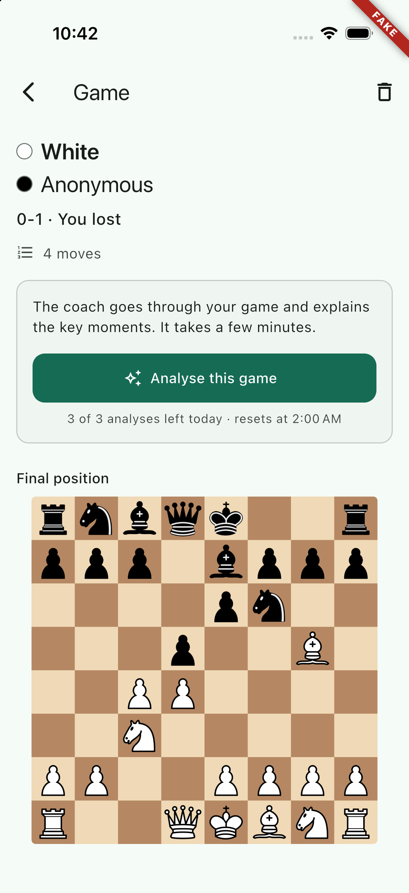 |
| Daily limit reached, English | 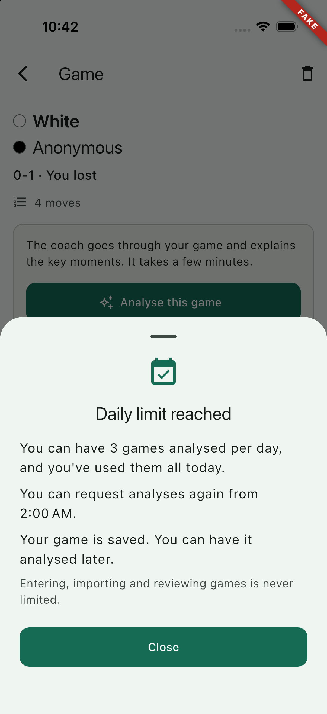 |

The whole loop was walked on the device: request → `QUEUED` → `RUNNING` →
`DONE`, the card changing in place. With the quota gone the app still asked,
and the mock server's log shows exactly that:

```text
[mock] RequestGameAnalysis -> ok
[mock] RequestGameAnalysis -> AnalysisLimitReachedError
```

Three things the running app changed:

1. **The "analysis ready" notice never went away.** `SnackBar` sets
   `persist = persist ?? action != null`, so a snack bar with an action
   ignores its `duration` — the notice sat over the tab bar and the last row
   until somebody tapped it, and because the messenger keeps one queue, every
   snack bar raised afterwards (a delete, an error) waited behind it for the
   rest of the session. Both notices now pass `persist: false`;
   `analysis_notices_test.dart` holds it.
2. The **sync banner** put its message and its button in a row. In German at a
   large text size the message was squeezed into a column of single words.
   Message and action are stacked now (last screenshot).
3. The **next page** was only asked for from a scroll notification, so a
   window of games shorter than the screen never loaded its second page. The
   tail spinner now asks for it when it is built.

## Handoff notes

### The two seams WP-27 left

- **`libraryRefreshProvider`** (`lib/core/game/library_refresh.dart`) is
  **wired**. `LibraryController.build` listens to it and refreshes. The file
  on this branch is byte-identical to the one on `mobile-mvp`, so the merge is
  a no-op. Anything that changes the server's games from outside the library
  calls `ref.read(libraryRefreshProvider.notifier).request()`.
- **`analysisJobSinkProvider`** (`lib/core/analysis/analysis_job_sink.dart`,
  on `mobile-mvp`, not on this branch) is **deliberately not overridden, and
  the indirection can be removed.** Its default, `PendingJobsAnalysisJobSink`,
  writes the job into `pending_jobs`; the tracker now *watches* that table
  (`pendingJobsDao.watchActive(owner)`, `JobTracker._adopt`) for as long as it
  runs, so a job the submit queue creates is picked up the moment the row
  exists — no earlier than the sink could deliver it, and it also survives an
  app kill, which a provider override does not. Overriding the provider as
  well would mean the same job arrives twice by two paths. Recommendation for
  the coordinator: **delete `analysis_job_sink.dart` and have WP-27 write the
  row directly through `pendingJobsDao.upsert`** (that is all the default sink
  does). If it is kept instead, leave it at its default; do not point it at
  `JobTracker.track`.

### Why the app asks even when it knows the answer

`requestGameAnalysis` is sent even when the cached usage says the quota is
gone. BE-17 made limit pressure server-written: the mutation inserts a
`mobile_event` (`analysis_limit_hit`, once per person per day, inside the
quota lock) when it refuses, because the client-side event proved unreliable.
A client that stops asking at the limit makes that metric read zero, which is
indistinguishable from a product nobody bumps into. `UsageSummary` warns
before the tap (in the warning colour); the refusal comes back as the typed
`AnalysisLimitReachedError` and `_LimitSheet` explains it. The reasoning sits
in a comment at the call site in `game_detail_screen.dart` and on
`GameDetailController.requestAnalysis`, because it looks like an obvious
optimisation. **Do not disable the button on cached usage.**

### No progress bar for a job

The card shows an indeterminate `LinearProgressIndicator` and words
("Your game is next.", "The engine is checking every move."). The backend's
`progressDone` / `progressTotal` are not in this branch's vendored schema, and
they are progress *inside the current stage* and null while `QUEUED`; a bar
that jumps back to zero at every stage is worse than one that does not
pretend. Queue position is shown, because that one is honest.

### Life cycle

`lib/core/app_foreground.dart` replaces `AppLifecycleListener` everywhere in
this work package. `AppLifecycleListener` **asserts** on a transition it
considers impossible (`paused` straight to `resumed`), and the framework puts
one inside every `EditableText`. The library's search field lives in the tab
shell, so from this branch on that assertion is reachable from any test that
drives the life cycle by hand. `test/features/entry/entry_screen_test.dart`
did exactly that; it now goes down and up through `inactive`/`hidden`, as iOS
reports it, which is the shape `test/core/links/incoming_link_service_test.dart`
already used. Nothing about the entry screen changed.

### Two files taken from the integration branch

`test/features/review/pump_review.dart` and
`review_screen_golden_test.dart` are `mobile-mvp`'s versions from `e40a452`
("fix the review golden against the prod-auth guard"). That golden had been
failing since WP-25 merged, for a reason that has nothing to do with this work
package, and this branch was cut before the fix. Taking the two files makes
`tool/golden.sh` green here, proves the stored image is unchanged by
`AnalysisNotices` moving into `app.dart`, and removes what would otherwise be
the one real merge conflict on this branch (the integration branch rewrote the
function that the WIP commit had added a line to; `pumpApp` supplies that line
now). The content is identical to `mobile-mvp`, so the merge is a no-op.

### Gotchas

- `ApiReviewRepository` decides "the cached analysis is stale" by comparing
  the job's `finishedAt` with the cache's `fetchedAt`. The database keeps
  whole seconds and the tracker fetches the document the moment the job ends,
  so the comparison allows two seconds of rounding; a strict `isAfter` refetched
  the document on every open.
- `JobTracker` polls only while the app is in the foreground **and** the widget
  tree is mounted (`AnalysisNotices` reports the second through
  `jobTrackerUiMountedProvider`). Without an active job it schedules nothing at
  all, which is what keeps `pumpAndSettle` usable in every test that pumps the
  whole app.
- Every test that pumps the whole app needs `backendOverrides()`: the library
  is the start screen, so the API and the database are read in the first frame.
  `pumpApp` adds them unless the test brings its own.
- `pumpApp(..., settle: false)` shows the first frame, for the states that only
  exist while the server has not answered.
- The three remaining `ß` in `app_de.arb` (`metadataColorWhite` and two
  metadata a11y strings) are WP-21's and predate this branch; `mobile-mvp`
  fixed them in `937a146`, and this branch does not touch those lines. Every
  string added here is Swiss ("Weiss", "Schliessen", "grösseren").

### Known gaps

1. The date filter is a range picker; there is no "last 30 days" shortcut, and
   no filter for "analysed only", which is the one people will ask for next.
2. Deleting is one row at a time. No multi-select, no undo — the dialog is the
   safety net, and the delete is final on the server.
3. The library pages forward only. Coming back to a game far down the list
   after a cold start means paging to it again; the cache holds what was
   fetched, not a window around a position.
4. `UsageSummary(style: block)` has no home yet; it is meant for the settings
   screen (WP-30/36).
5. The tracker's back-off restarts from the base interval on every resume and
   every new job. For a job that takes many minutes with the app open that is
   a few more polls than strictly needed.
6. A failed analysis says the limit is untouched, but the screen offers only
   "Try again" — it does not say *why* it failed, because `failureCode` is
   server vocabulary and has no strings yet.
