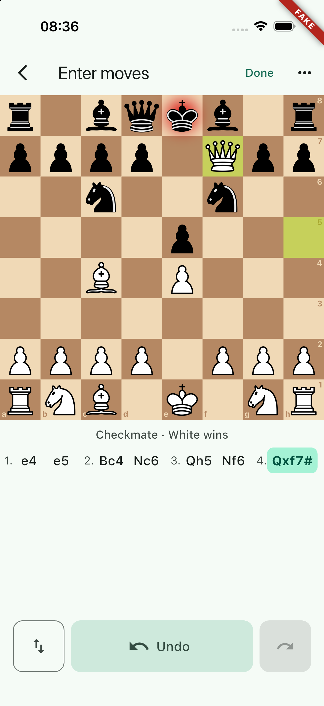
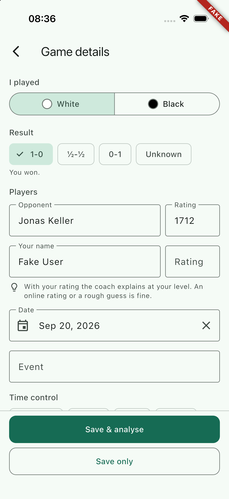
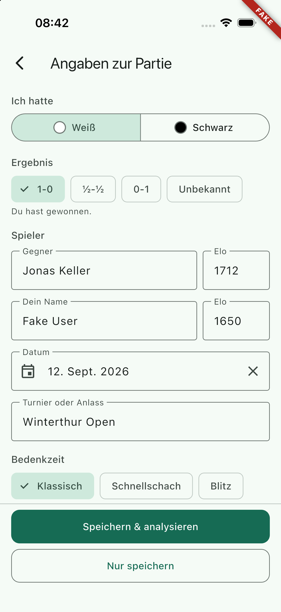
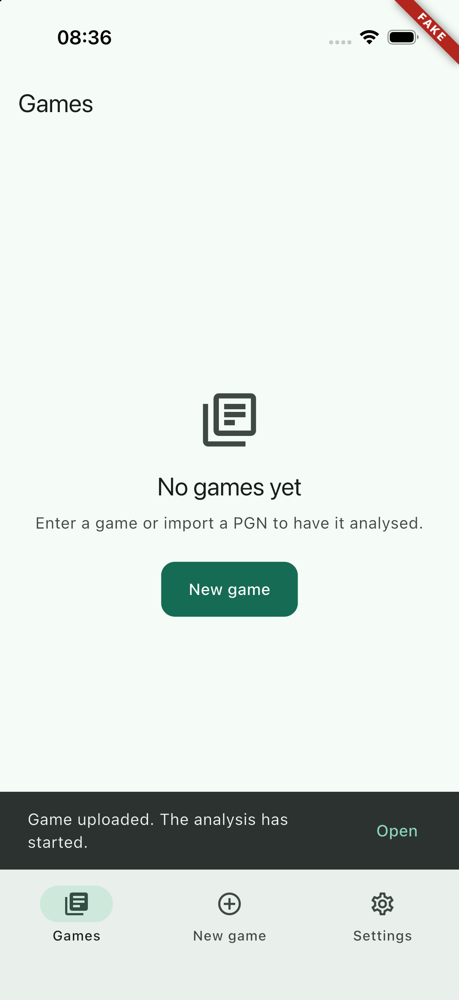
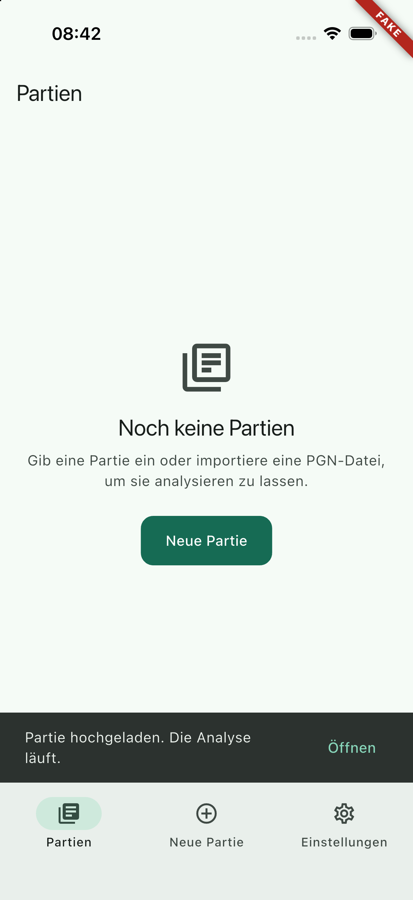
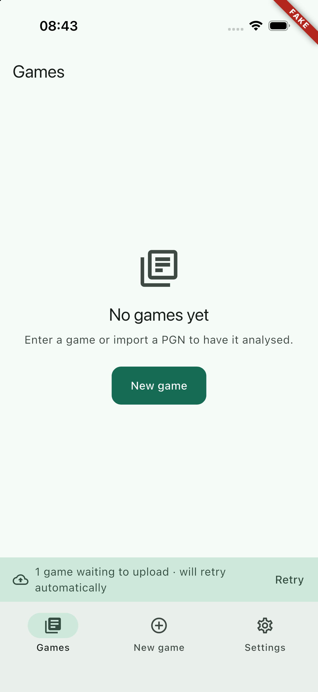
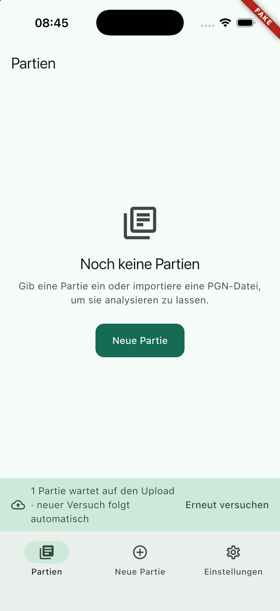
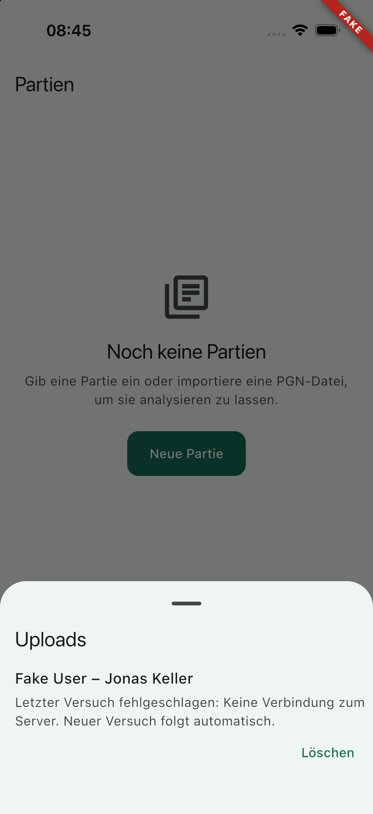

## Scope

PRD AC-3, "a game can be entered without connection and submitted later", and
the glue between entry / import → metadata → upload → analysis request.

- `lib/features/submit_queue/`: `SubmitQueue` (single-flight, sequential,
  back-off, per owner), `DraftMeta` (the format of `drafts.meta_json`),
  `SubmitError` / `SubmitQueueStatus` / `SubmitEvent`, the providers,
  `DriftEntryDraftStore` (WP-20's seam on WP-13's `DraftsDao`), and the queue
  surface (`SubmitQueueBanner`, `SubmitQueueSheet`).
- `lib/features/new_game/`: `NewGameFlow`, the coordinator both paths run
  through, `NewGameSaveRequest`, and a dev entry point that plays the whole
  flow with synthetic touches.
- `lib/core/`: `connectivity/` (the `ConnectivitySource` seam over
  `connectivity_plus`), `game/library_refresh.dart`, and
  `analysis/analysis_job_sink.dart` — the three seams agents A and C plug
  into.
- Small, listed edits in `router.dart`, `main.dart`, `tab_shell.dart`,
  `drafts_dao.dart`, and in the entry, import and metadata features (see
  Handoff notes).
- 44 strings in both ARB files (prefixes `newGame` and `submitQueue`).

## Out of scope

The library list and the game detail screen (WP-26/28, which read the drafts
and own `jobTrackerProvider`), the AI consent screen itself (WP-30; this flow
only pushes `AppRoutes.consentAi` and reads what it pops), analytics delivery
(WP-33; this only calls `analyticsProvider.track`), push and the job poller.

## Contracts

**Consumes:** `DraftsDao` (WP-13), `GamesApi.import` / `AnalysisApi.request` /
`LegalApi.aiConsent` (WP-10/12), `EntryScreen`+`EntryResult`+`EntryDraftStore`
(WP-20), `MetadataScreen`+`GameMetadata` (WP-21), `ImportScreen`+`ImportResult`
(WP-22), `authStateProvider` (WP-25), `analyticsProvider`.
**Produces:** `submitQueueProvider`, `submitQueueStatusProvider`,
`submitQueueEventsProvider`, `submitQueueDraftsProvider`,
`analysisHoldProvider`, `SubmitQueueBanner`, `analysisHoldText`,
`AnalysisJobSink`/`analysisJobSinkProvider`, `libraryRefreshProvider`,
`ConnectivitySource`/`connectivityProvider`, `submitQueueOverrides`,
`NewGameFlow`. Details under Handoff notes.

## Steps

1. `DraftMeta` and the drift-backed draft store; DAO additions.
2. The queue with its back-off and outcome rules; unit tests with `fake_async`.
3. The flow coordinator, the router wiring, the two save buttons, strings.
4. The queue surface (banner, sheet) and the flow tests through the real
   router with `FixtureLink` and an in-memory drift database.
5. Simulator: a dev entry point that plays the flow, end to end against the
   mock server, online and offline, in English and German.

## Acceptance commands

```bash
tool/check.sh
flutter build ios --simulator --debug --dart-define-from-file=config/fake.json
```

## Evidence

Run on 2026-09-20 (Flutter 3.47.5), after the last change.

`tool/check.sh` (progress lines cut)

```
==> 1/7 dependencies: flutter pub get --enforce-lockfile
==> 2/7 format: dart format --set-exit-if-changed
Formatted 287 files (0 changed) in 0.50 seconds.
==> 3/7 analyze: flutter analyze --fatal-infos
No issues found! (ran in 3.2s)
==> 4/7 licence headers: tool/check_headers.dart
check_headers: ok
==> 5/7 layer imports: tool/check_layers.dart
check_layers: ok
==> 6/7 codegen is clean: tool/gen.sh, then compare the working tree
gen: flutter gen-l10n
gen: dart run build_runner build --delete-conflicting-outputs
codegen: clean
==> 7/7 tests: flutter test --exclude-tags golden
00:19 +1473: All tests passed!
OK in 51s
```

```
flutter build ios --simulator --debug --dart-define-from-file=config/fake.json
✓ Built build/ios/iphonesimulator/Runner.app
```

68 of the 1473 tests are new (1405 before), plus three added to WP-13's DAO
test:

- `test/features/submit_queue/submit_queue_test.dart` (33, `fake_async` and an
  in-memory database): the happy path (import, analysis request, job handed
  over, library told, event emitted); board path through `enqueueEntry`
  (metadata merged into the autosaved draft, a second save refused, a draft
  whose autosave never landed created on the spot); "save only"; each of the
  five analysis refusals (limit, queue full, rate limit, unverified e-mail,
  missing consent) ending as `submitted` with the reason on the draft and no
  further request for three hours; `pgnInvalid` and a refused game ending
  `failed` for good with a readable error while the next draft still goes;
  the back-off schedule measured second by second (0, 5 s, 20 s, 80 s, 380 s,
  2180 s, 3980 s, 5780 s, then `failed` after eight attempts) and `retryAll`
  starting again from zero; `retryAfter` from a rate-limited import honoured;
  a failing analysis request repeating only the request and never making a
  saved game look failed; idempotency (a lost answer re-imports under the same
  `clientGameId` and gets the same game; a crash between the import and
  `markSubmitted` recovered by `start()`; a stored `server_game_id` skipping
  the import); single-flight (five kicks, a resume and a connectivity event
  produce one request at a time and two imports for two drafts); owner
  isolation and a sign-in during a flight; offline (nothing tried, no attempt
  used up, upload when the network returns), Retry overriding "offline",
  resume ending a back-off; delete; pruning of submitted drafts after a week;
  `DraftMeta` and `SubmitError` round trips, and that damaged or foreign
  `meta_json` reads as an empty board draft.
- `test/features/submit_queue/drift_entry_draft_store_test.dart` (9): the
  first save creates an `editing` draft under the entry screen's id; load
  gives back moves, cursor, orientation and the row's time; a save touches
  only the moves and the entry view, never `client_game_id`, `wants_analysis`
  or the metadata; a draft that is being sent or was sent is neither written
  nor resumable; resuming a `ready` or `failed` draft reopens it; a draft the
  server already has cannot be reopened; owner scoping; signed out nothing
  happens and nothing throws.
- `test/features/submit_queue/submit_queue_providers_test.dart` (6): signing
  in is a trigger and the coach language follows the system language ("de-CH"
  → "de"); signing out empties the status and keeps the drafts;
  `analysisHoldProvider` by server game id; the default job sink; and the
  banner sentence for every state in both languages.
- `test/features/new_game/new_game_flow_test.dart` (20, the whole app through
  the real router with `FixtureLink` and in-memory drift): the board path end
  to end (draft from the first move, prefilled result / date / own name,
  colour still to choose, Save & analyse, the game and the analysis request on
  the wire, `MOBILE_BOARD`, the job in `pending_jobs`, back on the library
  with a confirmation, the New game tab back at its root); a turned board
  meaning "I played Black" and "Save only" asking for no analysis; back from
  the details keeping the moves and queueing nothing; the import path
  (colour inferred from the account name, tags kept, draft created `ready`,
  `MOBILE_PGN`), a stranger's game where the colour has to be chosen, and
  text from outside arriving as `MOBILE_SHARE`; AI consent on record, given,
  refused (saved without analysis) and unreachable (saved, the queue then
  reports the reason); offline (saved at once, the banner, upload when the
  network returns, "Open" leading to the game); the analysis limit; a server
  that is down (banner with Retry, Retry uploads); a PGN the server cannot
  read (failed, the sheet with the reason, Delete with its confirmation);
  interrupt safety (a document arriving mid-entry takes the screen but not the
  moves, the draft resumes from the library and finishes the flow) and a
  failed draft reopened, corrected and sent again under the same
  `clientGameId`; and both languages at text scale 1.3 on a 375 × 667 screen
  in light and dark.
- `test/core/storage/drafts_dao_test.dart` (3 added): `create` with a given id
  and `ready: true`, `getAll`, and `markSubmitted` with a new `meta_json`.

**Simulator.** A throw-away device `BC-WP-27` (iPhone 17 Pro, iOS 26.5) with
the mock server on **port 5327** (`dart run tool/mock_server/main.dart --port
5327 --job-seconds 5 --ai-consent`) and a build of the dev entry point
(`-t lib/features/new_game/dev/flow_demo.dart`, `--dart-define-from-file=config/fake.json
--dart-define=API_URL=http://localhost:5327/graphql`). The device was deleted
and the server stopped afterwards.

*Board path, English.* The script played a scholar's mate, pressed Done,
chose White, typed the opponent and their rating, and pressed "Save &
analyse". `GET /__state` went from three games to four with `dailyUsed: 1`,
and the game on the server was:

```
[Event "?"] [Site "?"] [Date "2026.09.20"] [Round "?"]
[White "Fake User"] [Black "Jonas Keller"] [Result "1-0"] [BlackElo "1712"]

1. e4 e5 2. Bc4 Nc6 3. Qh5 Nf6 4. Qxf7# 1-0
```

with `playerColor: WHITE`, `clientGameId` = the draft's, and job `job-102`.

*Import path, German.* The Ruy-Lopez PGN with tags was pasted, Continue and
"Speichern & analysieren" pressed. The server received `game-102`:
`Event "Winterthur Open"`, `Date 2026.09.12`, `WhiteElo 1650`,
`BlackElo 1712`, `TimeControl 5400+30`, `playerColor WHITE` (inferred from the
account name), moves unchanged, and job `job-103`.

| Entry (en) | Details (en) | Details (de, imported) |
| --- | --- | --- |
|  |  |  |

| Uploaded (en) | Uploaded (de) |
| --- | --- |
|  |  |

*Offline.* With the mock server stopped, the same script saved the game and
the flow ended on the library with the queue banner; no attempt was lost and
nothing blocked the user. After the server was started again the queue
uploaded the waiting draft by itself (back-off timer), the banner disappeared
and the snack bar offered to open the game. The game arrived complete,
including its `clientGameId`.

| Waiting (en) | Waiting (de) | The uploads sheet (de) |
| --- | --- | --- |
|  |  |  |

The banner says "will retry automatically" rather than "offline" here,
because the device itself had a network: only the server was gone.
`connectivity_plus` reports the interface, not reachability. The "offline"
wording was exercised in the widget tests with a fake source.

*The consent gate, seen by accident and worth keeping:* after a `reset` of the
mock server (which forgets the accepted AI consent) "Save & analyse" pushed
`/consent/ai`, which is still WP-30's placeholder. Closing it saved the game
without an analysis, as designed.

## Handoff notes

### Seams for the parallel work packages

| Seam | Where | What to do with it |
| --- | --- | --- |
| `submitQueueStatusProvider` | `features/submit_queue/domain/submit_queue_providers.dart` | `SubmitQueueStatus{waiting, failed, uploading, offline, nextAttemptAt, isEmpty}`. A badge on the library tab, if wanted. |
| `SubmitQueueBanner` | `features/submit_queue/ui/submit_queue_banner.dart` | **Already placed**: `TabShell(banner:)` puts it above the navigation bar on every tab (`router.dart`). It is a `SizedBox.shrink()` while nothing waits, and it also shows the "uploaded" / "could not be uploaded" snack bars, so it wants to stay somewhere always mounted. `tab_shell.dart` gained one optional parameter; agent A's screens were not touched. |
| `submitQueueDraftsProvider`, `SubmitQueueDraftTile` | same feature | The `ready`/`submitting`/`failed` drafts of the signed-in user as a stream, and the row that shows one with Retry and Delete. The library (WP-26) can list them with its games, or leave them to the banner's sheet. |
| `analysisHoldProvider(gameId)`, `analysisHoldText(l10n, hold)` | same feature, `ui/submit_queue_texts.dart` | Why "Save & analyse" did not start an analysis for that game (limit, queue full, rate limit, unverified e-mail, missing consent, request failed). The game detail screen says "Saved. Analysis not started: …" next to its own Analyse button. Null once the draft row is pruned (a week after the upload). |
| `AnalysisJobSink` / `analysisJobSinkProvider` | `core/analysis/analysis_job_sink.dart` | The queue hands every accepted job to it. The default writes to `pending_jobs`, so a poller that starts later finds the job. **Agent A: override the provider with the tracker** (`class JobTracker implements AnalysisJobSink`) and keep writing the row, or keep the default and let the tracker read `pending_jobs`. |
| `libraryRefreshProvider` | `core/game/library_refresh.dart` | A counter. The queue calls `.request()` after every successful import. `ref.watch` it in the provider that loads the first page, or `ref.listen` it. Trivial on purpose; replace it with the documented hook at merge time if agent A has one. |
| `ConnectivitySource` / `connectivityProvider` | `core/connectivity/connectivity.dart` | `isOnline()` and `changes`. The only importer of `connectivity_plus`. Tests override it (`FakeConnectivity` in `test/features/submit_queue/fakes.dart`). |
| `submitQueueOverrides` | `features/submit_queue/submit_queue_overrides.dart` | The list `main.dart` puts into the root container: today only the drift-backed `entryDraftStoreProvider`. A test of the real flow uses the same list (`test/features/new_game/pump_flow.dart`). |

### The queue's rules, in one place

- **Order:** `nextSubmittable` (oldest `ready` whose back-off is over) →
  `markSubmitting` → import unless `server_game_id` is set → analysis request
  if `wants_analysis` → `markSubmitted`. Single-flight; a `kick()` during a run
  schedules one more pass, and `recoverInterrupted` runs once per owner per
  process, before the first pass.
- **The game is saved, the analysis is not:** every refusal of
  `AnalysisApi.request` that is not a transport failure ends as `submitted`
  with `DraftMeta.analysisHold`. The queue never asks again by itself. A
  transport failure repeats the *request* (the import is not repeated, the
  server id is stored) until the attempts run out, then `requestFailed`.
- **Terminal:** `pgnInvalid` and a rejected game (`ApiRejected` that is not
  retryable). Everything else backs off 5 s, 15 s, 1 min, 5 min, 30 min
  (repeating), at most `maxAttempts` = 8 attempts, then `failed` with a
  visible Retry. A rate limit waits at least the server's `retryAfter`.
- **Triggers:** `start()` at app start (after `recoverInterrupted`), app
  resume (`AppLifecycleListener`), connectivity turning on, sign-in
  (`submitQueueProvider` listens to `authStateProvider`), `enqueue*`, and the
  UI's Retry. Resume and "the network is back" also clear every back-off.
- **Offline:** while the device reports no network the queue does not try at
  all, so an afternoon without reception does not use up the attempts.
  `retry`/`retryAll` ignore that.
- **Owners:** every call carries the `sub`; between the import and the
  analysis request the queue checks again who is signed in, and puts the draft
  back to `ready` if it changed, so one person's game is never uploaded with
  another's token.
- **Housekeeping:** submitted drafts are deleted seven days after their
  upload (`SubmitQueue.keepSubmittedFor`); they are kept that long only so the
  game detail screen can still explain a missing analysis.

### `drafts.meta_json` (`DraftMeta`)

`GameMetadata.toJson()` at the top level plus a `draft` object with `source`
(`board|pgn|file|share`), `cursorPly`, `orientation`, `analysisHold`. Anyone
may read the row with `GameMetadata.fromJson(jsonDecode(metaJson))` and ignore
the rest. Reading never throws; unknown or damaged content reads as "not
known". **No schema change was needed**, so no migration step and no new
`drift_schemas/` dump. `DraftSource.file` is sent to the server as
`MOBILE_PGN`; the distinction only lives on the device (and in analytics).

### Edits in other features' files (all small, all listed)

- `lib/router.dart`: the entry route passes `onDone`, the import route passes
  `onContinue`, and `/new/metadata` accepts a `NewGameSaveRequest` as `extra`
  besides the existing `MetadataScreenArgs` (`_newGameSaveStep` builds the
  screen with the two buttons). `TabShell` gets the banner. Append-only apart
  from those three builders; no new route and no new constant.
- `lib/main.dart`: `submitQueueOverrides` in the container and
  `submitQueueProvider.start()` inside the guarded zone, after the link
  service.
- `lib/core/ui/widgets/tab_shell.dart`: one optional `banner` parameter.
- `lib/core/storage/daos/drafts_dao.dart`: `create(id:, ready:)` (the entry
  screen names its draft before the first save; an import has no editing
  phase), `markSubmitted(metaJson:)` (the reason an analysis did not start),
  and `getAll(...)` next to `watchAll(...)` (a `Stream.first` on a drift query
  never completes under `fake_async`, which is what the queue's unit tests
  run in).
- `lib/features/metadata/ui/metadata_screen.dart`: optional `primaryAction`
  and `secondaryAction` (`MetadataAction{label, onPressed}`). Without them the
  screen is exactly what WP-21 built (Save pops with the metadata); with them
  it never pops by itself, disables both buttons while one runs and shows a
  progress ring in it. New key: `MetadataScreen.secondaryKey`.
- `lib/features/import/domain/import_result.dart` and `ui/import_screen.dart`:
  `ImportResult.origin` (`text | file | external`), set where the text enters
  the screen. It becomes the draft's `source`, so a shared game is reported as
  `MOBILE_SHARE`.
- `lib/features/entry/**`: unchanged. `test/features/entry/pump_entry.dart`
  gained `PoppingNewGameFlow`, because the app's entry route now leads to the
  metadata step instead of popping; `entry_screen_test.dart`'s "Done without a
  next step" test builds a small router of its own for the `onDone == null`
  behaviour.
- `test/features/import/import_screen_test.dart`: the in-app test now expects
  the metadata step; the pop behaviour is tested with a plain `MaterialPageRoute`.

### Decisions

- **Consent is asked at "Save & analyse" time, not before an upload.**
  Uploading a game is not AI processing. The flow asks `LegalApi.aiConsent()`
  (4 s time-out) only when the user wants an analysis and the device is
  online; if the server cannot be reached the game is saved with
  `wants_analysis` and the queue finds out (`aiConsentRequired` becomes a
  hold). A refusal means "save only", with its own confirmation. The answer is
  remembered per `sub` for the session, so the second game of an evening asks
  nothing.
- **Nothing in the flow waits for the upload.** `save()` writes the draft,
  kicks the queue and navigates. The only await before the confirmation is the
  consent question.
- **The entry draft is the same row from the first move to the upload.** The
  entry screen created it (autosave), the flow fills in the metadata and marks
  it `ready`. That is what makes AC-3 and interrupt safety one mechanism
  instead of two: a document that arrives mid-entry replaces the stack, and
  the moves are already in the database (WP-23's open point is closed, with a
  test).
- **A finished draft can be reopened.** `DriftEntryDraftStore.load` puts a
  `ready` or `failed` draft back into `editing`, so "resume" from the library
  works for a game that failed to upload, and its metadata is still there when
  the user presses Done again. A draft the server already has (`server_game_id`
  set) is refused; that game belongs to the library now.
- **`markSubmitted` after a refused analysis, not `failed`.** The game is in
  the library; calling it a failure would invite the user to send it twice.
- **The banner stacks its Retry button under the sentence above text scale
  1.2**, because "Erneut versuchen" next to a long sentence squeezed the text
  into a column of single letters on a 375-point screen.
- **`SubmitError` is a code in `last_error`, not a sentence** (`network`,
  `server`, `rateLimited`, `unauthenticated`, `pgnInvalid|<move>|<san>`,
  `rejected`, `internal`). The language can change between the failure and the
  screen that explains it. `submitErrorText(l10n, error)` does the wording.
- **`connectivity_plus` reports interfaces, not reachability.** "Online" only
  means an interface is up; every request still handles its own failure, and
  the value is used for two things: not wasting attempts while there is
  certainly no network, and the word "offline" in the banner.

### Gotchas

- **A drift `Stream.first` never completes under `fake_async`** (the query
  runs on a real microtask chain but the stream's first event arrives through
  a timer the fake clock owns). Hence `DraftsDao.getAll`. Whoever writes
  queue-like tests should use it.
- **`SIMCTL_CHILD_*` does not reach `Platform.environment`** on this simulator
  runtime: `flow_demo.dart` reads its scenario from `tmp/flow_demo.txt` in the
  app's data container (`xcrun simctl get_app_container <udid>
  com.bognerchess.mobile data`), like WP-20's `entry_demo.dart`. The first run
  of this session silently used the default scenario because of it.
- **The mock server's `reset` scenario also forgets the accepted AI consent**,
  which sends the flow to the (unbuilt) consent screen. Start it with
  `--ai-consent` or apply `consent_accepted` after a reset.
- Two agents sharing port 5299 and a scratchpad file of simulator UDIDs cost
  this session a device and a set of screenshots; this work package used port
  5327 and kept the UDID in `build/`.
- The app contradicts itself in German today: the entry screen says "Weiss
  gewinnt" (WP-20, Swiss) and the metadata form "Weiß gewann" (WP-21's open
  point 3) — both are visible in the screenshots above. The strings added here
  carry no "ß" at all. One decision for the whole app is overdue.

## Open points

1. **`jobTrackerProvider` did not exist at the time of writing.** The queue
   uses `analysisJobSinkProvider`, whose default writes `pending_jobs`. Agent
   A should override it (or confirm that reading the table is enough) at merge
   time.
2. **`libraryRefreshProvider` is a placeholder** for whatever hook WP-26
   documents. One line to change in `submit_queue_providers.dart`.
3. **The coach language is guessed locally** (`coachLanguageOf`, `{en, de}`)
   because nothing loads `mobileConfig` yet. The first work package that
   caches `MobileConfig.supportedCoachLanguages` should feed it in.
4. **No background upload.** A draft that waits goes out when the app is in
   the foreground again. That is the MVP decision (no background fetch); if
   the product wants it later, `BGProcessingTask` would call `kick()`.
5. **The deep-link case "a document arrives while entering" is now safe, but
   the user is still taken away from the board** without being asked. The
   moves survive (tested), and the draft can be resumed from the library once
   WP-26 lists drafts. Whether to ask first is a product decision.
6. The queue prunes submitted drafts after seven days; the reason a game has
   no analysis disappears with them. If the game detail screen should show it
   for longer, it belongs on the server or in `cached_games`.
