## Scope

The screen the product exists for (PRD AN-3 to AN-7): a player opens an analysed game, swipes through the moments that mattered, reads a short explanation, sees it on the board, and rates it. The coach is the star, the engine is supporting evidence.

- `lib/features/review/domain/`: `review_repository.dart` (the data seam: `ReviewRepository`, `FeedbackSink`, `ReviewData`, `GameHeaderInfo`, `CommentRating`), `review_controller.dart` (Riverpod `Notifier`, `reviewDataProvider`, `reviewControllerProvider`), `review_state.dart`, `review_board.dart` (what `BoardView` shows for a state), `eval_verdict.dart` (evaluations in words, graph curve).
- `lib/features/review/data/`: `review_providers.dart` (`reviewRepositoryProvider`, `feedbackSinkProvider`), `fixture_review_repository.dart` (`FixtureReviewRepository`, `InMemoryFeedbackSink`).
- `lib/features/review/ui/`: `review_screen.dart` (replaces the placeholder; same class name and constructor, so `router.dart` is untouched), `coach_tab.dart`, `line_panel.dart`, `moves_tab.dart`, `summary_tab.dart`, `eval_graph.dart`, `review_controls.dart`, `review_ids.dart`, `review_colors.dart`, `review_l10n.dart`.
- `lib/features/review/dev/`: `demo_analysis.dart` (the one bundled demo document, a Dart constant) and `review_demo.dart` (entry point for simulator screenshots, driven by launch arguments).
- 49 strings appended to both ARB files; `fl_chart ^1.2.0` (MIT) in `pubspec.yaml` with its row in `docs/dependencies.md`.
- `test/features/review/`: 83 tests and one golden.

All code is written fresh. Nothing was adapted from `lichess-org/mobile`, so there is no GPL-3.0-only file, no `NOTICE` row and no entry in the adapted-source list.

## Out of scope

- The API- and cache-backed repository, the feedback outbox, and whatever opens this screen from the library (WP-28). "Analysis not ready yet" is not a state of this screen.
- `lib/core/**` (nothing there was changed; see the gaps below for what the screen would like from `BoardView`), `router.dart`, `lib/core/auth`, `lib/features/auth`, `lib/core/links`, `lib/features/entry`.
- `docs/tasks/INDEX.md`.

## Contracts

**Consumes:** `core/analysis` (WP-14: parser, model, view helpers, board mapping), `core/chess/board_view.dart` (WP-04), `core/l10n/board_labels.dart` (WP-20; the branch was fast-forwarded to `mobile-mvp` at `420b4b1` before the first change, because that file and WP-20's ARB strings arrived after the branch was cut), shell, theme and `ErrorRetry` (WP-03), `Env.usesFakeAuth`.

**Produces:** the seams and providers in the handoff notes, the semantics identifiers in `ReviewIds`, `test/features/review/pump_review.dart`.

## Steps

1. Fast-forward to the integration branch; verify and add `fl_chart`.
2. Domain: seam, state, controller, board model, verdicts. Data: providers, fixture repository, demo document with a German overlay.
3. UI: screen and states, graph, controls, the three tabs, line viewer.
4. Demo entry point; build, look, change, look again (four rounds, see Evidence).
5. Tests: units, widgets, the layout matrix, one golden.
6. Gate, acceptance build, bundled-asset check, this file.

## Acceptance commands

```bash
tool/check.sh
flutter build ios --simulator --debug --dart-define-from-file=config/fake.json
tool/check_bundled_assets.sh
tool/golden.sh        # macOS
```

## Evidence

All run on 2026-09-20 on macOS, Flutter 3.47.5, after the last change to the code.

```text
$ tool/check.sh
==> 1/7 dependencies … ==> 7/7 tests: flutter test --exclude-tags golden
00:18 +773: All tests passed!
OK in 32s

$ flutter test test/features/review --exclude-tags golden
00:09 +83: All tests passed!

  review_screen_test.dart       30  header, stepping, key moments, coach card, engine fact, swipe, fallback,
                                    unknowns, line viewer (board asserted through the squares' labels), thumbs,
                                    rollback + snackbar, moves tab, summary chips, graph tap/drag/semantics,
                                    board options, newer major, invalid, load error + retry, mate in words
  review_controller_test.dart   19  bounds, animate flag, moments both ways, line enter/step/clamp/exit,
                                    toggles, optimistic feedback, rollback, old failure vs newer tap, newer major
  review_board_test.dart        11  arrows and glyph per state, toggles, the three line kinds, no FEN parsing
  review_layout_test.dart        9  the matrix below, board size, 44-point controls at the bottom edge, German
  eval_verdict_test.dart         7  thresholds, mate, graph curve, words in en and de, every contract theme
  review_providers_test.dart     7  unwired defaults, fake-config defaults, demo document == contract fixture,
                                    German overlay keeps mentioned moves and length limits

$ tool/golden.sh
00:03 +2: All tests passed!          (WP-04's board and the new review golden)

$ flutter build ios --simulator --debug --dart-define-from-file=config/fake.json
Xcode build done.                                           16.6s
✓ Built build/ios/iphonesimulator/Runner.app

$ tool/check_bundled_assets.sh
check_bundled_assets: ok
```

**The layout matrix** (`review_layout_test.dart`) walks the whole screen — start position, every key moment, every line of every moment to its last move, a rating, a plain move, the last move, the moves tab, the summary scrolled to its end — on 375 × 667 at text scale 1.3 in German with every title, comment, line label and lesson stretched to the contract's maximum (40 / 320 / 24 / 240 characters, long German compounds, long player names), light and dark, plus English with the real fixture, the newer-major state, and once more at text scale 2.0. It found two real overflows (the move-quality table and the status line), both fixed.

**The golden** (`test/features/review/goldens/review_screen_blunder.png`, tag `golden`): the whole screen on the blunder of `short-game.json`, 402 × 874 at 3x. Two consecutive runs produced byte-identical files. The repository bundles no font, and the test font draws boxes nobody can judge, so the test loads Roboto and the Material icons from the Flutter SDK that runs it (`$FLUTTER_ROOT/bin/cache/artifacts/material_fonts`, Apache-2.0, pinned through the Flutter version); nothing is copied into the repository, and without that directory the test skips. It runs with `ENV_NAME=prod`, because the environment ribbon paints its text in a font of its own. I looked at the image; it matches the simulator.

**Simulator.** Two throw-away devices, `BC-WP-29-pro` (iPhone 17 Pro) and `BC-WP-29-se` (iPhone SE 3rd generation, the smallest device type installed: 375 × 667), iOS 26.5, deleted afterwards. The demo entry point was built with `config/fake.json` and launched with `-AppleLanguages "(de)" -review_demo_ply 16 -review_demo_tab summary` and the like.

| | |
| --- | --- |
| Coach comment on a blunder, 17 Pro | 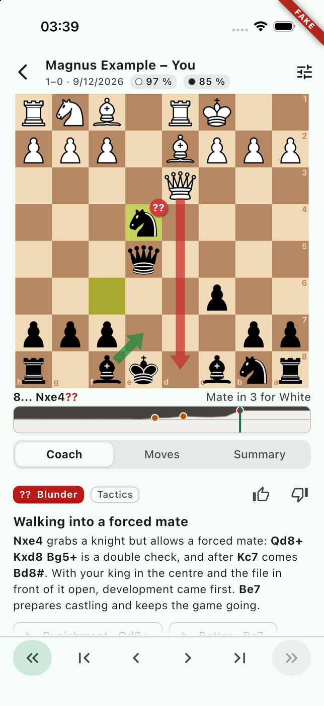 |
| The same on the SE | 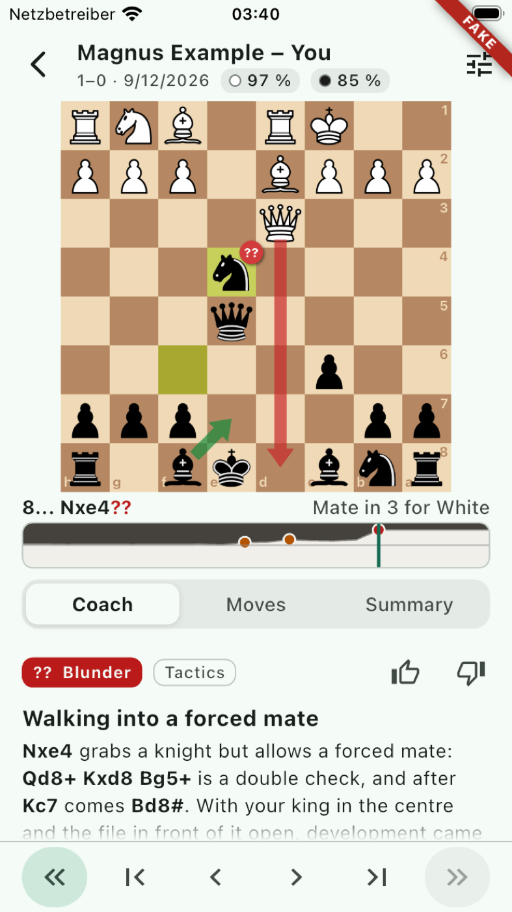 |
| Line viewer ("Punishment", third move) | 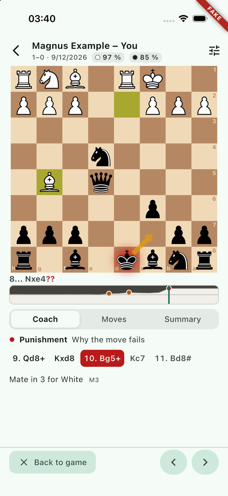 |
| Moves tab | 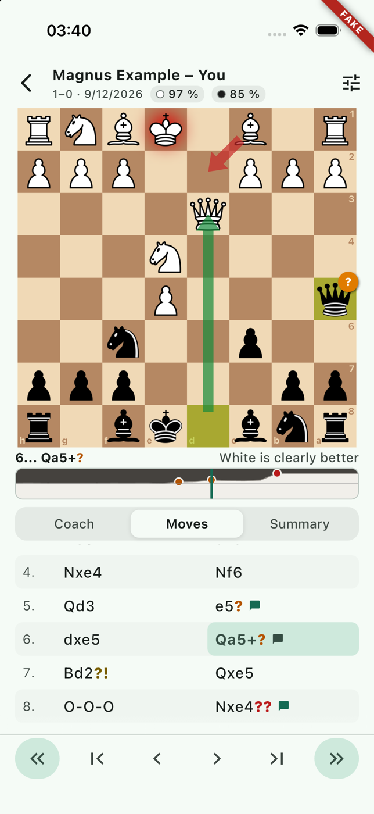 |
| Summary tab | 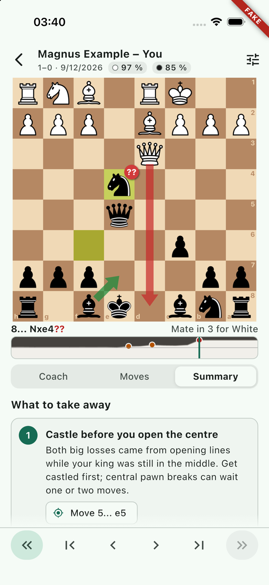 |
| German, rated comment | 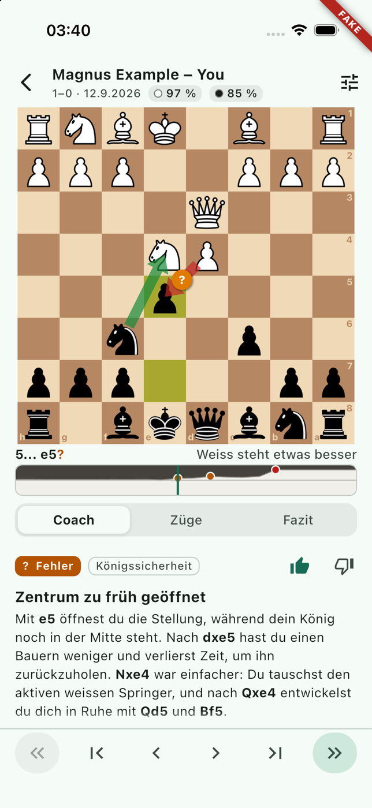 |
| German, start position, SE | 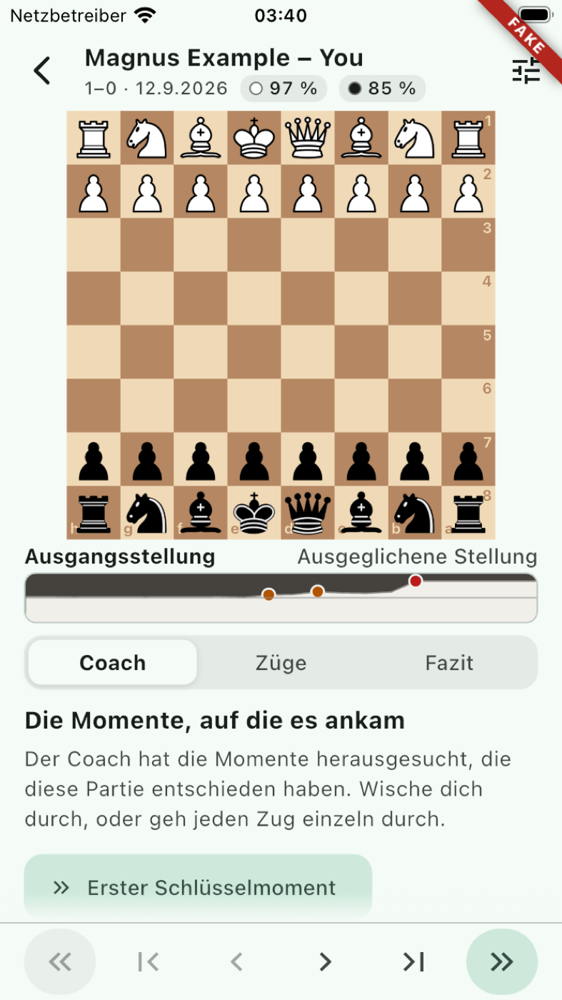 |
| German, summary, SE | 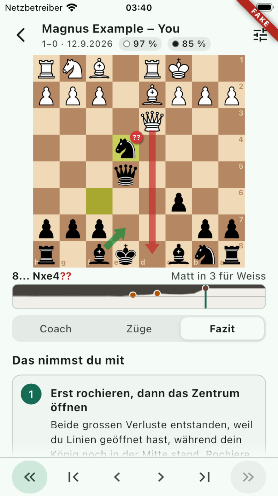 |
| German, dark, SE | 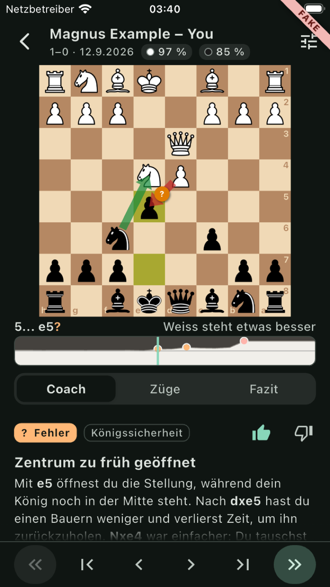 |
| German, dark, line viewer | 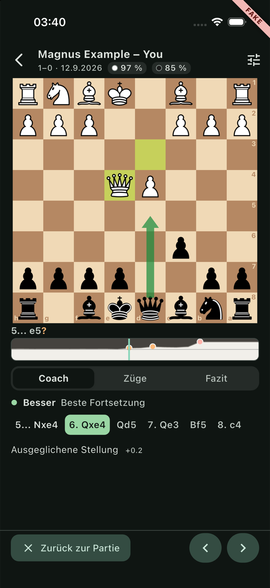 |
| German, dark, moves | 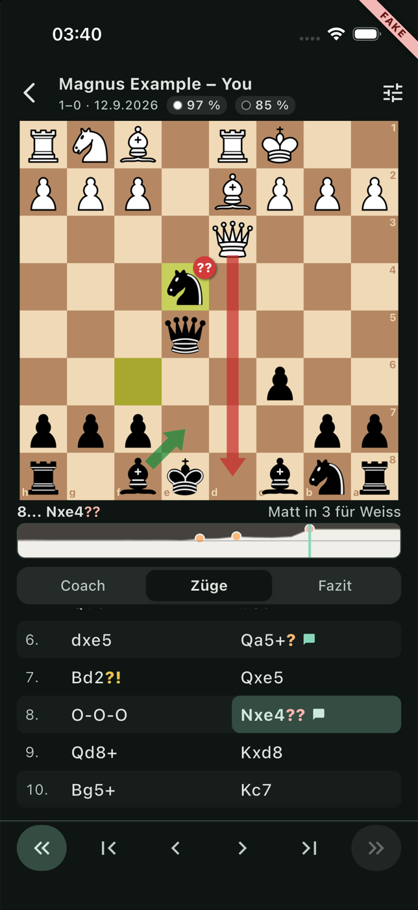 |
| Newer major version | 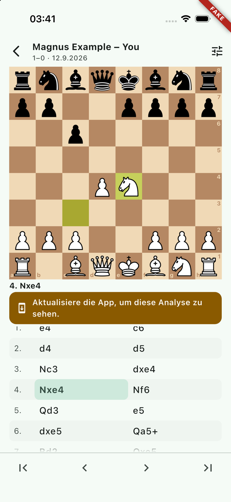 |

What looking at the screenshots changed (four rounds):

1. The first version had the step buttons mid-screen and the comment in a card that was cut off by the screen edge, thumbs below the fold. Now the **step buttons are pinned to the bottom edge** (where the thumb is), the panel scrolls between the tab row and that bar, and the **thumbs sit in the comment's first row**, always visible.
2. The coach text got two or three visible lines, which is the wrong hierarchy for "the coach is the star". The card's box-in-box chrome went, graph and tab row got slimmer, and **the board gives up height when the panel needs it**: the panel is guaranteed 150 points on the SE (board 295 of 375 wide) growing to 220 on tall phones (board 376 of 402 on the 17 Pro). On the 17 Pro a 290-character German comment now reads without scrolling, with the line buttons peeking over the fold.
3. A text that continues below **fades out** towards the control bar, only while there is more to scroll (the first attempt also faded a button that was fully visible).
4. The dot of a mate score was clipped at the top of the graph (head room added); "White is slightly better" on the start position looked silly (the engine's +0.3 is now "equal"); the right thumb did not line up with the text margin; the move list touched the tab row.

The simulator tool's `inspect` was not available in this session either (as in WP-04 and WP-20), so labels and identifiers are verified by widget tests only.

## Handoff notes

### The seams, for WP-28

```dart
// lib/features/review/domain/review_repository.dart
abstract class ReviewRepository { Future<ReviewData> load(String gameId); }        // a failure is thrown
abstract class FeedbackSink    { Future<void> rate(String commentId, CommentRating? rating); } // null withdraws
enum CommentRating { up, down }
class ReviewData { AnalysisParseResult result; GameHeaderInfo header; Map<String, CommentRating?> myFeedback; }
class GameHeaderInfo { String? white, black; String? result /* PGN token */; DateTime? date; }  // display only

// lib/features/review/data/review_providers.dart
final reviewRepositoryProvider = Provider<ReviewRepository>(...);
final feedbackSinkProvider     = Provider<FeedbackSink>(...);
```

- Both providers default to an implementation that throws `UnimplementedError('wired in WP-28')`, **except** when `!kReleaseMode && env.usesFakeAuth`: then `FixtureReviewRepository` (the demo document for every game id, German coach texts when the device language is German) and `InMemoryFeedbackSink`. The `kReleaseMode` check lets the compiler drop the 25 kB demo constant from a release build. WP-28 replaces the provider bodies (or overrides them at the root); keep the fake branch if the fake build should still show a review without the mock server.
- Hand over `AnalysisParser.parseString(payload)` as it is. The screen has a state for each outcome: supported, newer major (board, moves, banner), invalid (`ErrorRetry` with "This analysis could not be read"). A thrown load error is `ErrorRetry` too; retry invalidates `reviewDataProvider(gameId)`.
- `reviewDataProvider` is `FutureProvider.autoDispose.family` with **Riverpod's automatic retry switched off** (the screen has a button). `reviewControllerProvider(gameId)` may only be read once the data is there; `ReviewScreen` takes care of that.
- Feedback is optimistic. A sink that throws rolls the thumb back and shows a snackbar; for an outbox that accepts offline ratings, simply do not throw. A rollback never undoes a newer tap on the same comment (tested).
- `myFeedback`: a missing key and a `null` value both mean "not rated".
- The header falls back to "White – Black" and to the document's result. Accuracy chips come from the document.

### Semantics identifiers (`ReviewIds`, `lib/features/review/ui/review_ids.dart`)

`review-first`, `review-prev`, `review-next`, `review-last`, `review-prev-moment`, `review-next-moment`; `review-tab-coach`, `review-tab-moves`, `review-tab-summary`; `review-eval-graph` (adjustable: increase/decrease step a ply, value is "3... b6, White is clearly better"); `review-menu`, `review-menu-best-arrow`, `review-menu-played-arrow`, `review-menu-flip`; `comment-card`, `comment-thumb-up`, `comment-thumb-down` (toggled state), `comment-line-<variationId>`; `review-engine-fact`, `review-coach-next`; `line-prev`, `line-next`, `line-exit`, `line-move-<n>`, `line-eval`; `review-move-<ply>` (selected state); `review-lesson-<n>`, `review-lesson-<n>-ply-<ply>`; `review-accuracy-white|black`; `review-update-banner`; plus WP-04's `board-square-e4`. If a ply ever has two comments, only the selected one carries the plain identifiers; the other gets `-<commentId>` appended.

Tests: `pumpReview(tester, {fixture, patch, result, header, myFeedback, loadError, env, locale, brightness, textScale, screen})` returns the fake repository and a `RecordingFeedbackSink` (`calls`, `failWith`, `gate`); `tester.tapReview(id)`, `tester.reviewState`, `tester.reviewController`; `stretchTexts` makes every text as long as the contract allows.

### UX decisions

- **One board, no before/after mode.** The board always shows the position after the move under discussion: the verdict as a glyph on the moved piece, the better move as a green arrow, what the opponent now threatens in red. The amber "played" arrow is off by default (the last-move highlight already says it) and can be switched on, like the best arrow, in the board-options menu, which also flips the board. The default orientation is the analysed player's side.
- **Key moments first.** The screen opens on the coach tab; on the start position the coach explains what to do and offers "First key moment". The two filled buttons at the edges of the bottom bar, a horizontal swipe on the panel, and the button on moves without a comment all jump between moments and bring the coach tab forward; after the last one the button becomes "See your lessons".
- **Line viewer.** "Better · d5" and "Punishment · d4" buttons (label from the document plus the first move) open the line with its first move already played, because that move is the point. The bottom bar becomes "Back to game", back, forward; the panel shows the line's moves (tappable), what kind of line it is, and where it ends in words with the engine number small beside it. The next move of the line is drawn as an arrow: the line's colour for the side the line is about (green best, red punishment, blue alternative), a thin amber one for replies. Any main-line navigation, the graph, or another tab leaves the line.
- **No centipawns in the primary UI.** "Equal" up to 0.40, "slightly better" up to 1.20, "clearly better" up to 3.00, then "winning", "Mate in 3 for White", "Checkmate. White wins". Numbers appear only in the line viewer.
- **Graph**: an eval bar laid on its side (light area is White's share, in both themes), along the winning-chances curve so that a pawn in the opening is visible; key moments are dots in the verdict's colour; tap or drag jumps. `fl_chart` only draws: its touch handling and titles are off, and a tap is mapped to a ply by `EvalGraph.plyAt`, which keeps it testable and exact.
- **Moves mentioned in a comment are set in semi-bold**, so the eye finds on the board what the sentence is about.
- A **fallback comment looks like any other**; a theme this build has no word for (including `unknown`) shows no chip rather than English snake case. Every comment carries "AI-generated. May contain mistakes."
- Accuracy is rounded in the header ("92 %") and exact in the summary table.
- German follows the Swiss spelling WP-20 chose ("Weiss"); the summary tab is "Fazit" because "Zusammenfassung" does not fit a third of 375 points at text scale 1.3.

### Gotchas

- `fl_chart` imports the framework's legacy Material library; all colours are passed in, nothing reads its `Theme`. Its animation is set to zero: stepping must be instant, and `pumpAndSettle` stays cheap.
- A `Semantics` node with `onIncrease` needs `value` and `increasedValue` together, or the framework asserts.
- The comment is one semantics container, so VoiceOver reads it in one go; the counter "1/8" is announced as "Key moment 1 of 8" inside it.
- Popup-menu rows: tap the `PopupMenuEntry` ancestor in tests, not the `Text`, or the hit-test warning WP-20 describes appears.
- `review_demo.dart`: `-review_demo_ply 16` arrives in `NSUserDefaults` as an integer, not a string; the entry point reads both.

### Known UX gaps

1. **Square marks of a comment (`target`, `weak`, `key`) are parsed but not drawn**: `BoardView` has no square-highlight API, and `lib/core/chess` was out of bounds. This is the most valuable follow-up; it needs a `Map<Square, BoardSquareTone>` on `BoardView`.
2. The **summary tab** shares the screen with the board, which it does not need; on the SE a lesson and a half is visible. A full-height summary (or a sheet) would read better. The same, less so, for the moves tab.
3. The best-move arrow is drawn on the position *after* the played move. When the played and the better move start from the same square, the arrow starts on an empty square. It reads fine in practice ("it should have gone there"), and "Show line" shows the real thing.
4. On a move without a comment the panel's engine fact repeats the status line unless the engine has a better move to name; the fixtures carry `best` mostly on critical nodes.
5. SAN uses English piece letters everywhere, also inside German coach texts (as in WP-20's open point 4). Figurines would solve both at once.
6. No haptics, no keyboard shortcuts, portrait only; the board theme is the default until a setting exists (WP-36).
7. `inspect` on a device has still not been run by anyone.
