## Scope

The in-app half of the GPL compliance checklist (PRD PL-1): the screen behind `/settings/about` with app name, version and build, a description, the "not affiliated with Lichess" statement, a link to the source of exactly this build, the full GPL text, the additional permission for app stores (a draft, shown as one), the third-party notices, and the licences of every package.

- `lib/features/about/domain/`: `source_link.dart` (repository base, release tag, URL), `link_launcher.dart` (`linkLauncherProvider`, the only importer of `url_launcher`), `additional_licenses.dart` (`registerAdditionalLicenses()`), `licence_document.dart` (the three bundled texts and the plain-text block parser)
- `lib/features/about/ui/`: `about_screen.dart` (replaces the placeholder that lived in `features/legal/ui/`), `licence_text_screen.dart`, `open_source_licences_screen.dart`
- `lib/features/about/dev/about_demo.dart`: development entry point for simulator screenshots
- `pubspec.yaml`: `url_launcher`, and `LICENSE`, `NOTICE`, `LICENSE-APP-STORE-PERMISSION.md` as assets (the root files themselves, no copies)
- `lib/main.dart`: one call, `registerAdditionalLicenses()`; `lib/router.dart` and `test/app_shell_test.dart`: the import path of `AboutScreen`
- 15 strings appended to both ARB files; `docs/dependencies.md`; `NOTICE` (pointer to the screen, two tables re-aligned)
- `test/features/about/`: 41 tests

## Out of scope

Privacy policy and terms (`features/legal`, WP-30). The final wording of the permission (H7). Making the repository public and tagging releases (launch). The settings screen: it already had the "About and licences" entry from WP-03 and was not touched.

## Contracts

**Consumes:** `appInfoProvider`, `AppRoutes.settingsAbout`, `AppScaffold`, `ErrorRetry`, `AppColors`, `context.l10n`, `test/helpers/pump_app.dart` (WP-03); the piece-set and vendoring facts in `NOTICE` and `tool/asset_allowlist.txt` (WP-04).
**Produces:** `registerAdditionalLicenses()` and the `additionalLicenses` list that later WPs extend; `linkLauncherProvider` / `LinkLauncher`; `kSourceRepositoryBase`, `releaseTagFor`, `sourceUrlFor`; `LicenceTextScreen(title, document, warning)` and `parseTextBlocks` for any other bundled plain text.

## Steps

1. Verify `url_launcher` on pub.dev (licence, publisher, Swift Package Manager), add it, record it.
2. Domain: source link, launcher seam, licence registry additions, document parser.
3. Screens, strings in English and German, assets in `pubspec.yaml`, the call in `main.dart`.
4. Tests; simulator build; check the bundle; screenshots in both languages.

## Acceptance commands

```bash
tool/check.sh
flutter build ios --simulator --debug --dart-define-from-file=config/fake.json
find build/ios/iphonesimulator/Runner.app -name "LICENSE*" -o -name NOTICE
tool/check_bundled_assets.sh
```

## Evidence

All commands were run on 2026-09-19 from the repository root, after the last change to the code.

`tool/check.sh`

```
==> 1/7 dependencies: flutter pub get --enforce-lockfile
Got dependencies!
==> 2/7 format: dart format --set-exit-if-changed
Formatted 90 files (0 changed) in 0.18 seconds.
==> 3/7 analyze: flutter analyze --fatal-infos
No issues found! (ran in 2.5s)
==> 4/7 licence headers: tool/check_headers.dart
check_headers: ok
==> 5/7 layer imports: tool/check_layers.dart
check_layers: ok
==> 6/7 codegen is clean: tool/gen.sh, then compare the working tree
codegen: clean
==> 7/7 tests: flutter test --exclude-tags golden

OK in 11s
```

`flutter test --exclude-tags golden`: `00:05 +141: All tests passed!` (100 before this WP, 41 new in `test/features/about/`).

What the 41 cover: version and build shown; the five rows; the Lichess statement; the legal notice; the source row shows and opens `https://github.com/bognerchess/studentapp/tree/v1.2.3+45` through a fake launcher; a launcher that returns false or throws ends in a snack bar; no app info means no version line and a link to the repository; the GPL opens from the real asset bundle, contains "GNU GENERAL PUBLIC LICENSE", scrolls to "END OF TERMS AND CONDITIONS", is monospace and inside a `SelectionArea`; the permission carries the draft box and the file's own DRAFT notice; NOTICE shows cburnett, merida and rhosgfx with authors and licences in a table that does not wrap; the active tab pops the pushed text; the licence page lists our four entries, in the dark theme and in German; German strings; text scale 1.3 on 375 x 667 over the about screen and all three text screens in both languages and both brightnesses. Unit tests: the parser (every non-blank character of all three real files survives, in order), the source link, and the registry additions, which are compared with `NOTICE` and `tool/asset_allowlist.txt` so the three cannot drift apart.

`flutter build ios --simulator --debug --dart-define-from-file=config/fake.json`

```
Xcode build done.                                            6.8s
✓ Built build/ios/iphonesimulator/Runner.app
```

(21.4 s for the first build after adding the plugin.) Nothing under `ios/` changed: `url_launcher_ios` comes in through Swift Package Manager.

`find build/ios/iphonesimulator/Runner.app -name "LICENSE*" -o -name NOTICE`

```
build/ios/iphonesimulator/Runner.app/Frameworks/App.framework/flutter_assets/LICENSE
build/ios/iphonesimulator/Runner.app/Frameworks/App.framework/flutter_assets/NOTICE
build/ios/iphonesimulator/Runner.app/Frameworks/App.framework/flutter_assets/LICENSE-APP-STORE-PERMISSION.md
```

`cmp` of each against the file in the repository root: identical. `tool/check_bundled_assets.sh`: `check_bundled_assets: ok`.

**Simulator.** A throw-away device `BC-WP-31` (iPhone 17 Pro, iOS 26.5) was created and deleted afterwards. The simulator tool had no access to the new device (`inspect`, `tap` and `screenshot` were refused), so the screens were reached with the development entry point and launch arguments (`-about_demo_screen gpl`, see the header of `lib/features/about/dev/about_demo.dart`) and captured with `xcrun simctl io <udid> screenshot`; languages with `-AppleLanguages "(de)" -AppleLocale de_CH`, dark mode with `xcrun simctl ui <udid> appearance dark`. All screenshots were looked at: nothing is clipped in either language, the version line reads "Version 0.1.0 (1)" from the real `package_info_plus`, the source row reads `.../tree/v0.1.0+1`, tables scroll sideways while running text wraps, our entries sit in the licence list between `characters` and `clock`, and `chessground` shows "2 licences" (its own LICENSE plus our note). The last picture is Safari after the demo triggered the source row: `url_launcher` works on the device. GitHub answers 404 because the repository is private until launch, which is what the `TODO(launch)` next to `kSourceRepositoryBase` is about.

| | English | German |
| --- | --- | --- |
| About | 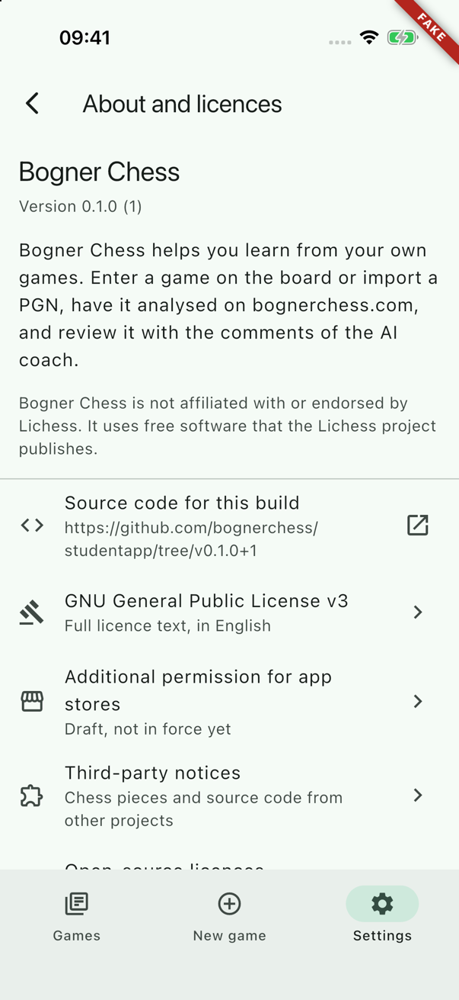 | 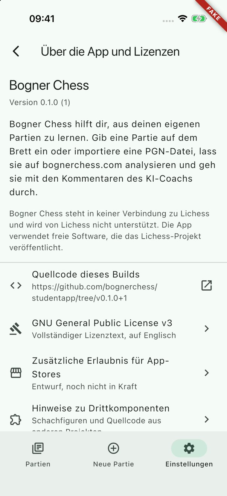 |
| GPL |  | 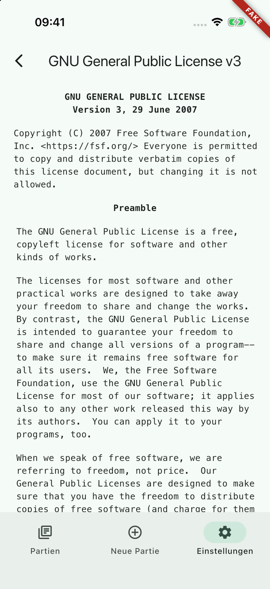 |
| Additional permission | 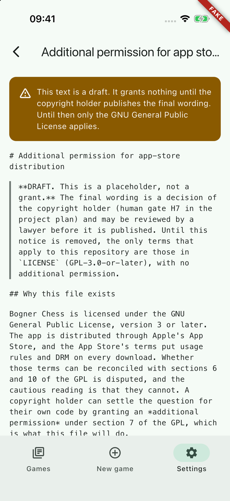 | 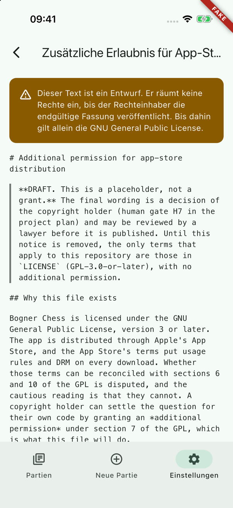 |
| Third-party notices | 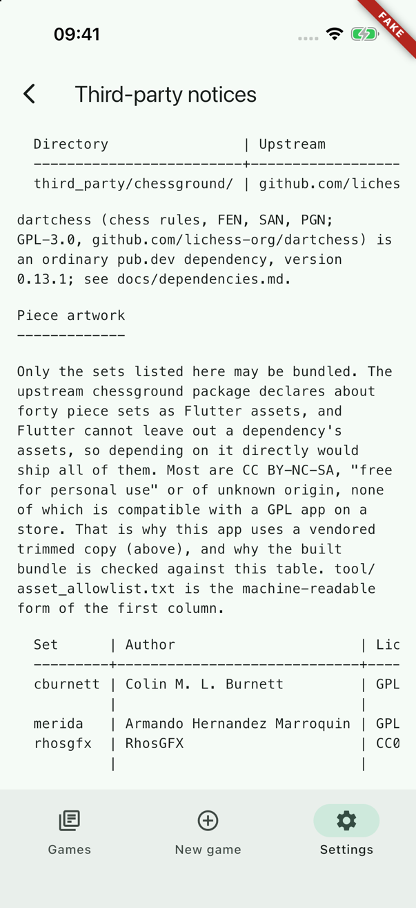 | 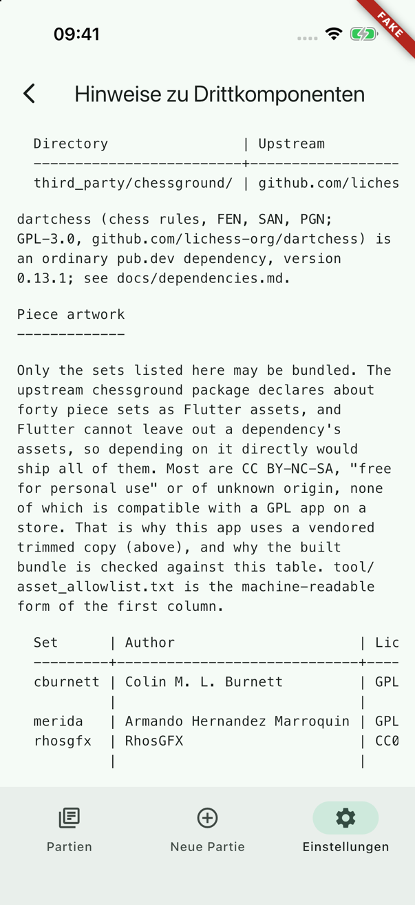 |
| Open-source licences | 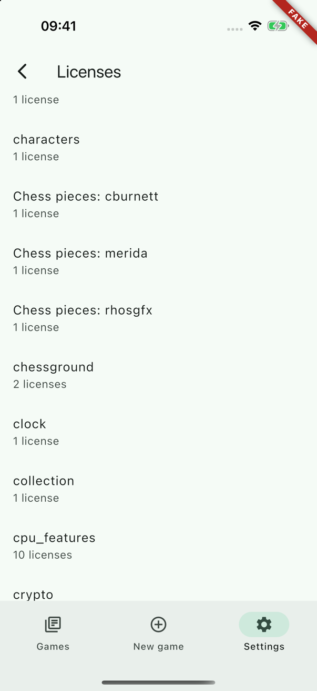 | 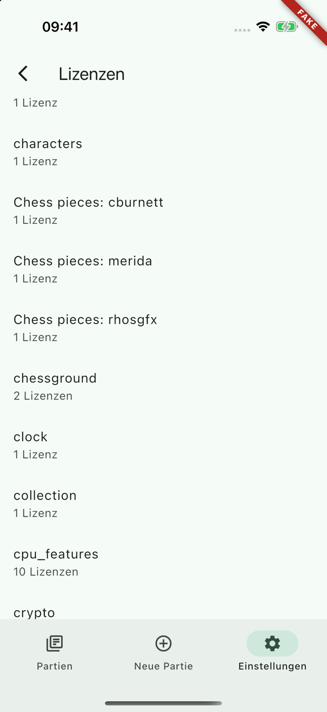 |
| Dark | | 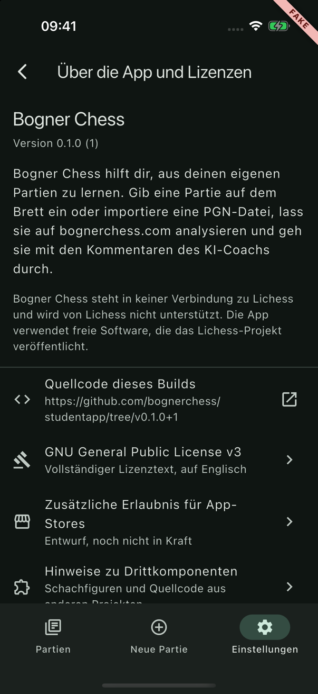 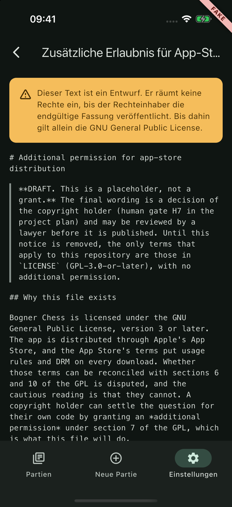 |
| Source link opened | 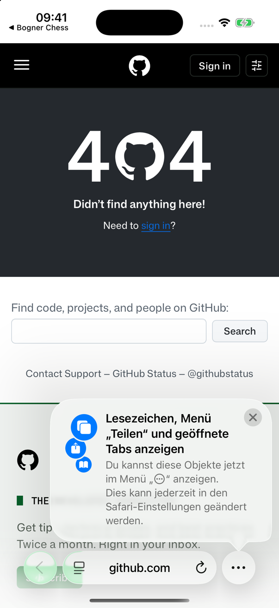 | |

## Handoff notes

**For the coordinator, at merge time**

- `lib/main.dart` calls `registerAdditionalLicenses()` (from `lib/features/about/domain/additional_licenses.dart`) inside the guarded zone, right before `runApp`. It is already in this branch as a four-line insertion plus one import. If another branch rewrote `main.dart`, keep that one call; it is idempotent and needs no binding.
- `AboutScreen` moved from `lib/features/legal/ui/about_screen.dart` to `lib/features/about/ui/about_screen.dart`. `router.dart` and `test/app_shell_test.dart` changed by one import line each; class name, constructor and route are the same. WP-30 owns what is left in `features/legal`.
- The settings screen already had the "About and licences" tile; nothing was added there.
- `pubspec.yaml` gained a `flutter: assets:` list at the end of the file. A branch that adds assets of its own will conflict there: keep both sets of lines.
- `NOTICE`: the last paragraph now names the screen and `additional_licenses.dart`, and two tables were re-aligned (the author column was one character too narrow for "Armando Hernandez Marroquin", which showed on the screen). No fact changed.

**Licence registry.** `additionalLicenses` has four entries today: `chessground` (merged by name into the entry Flutter collects from `third_party/chessground/LICENSE`; ours states that the copy is modified, the version, the commit and the date, as GPL section 5a asks) and `Chess pieces: cburnett | merida | rhosgfx` with author, licence and source from `NOTICE`. Two empty lists wait for later WPs: `_fonts` (the first bundled font, with the full OFL text) and `_adaptedSource` (the first file adapted from lichess-org/mobile). A test compares the piece-set entries with `tool/asset_allowlist.txt` and every author, URL, version and commit in the entries with `NOTICE`, so adding a piece set without an entry fails the gate. The app's own `LICENSE` is also picked up by Flutter's collector, under `bogner_chess` (checked in the built `NOTICES.Z`).

**Legal texts as assets.** `pubspec.yaml` lists the root files; the asset keys are the file names (`LICENSE`, `NOTICE`, `LICENSE-APP-STORE-PERMISSION.md`), enumerated in `LicenceDocument`. No copy exists anywhere. The texts are English only and the German UI says so ("Vollständiger Lizenztext, auf Englisch").

**How the texts are laid out.** An 80-column file in a monospace face does not fit a phone: at a readable size every line would wrap in the middle. `parseTextBlocks` therefore splits a file at blank lines and re-flows running text, keeps tables (any block with ` | ` or `-+-`) as they are inside a horizontal scroller, centres the GPL's deeply indented headings, and strips the `>` of Markdown quotes (shown with a bar at the left). It only ever changes white space and those markers; a test proves that for all three real files. The permission file is shown as its Markdown source on purpose: `flutter_markdown_plus` is WP-30's dependency. If WP-30 wants it rendered, swap the body of `LicenceTextScreen` for that document only.

**Draft marking.** The permission row has the subtitle "Draft, not in force yet" and the text screen a warning box; both are marked `TODO(H7)` in `about_screen.dart`. When H7 delivers the wording: replace the file, delete the `warning:` argument and the subtitle, and delete the three `aboutAppStorePermissionDraft*` strings.

**Source link.** `kSourceRepositoryBase` in `lib/features/about/domain/source_link.dart` is the only place the repository address appears, with `TODO(launch)`. The link is `<base>/tree/v<version>+<build>`, the tag scheme from `pubspec.yaml`. The `+` stays literal; it is a legal path character and GitHub resolves it. The release process has to push that tag for every App Store build, otherwise the link is a 404: this belongs on the release checklist (WP-50).

**`linkLauncherProvider`** lives in `features/about/domain` because this WP may not add to `lib/core`. WP-30 needs the same thing for the legal documents; importing another feature's `domain/` passes the layer check, but moving the file to `lib/core/` would be the better home. It opens links in the external browser, not in an in-app web view, and never calls `canLaunchUrl`, so `Info.plist` needs no `LSApplicationQueriesSchemes`.

**Sub-screens are pushed, not routed.** The three text screens and the licence page are leaves nobody links to, so they go on the settings tab's navigator with `Navigator.push`; `router.dart` did not grow, the tab bar stays, swipe-back works, and tapping the active tab pops them together with the about screen (tested). If analytics later wants screen names for them, give them routes under `/settings/about/`.

**The licence page** is `material_ui`'s `LicensePage` wrapped in `OpenSourceLicencesScreen`, not a hand-written list: it takes the app theme and the German Material strings, and it already loads the several hundred kilobytes of NOTICES in slices between frames. Its title is the Material string ("Licenses" / "Lizenzen"), which is American English in the English locale; everything else in the app says "licences".

**Testing gotchas**

- `flutter test` serves the assets declared in `pubspec.yaml` synchronously, so widget tests read the real `LICENSE`. But never pre-load them with `rootBundle.loadString` (cached): the cached future belongs to the zone of the test that created it and never completes in the next test, which shows up as "pumpAndSettle timed out" only when tests run together. `LicenceTextScreen` loads with `cache: false` for that reason (and because nobody reads the GPL twice).
- In widget tests the packages' NOTICES file cannot be waited for. Tests of the licence page do `LicenseRegistry.reset()` and add `additionalLicenseEntries` themselves.
- `tester.pageBack()` only finds the English tooltip; German tests tap `find.byType(BackButton)`.
- With the test font the about list is taller than the screen and builds lazily: scroll to a row (`AboutScreen.listKey`, `scrollUntilVisible`) before expecting it.
- `pumpApp` has no parameter for extra provider overrides, so `about_screen_test.dart` has its own `_pumpAbout`. An `overrides:` parameter on `pumpApp` would remove that duplication; not done here because several branches would make the same edit.

**`about_demo.dart`** reads `-about_demo_screen <about|source|gpl|permission|notice|licences>` and `-about_demo_offset <pixels>` from the launch arguments (they land in NSUserDefaults, where `shared_preferences` reads) and triggers the row's own `onTap`. One build serves every screen. Useful whenever the simulator tool cannot tap; the pattern carries over to other features.

**Not done:** the app bar title of the permission screen is cut off with an ellipsis in both languages ("Additional permission for app sto…"); the full name is on the row and in the first line of the text. No golden test: nothing here is about pixels.
